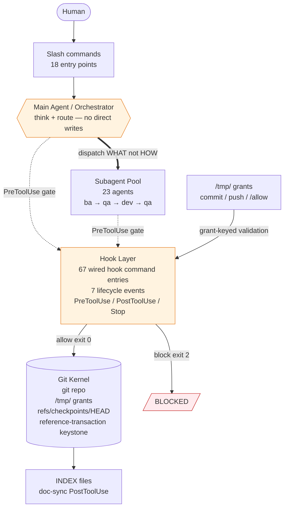
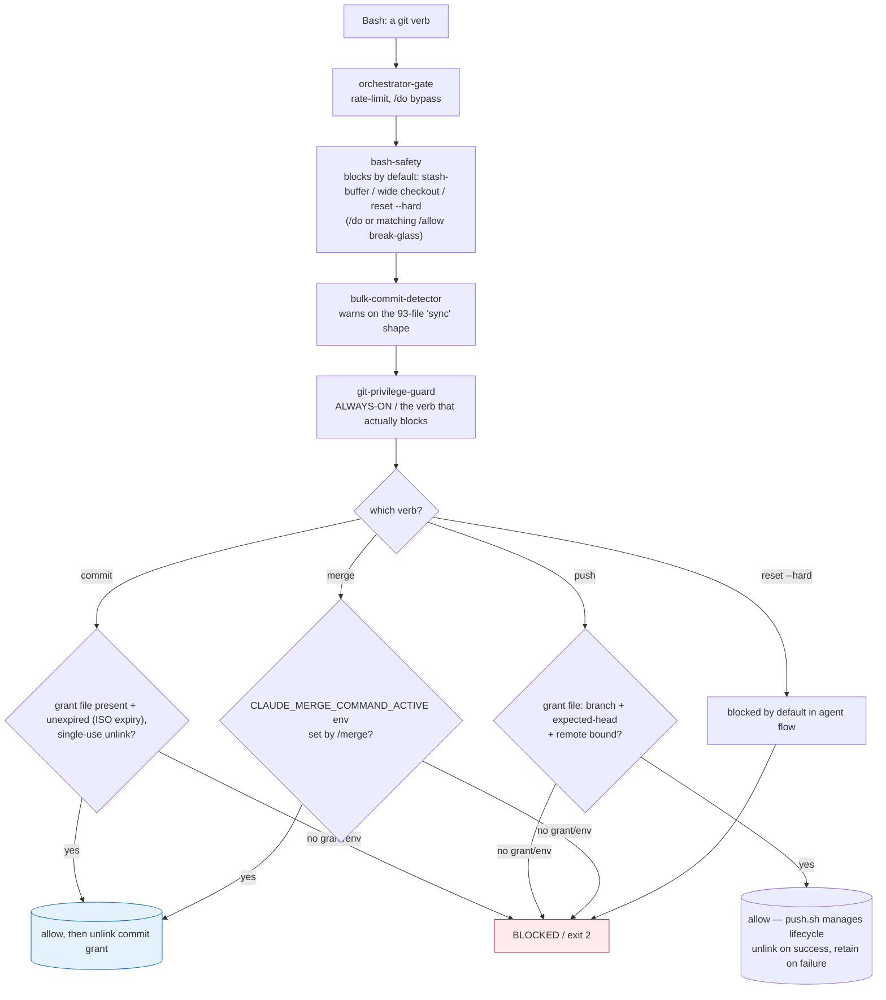

# `awesome-claude-harness` — A Self-Governing Agent Operating System for Claude Code

<p align="center">
  
</p>
<p align="center"><sub><em>Composed from a real run — every visible line traces to <a href=".github/assets/demo-trace.json">.github/assets/demo-trace.json</a>. Stylized &amp; condensed, not a screen recording.</em></sub></p>

An operating system for Claude Code agents — orchestrator-only routing, an evidence-gated `/spec → /dev → /close → /commit → /push` pipeline, a defense-in-depth git protection kernel, and an autonomous overnight loop, every mechanism traceable to a file in this repo.

<p>


</p>

[CHANGELOG](CHANGELOG.md)

---

## Install

Verify prerequisites — `python3`, `git`, `jq` (or run `scripts/doctor` for a full preflight):

```bash
python3 --version && git --version && jq --version
```

```bash
git clone https://github.com/Yugoge/awesome-claude-harness.git ~/.claude
~/.claude/scripts/bootstrap        # non-destructive; --force backs up + recreates the venv
claude
```

Run the guard demo: `bash examples/guard-demo/run-demo.sh`

---

## Feature highlights

| Capability | What it gives you | Grounded in |
|---|---|---|
| **Orchestrator-only architecture** | The main agent routes; each real edit goes to a fresh subagent with one job and a clean context, so quality stays high. | `hooks/pretool-orchestrator-gate.py`, `CLAUDE.md` |
| **Durable specs** | `/spec` captures the requirement verbatim, persists design + evidence, and splits the monolith into per-agent briefing books with Gawande-style checkpoints. Feeds `/dev` as the authoritative source of truth. | `commands/spec.md`, `agents/spec.md` |
| **Evidence-gated BA → Dev → QA pipeline** | The analysis is QA'd *before* coding; every claim needs proof (git blame, grep, import-chain); the user's verbatim words are the binding spec. Pipeline: `/spec → /dev → /close → /commit → /push`. | `commands/dev.md`, `agents/ba.md`, `agents/qa.md` |
| **Release-readiness gate** | `/close` proves not just "the code works" but "the system can ship it" — four Workflow-Integrity checks, optionally a multi-round QA↔Codex debate. | `commands/close.md` |
| **Git protection kernel** | `commit / push / merge / reset --hard` refused unless a per-operation authorization grant is present (commit grant is single-use; push grant is wrapper-managed and retryable on failure); wide-path checkout, stash-as-buffer, and hard resets blocked by default. Each guard maps to a specific failure class it prevents. | `hooks/pretool-git-privilege-guard.py`, `hooks/pretool-bash-safety.sh` |
| **Autonomous overnight pipeline** | `/dev-overnight 6:00` runs an unattended explore → triage → fix → verify → commit loop until a wall-clock end time. Stop-hook physically refuses early termination. | `commands/dev-overnight.md`, `hooks/stop-overnight-timelock.py` |
| **Structured break-glass grants** | `/allow` writes a structured grant (`{op, target, args_contain}`) matched by command structure — consumed on any terminal result. | `hooks/lib/allowlist.py`, `commands/allow.md` |
| **Branch / PR / worktree firewall** | Creating a branch, PR, or worktree is forbidden by default everywhere, with explicit human escape hatches and a live-overnight exception. | `hooks/pretool-block-branch-pr-worktree.py`, `hooks/pretool-block-enterworktree.sh` |
| **Crash-proof checkpoints** | Snapshots written to `refs/checkpoints/<branch>` via git plumbing — never move `HEAD`, so `git blame` always points at a real semantic commit. | `hooks/lib/checkpoint-core.sh`, `docs/reference/checkpoint-mechanism.md` |
| **Self-updating documentation** | Edit a command or agent and `INDEX.md` / subdirectory `README.md` files (those with the `AUTO:readme-stats` annotation) and `CLAUDE.md` stat blocks regenerate automatically; root `README.md` has no annotation and is hand-maintained. | `hooks/posttool-doc-sync.py`, `hooks/doc_sync/` |
| **Adversarial second opinion** | Add `--codex` to `/dev`, `/close`, or `/commit` to run an OpenAI Codex round through a fail-closed isolation wrapper. | `commands/codex.md`, `commands/close.md` |
| **UI-audit skill suite** | Playwright-driven review: axe-core injection, APCA contrast, a 58-rule anti-pattern catalog, state matrix, token conformance, and a weighted beauty score. | `skills/` |

---

## System architecture



---

## The full pipeline

```
   /spec                                  capture the requirement verbatim, split into per-agent briefs
     │
     ▼
   /do · /dev · /dev-command · /dev-overnight     do the work (direct, orchestrated, or autonomous)
     │
     ▼
   /close                                 release-readiness gate (QA, optionally a Codex debate)
     │
     ▼
   /commit                                surgical staging + conventional message + commit grant
     │
     ▼
   /merge · /push                         bridge to the target branch · single-process gated push
```

Each stage hands a verified artifact to the next; `--codex` adds an opt-in adversarial round on `/dev`, `/close`, and `/commit`.

---

## Failure modes this exists to prevent

| Failure mode | Harness mechanism | Key file |
|---|---|---|
| Agent does too much in one context — quality silently degrades | Orchestrator-only gate; every real change goes to a single-purpose subagent with a clean context | `hooks/pretool-orchestrator-gate.py` |
| Irreversible git operation (history-erasing wide checkout; bulk unreviewed commit/push) | Git protection kernel: default-deny for commit/push/merge/reset--hard; stash-as-buffer and wide-path checkout blocked by shape | `hooks/pretool-bash-safety.sh`, `hooks/pretool-git-privilege-guard.py` |
| Implementation drifts from the requirement | BA → QA-of-BA → Dev → QA pipeline; user's verbatim words written to disk as the binding spec before any code is written | `agents/ba.md`, `agents/qa.md`, `commands/dev.md` |

---

## Context-engineering guardrails

| Guardrail | What it blocks | Why (context / safety) | Hook |
|---|---|---|---|
| Consecutive-Bash cap | 6th back-to-back `Bash` in the main agent (limit 5; only an `Agent` dispatch resets the streak) | Forces delegation before shell output floods the orchestrator's context | `pretool-orchestrator-gate.py` |
| Non-whitelist once-per-turn | 2nd `Edit`/`Write`/`WebFetch`/… of the same tool per turn in the main agent | Keeps real edits in clean subagent contexts, not the orchestrator's | `pretool-orchestrator-gate.py` |
| Read-size cap | Main-agent `Read` of a file >600 lines (unless sliced with `limit`≤600) | Stops one large file from swamping the lean context — delegate a summary instead | `pretool-read-size-guard.py` |
| Write-over-existing | `Write` onto a file that already exists (forces `Edit`) | Prevents silent whole-file loss from memory-reproduced content — no diff to catch it | `pretool-write-guard.sh` |
| No background dispatch | `Agent`/`Task` unless `run_in_background:false`; `SendMessage`/`Workflow` outright | Background agents escape harness monitoring — work stays synchronous and observable | `pretool-block-background-tasks.py` |
| Gitignored-deliverable preflight | `Agent` dispatch when a dev-report names a gitignored file | Blocks a cycle that would pass QA yet never ship via git | `pretool-gitignore-preflight.py` |
| Todo sequence integrity | Illegal `TodoWrite` transitions (skip, multi-complete, reorder, content edit) | Keeps the plan an auditable one-step-at-a-time ledger | `pretool-todo-validate.py` · `posttool-todo-sequence.py` |
| Privileged-git default-deny | `commit`/`push`/`merge`/`reset --hard` without a per-op grant | See [git protection kernel](#the-git-protection-kernel) | `pretool-git-privilege-guard.py` |

<p align="center">
  
</p>

<p align="center"><sub><em>Composed from real hook interceptions — every line traces to <a href=".github/assets/hook-trace.json">.github/assets/hook-trace.json</a>. Stylized &amp; condensed, not a screen recording.</em></sub></p>

---

## The git protection kernel

Two failure classes drove its design:

> **Overwriting uncommitted work.** Using `git stash` as a throwaway buffer plus a wide-path `git checkout <ref> -- .` can silently overwrite uncommitted work with an old baseline. So `hooks/pretool-bash-safety.sh` now blocks **stash-as-buffer** (`git stash push/save/-u/--all` and bare `git stash`), **wide-path checkout-from-a-ref** (`git checkout <ref> -- .` / `-- *` / `-- dir/`), its modern `git restore --source=… -- .` equivalent, and **every `git reset --hard` form** — each blocked **by default**, absent a main-agent `/do` or a matching `/allow` grant. Single-file checkout (`git checkout <ref> -- path/to/file.ts`) stays allowed.
>
> **Concrete example:** if an agent tries `git checkout abc123 -- .`, bash-safety blocks it with exit 2. To restore a single file: `git checkout abc123 -- hooks/pretool-bash-safety.sh` — that is allowed. To widen the checkout back to a whole directory, a human must first `/allow git checkout` with the matching `args_contain`.

> **Bulk unreviewed commit + push.** A bulk "commit and push everything" request can produce a large multi-subsystem commit with no human sign-off. Gating on overnight-context alone would let this class through, so `hooks/pretool-git-privilege-guard.py` is **always-on** — it runs on every Bash call in both subagent and main-agent contexts — and requires a per-operation authorization grant for each privileged verb.



#### Hook chain reference

Note: `pretool-bulk-commit-detector.py` is warn-only — it exits 0 and never blocks by itself; the blocking of agent commit/push is the privilege-guard's job.

| Hook | Event | Covered operations | Default | Break-glass |
|---|---|---|---|---|
| `pretool-bash-safety.sh` | PreToolUse Bash | stash-buffer, wide checkout (-- . / -- *), git restore --source -- ., reset --hard | BLOCK (exit 2) | /do or matching /allow |
| `pretool-bulk-commit-detector.py` | PreToolUse Bash | 93-file 'sync all uncommitted' shape (3+ subsystems + sync subject) | WARN only (exits 0) | N/A — warn-only per current policy |
| `pretool-git-privilege-guard.py` | PreToolUse Bash | commit, push (any form), merge, reset --hard, direct ref mutation | BLOCK (exit 2) | /commit or /push grant, or /allow (subagents); /do (main agent only) |
| `pretool-orchestrator-gate.py` | PreToolUse (all tools) | Non-whitelisted tools in main-agent context; streak rate-limit | BLOCK (rate-limited) | /do |
| `pretool-tool-policy.py` | PreToolUse Write | Role-scoped deny rules from policies/tool-policy.v1.json | FAIL CLOSED (non-dev roles); fail-safe ALLOW (dev role when policy missing) | N/A |
| `stop-overnight-timelock.py` | Stop | Early session termination before declared end-time | BLOCK (exit 2) | /stop at or after end-time; defaults to 8h if no end-time set |
| `posttool-doc-sync.py` | PostToolUse | INDEX.md / README / CLAUDE stat block regeneration | UPDATE (idempotent) | N/A |

Read-only git (`status`, `log`, `show`, `diff`, `blame`, `ls-files`, `branch` listing, `stash list/show`) stays freely available. `add`, single-file working-tree `restore`, and `stash pop` are also permitted — they mutate the index or working tree but never history or the remote.

#### Grant lifecycle comparison

| Grant type | Written by | Key fields | Expiry | Consumed on | Honored for |
|---|---|---|---|---|---|
| Commit grant `/tmp/claude-commit-grant-<sid>-<nonce>.json` | /commit command | nonce, expires_at (ISO-8601 UTC) | Time-boxed ISO expiry | Consumed on success (exit 0) only — renamed to `.lck` at PreToolUse validation, unlinked by `posttool-allowlist-consume.py` on exit 0; validation failures do NOT consume the grant | Main agent + subagents |
| Push grant `/tmp/claude-push-grant-<sid>-<nonce>.json` | /push command | nonce, branch, expected-head SHA, remote | None — branch/head/remote-bound | Unlinked by `push.sh` after a successful `git push`; left in place on failure (for retry). The privilege guard does not fire on `push.sh` subprocesses — `push.sh` manages the lifecycle directly. | Main agent + subagents |
| /allow sentinel `/tmp/claude-grants/<task_id>.json` | /allow command | task_id, session_id, allowed_operations[] ({op, target?, args_contain?}), expires_at | ISO expiry | Any terminal result (posttool-allowlist-consume.py) | Main agent + subagents |

Match channel for /allow: structural (`op` = first token of sub-command; `args_contain` = leading argument sequence prefix). Command-text substring grep is not the match channel. Refuse-by-default is the rule — the match-all hole was closed; the grant is single-use and consumed on any terminal result. Legacy git-allowlist grants are main-agent only.

---

## The overnight autonomous pipeline


`/dev-overnight` runs a todo-completion-driven loop inside a dedicated worktree. A `Stop` hook (`hooks/stop-overnight-timelock.py`) physically refuses to end the conversation until your wall-clock end time, defaulting to an 8-hour session if no end time is provided. Each issue gets its own one-issue-per-subagent pipeline; cycles deduplicate against state and end with a real, merge-ready commit. Cancel any time with `/stop`.

> **Limitation.** The overnight session runs in a *linked* worktree that shares the repository `.git` common-dir with the main checkout — an accepted deviation, not a clean isolation guarantee, documented in `commands/dev-overnight.md`.

---

## The cast: 23 subagents

The orchestrator dispatches specialists by *describing the problem* — never the tooling (`hooks/pretool-orchestrator-prompt-purity.py` watches for leaked "HOW"). Each picks its own approach and returns a structured report.

| Agent | Availability | Dispatch trigger | Key input | Key output |
|---|---|---|---|---|
| **`ba`** | always-on | Every `/dev` invocation | user requirement + git log | ticket-*.md + context-*.json |
| **`dev`** | after BA validated by QA | /dev pipeline step 2 dispatch | context-*.json | implementation + dev-report-*.md |
| **`qa`** | always-on | BA spec or dev report delivered (twice per /dev cycle) | BA spec or dev report | pass/fail + structured objections |
| **`test-writer`** | complexity ≥ STANDARD or risk_level = high | acceptance-criteria-*.json generated | acceptance-criteria-*.json | pytest skeletons with TEST_INCOMPLETE hard-stops |
| **`graphify`** | GRAPHIFY_ENABLED=auto and binary present | blast-radius-map.json generated | blast-radius-map.json | graph_context patch injected into context JSON |
| **`spec`** | /spec invocation | monolithic spec file provided | monolithic spec file | per-agent view files + Gawande-style checkpoints |
| **`architect`** | overnight + on-demand | /dev-overnight or PM PLAN dispatch | live app URL | structured JSON report per specialist |
| **`product-owner`** | overnight + on-demand | /dev-overnight or PM PLAN dispatch | live app URL | structured JSON report per specialist |
| **`user`** | overnight + on-demand | /dev-overnight or PM PLAN dispatch | live app URL | structured JSON report per specialist |
| **`ui-specialist`** | overnight + on-demand | user-facing change detected or /test UI mode | live app URL | structured JSON report per specialist |
| **`pm`** | overnight | /dev-overnight invocation | live app URL + test plan | PLAN/TRIAGE/RETRO structured report |
| **`changelog-analyst`** | /commit invocation | /commit command | git diff + dev report | surgical staged commit + push-gate token |
| **`push-analyst`** | /push invocation | /push command | commits/branch range | nonce-keyed grant + risk summary |
| **`merge-analyst`** | /merge invocation | /merge command | commits/branch range | nonce-keyed grant + risk summary |
| **`pull-analyst`** | /pull invocation | /pull command | commits/branch range | risk summary |
| **`cleaner`** | /clean invocation | /clean command | project tree | hygiene execution report |
| **`cleanliness-inspector`** | /clean invocation | /clean command | project tree | hygiene audit report |
| **`style-inspector`** | /clean invocation | /clean command | project tree | style violations report |
| **`rule-inspector`** | /clean invocation | /clean command | project tree | discovered folder rules |
| **`prompt-inspector`** | on-demand | on request | agent/command docs | verbosity violations report |
| **`git-edge-case-analyst`** | on-demand | on request | git history | edge case report |
| **`test-executor`** | /test invocation | /test command | test files | execution report |
| **`test-validator`** | /test invocation | /test command | test files | validation report |

> Full, auto-maintained roster: [`agents/README.md`](agents/README.md).

---

## The command surface: 18 slash commands

| Group | Command | What it does | When to use |
|---|---|---|---|
| **Spec** | `/spec` | Capture the requirement verbatim, persist design + evidence, split into per-agent briefs + Gawande-style checkpoints. | Starting a net-new feature that needs a persisted design contract. |
| **Spec** | `/spec-update` | Append continuation cycles to an existing spec. | A spec already exists and you're extending it another cycle. |
| **Develop** | `/dev` | Orchestrated single-pass development pipeline. | You have one clear, single-shot requirement to build. |
| **Develop** | `/dev-command` | Command-authoring dev pipeline. | The thing you're building is itself a command or agent. |
| **Develop** | `/dev-overnight` | Autonomous overnight loop. | A backlog to grind through unattended, all night. |
| **Develop** | `/redev` | Re-dev a prior cycle with a revised context. | Re-running one cycle after feedback or a revised context. |
| **Ship** | `/close` | Release-readiness gate (QA verdict + optional Codex debate). | After dev finishes, before committing — the go/no-go gate. |
| **Ship** | `/commit` | Surgical staging + conventional commit message + commit grant. | Once /close passes and you're ready to record the change. |
| **Ship** | `/merge` | Bridge to target branch with pre-merge analyst grant. | After commit, to carry the change into a target branch. |
| **Ship** | `/push` | Single-process gated push with push analyst grant. | After commit/merge, to publish the branch to remote. |
| **Ship** | `/pull` | Post-pull advisory risk analysis. | Just pulled — you want a read on what the incoming commits touch. |
| **Ship** | `/checkpoint` | Manual snapshot to `refs/checkpoints/<branch>`. | Want a safety snapshot without advancing HEAD or committing. |
| **Quality** | `/clean` | Cleanup cohort (cleaner + inspectors). | Repo has drifted — stray files or style violations to sweep. |
| **Quality** | `/test` | Test workflow (execute + validate). | You need the test suite executed and its results validated. |
| **Control** | `/do` | Break-glass consent for the main agent, one turn (never a subagent); does not silence the bulk-commit warning. | Main agent must break the rules for one entire turn. |
| **Control** | `/allow` | Structured single-use break-glass grant for one specific operation. | Green-light one specific blocked operation, a single time. |
| **Control** | `/stop` | Cancel an overnight session. | Mid-overnight, to abort a running session. |
| **Control** | `/codex` | OpenAI Codex adversarial delegation. | You want an adversarial second opinion from an outside model. |

> Full, auto-maintained list: [`commands/README.md`](commands/README.md).

---

## Pipeline in action

### Walkthrough 1 — `/dev "the login button is misaligned on mobile"`

| Step | Who acts | What happens | Bounds |
|---|---|---|---|
| 1 | UserPromptSubmit hook | Pre-creates per-agent sentinel files; writes verbatim requirement to disk as the binding spec | — |
| 2 | Orchestrator | Evaluates specialist triggers (e.g., `ui-specialist` for layout reports); must justify RELEVANT-or-SKIP per specialist — silently skipping is itself a violation | — |
| 3 | BA subagent | Git root-cause analysis → finds the *actual* file (not a plausible cousin); emits Markdown ticket + JSON context, scored on 5 clarity dimensions (What/Why/Where/Scope/Success) | — |
| 4 | QA subagent | Validates the BA *before any code is written*: git-blame evidence? files exist? scope narrowed? prior cycle contradiction? If weak, BA is sent back | QA→BA loop max 3 rounds; unresolved objections appended to context, workflow proceeds with documented assumptions |
| 5 | Dev subagent | Implements the vetted plan under minimum-diff discipline; runs self-verification (build + smoke) | — |
| 6 | QA subagent | Verifies against acceptance criteria; returns structured objection (wrong_layer / missing_evidence / over_diff / …) on failure; may re-invoke BA if wrong abstraction layer | Dev→QA loop max 5 attempts; same fix layer twice → attempt 3 must target a different layer |
| 7 | `/close → /commit → /push` | Release-readiness gate, then grant-gated git pipeline | — |

### Walkthrough 2 — a hook firing

You (the agent) try the obvious shortcut:

```bash
CLAUDE_PUSH_COMMAND_ACTIVE=1 git push
```

`hooks/pretool-git-privilege-guard.py` runs *before* the tool executes. It recognizes the `CLAUDE_PUSH_COMMAND_ACTIVE=` prefix as an env-injection attempt — the sanctioned env var must be set by the `/push` wrapper in the child's real environment, not pasted onto the command line — and returns exit 2: **BLOCKED** before any `/push` grant or `/allow` is consulted (absent main-agent `/do`).

| Method | Result |
|---|---|
| Inline `CLAUDE_PUSH_COMMAND_ACTIVE=1 git push` | BLOCKED (exit 2) — env-injection detected before grant/allow check |
| `/push` grant file (nonce-keyed, branch+head+remote-bound) | ALLOWED — `push.sh` manages grant lifecycle; guard does not fire on `push.sh` subprocesses. Grant unlinked by `push.sh` on success; left in place on failure (for retry) |

The model is *encouraged* toward the right path and *physically prevented* from the wrong one — and when it is prevented, the evidence is left on disk. (`hooks/pretool-git-privilege-guard.py`)

---

## Trust model in practice

| Actor | Edit/Write | git commit | git push | git reset --hard | /do bypass | Break-glass path |
|---|---|---|---|---|---|---|
| Human (shell) | ✓ | ✓ | ✓ | ✓ | N/A | N/A |
| Main Agent | via /do | /commit grant (time-boxed ISO expiry) | /push grant (branch+head+remote-bound) | via /do or matching /allow | ✓ | /do — breaks all gates for one turn |
| Subagent | role-restricted | /commit grant | /push grant | matching /allow only — /do never applies to subagents | ✗ (subagents never get /do) | /allow only |

Commit grant = time-boxed ISO expiry, single-use (unlinked by posttool hook on success). Push grant = branch+head+remote-bound, no expiry, wrapper-managed lifecycle (push.sh unlinks on success; left in place on failure for retry). /allow sentinel = structured match (op+target+args_contain), ISO expiry, single-use (consumed on any terminal result), honored for subagents. For git reset --hard: subagents can use /allow; they cannot use /do.

---

## Setup

### Try it without Claude Code

The project ships a runnable demo exercising the real guard (`pretool-tool-policy.py`) against an isolated ephemeral home — no Claude Code session needed:

```bash
examples/guard-demo/run-demo.sh
```

| Phase | Expected result | Exit code |
|---|---|---|
| STEP 1 — dangerous operation | BLOCKED (exit 2) by the guard, fail-closed | 2 |
| STEP 2 — authorized fix | ALLOWED (exit 0) — operation is within policy | 0 |
| STEP 3 — fix completes | Fix write landed on disk | — |

Exit 0 = allow, exit 2 = block. See [`examples/guard-demo/run-demo.sh`](examples/guard-demo/run-demo.sh) for details.

### Usage examples

```bash
# Orchestrated development (vague requirements welcome)
/dev add a --dry-run flag to the export command

# Adversarial review enabled
/dev --codex fix the off-by-one in pagination

# Autonomous overnight run until 6am, focused on a subsystem
/dev-overnight 6:00 fix flaky tests in the parser

# Cancel an overnight session
/stop
```

---

## Portability guarantee

The harness runs on a fresh non-root clone. Clone to `$HOME/.claude` on any Linux box (non-root user, `$HOME` not under `/root`), populate the venv, and the core flows resolve to *your* home with zero author-path literals load-bearing. The structural resolver (`hooks/lib/claude_home.{sh,py}`) locates the harness home by walking up to the `settings.json + hooks/ + policies/ + scripts/` sentinel set — there is no `/root` to rewrite.

| Guarantee | Verified by | Caveat / extra |
|---|---|---|
| **Fresh non-root clone**: core flows resolve to *your* home with zero author-path literals load-bearing | `tests/` WS2 smoke test — runs under a synthetic non-root `$HOME` with the author's home absent; asserts "core is runnable" and "security guards engage" | Non-root user, `$HOME` not under `/root`; venv must be populated via `scripts/bootstrap` |
| **Structural resolver**: home located by `settings.json + hooks/ + policies/ + scripts/` sentinel set | `hooks/lib/claude_home.{sh,py}` — walks up from script location | Repo may be cloned to any path, not just `~/.claude` |
| **Smoke-test WS2**: both "core is runnable" and "security guards engage" | `tests/` WS2 fresh-clone smoke test | Requires Python 3 + venv populated |
| **Zero author-path literals load-bearing** | `hooks/lib/claude_home.{sh,py}` structural resolver handles runtime path lookup; production hooks still retain known historical `/root/` and `/dev/shm` topology literals tied to the nested-repo layout documented in `NESTED-REPO.md`, but those residuals are not load-bearing for home resolution | Historical hardcoded-path caveat superseded by resolver; retained in `NESTED-REPO.md` for background |
| **External extras degrade gracefully, never fall back unsafely** | D2 dependency table (below) | Codex CLI **never** falls back to a bare unsafe `codex`; bwrap absence → fail closed |

---

## Dependencies

### Quick dependency reference

| Tier | Component | Needed for | On absence |
|---|---|---|---|
| Tier 0 — core | Claude Code, Python 3 + venv, git ≥ 2.4x, jq, Bash/GNU userland | Everything | Guards fail silently / kernel inactive |
| Tier 1 — release | openssl | /merge, /push nonce grants | Those commands fail at grant-write step |
| Tier 1 — release | pytest + jsonschema + pyyaml (via bootstrap) | /test, generated AC tests | /test fails; test skeletons cannot execute |
| Tier 2 — overnight | bwrap (bubblewrap) | /dev-overnight write boundary | Fail closed — non-worktree-local write blocked (security-relevant) |
| Tier 2 — overnight | Playwright MCP | User-facing QA, UI audits, overnight PM | QA fails closed for user-facing changes |
| Tier 3 — optional | Codex CLI + CODEX_ISO_BIN | --codex adversarial rounds | --codex unavailable; pipeline unaffected |
| Tier 3 — optional | graphify + GRAPHIFY_BIN | Code-graph enrichment in Dev context | Dev skips enrichment; proceeds degraded |
| Tier 3 — optional | websocket-client | Websocket enrichments | Silently skipped; core pipeline unaffected |

<details>
<summary>Dependency requirements</summary>

| Dependency | Tier | What needs it | Degrades when missing |
|---|---|---|---|
| [Claude Code](https://claude.com/claude-code) | **REQUIRED** | The host. Must be recent enough to fire `UserPromptSubmit` / `Notification` / `SubagentStop` hook events, honor `disable-model-invocation` frontmatter, and enforce `Skill(*)` permission denies — older clients silently skip these and the guardrails won't engage. | All hooks fail silently — the entire guardrail stack disengages. |
| Python 3 + a venv at `~/.claude/venv` | **REQUIRED** | Runs every Python hook (the git kernel, gates) and helper script. The venv ships empty — `scripts/bootstrap` creates it and installs the manifest. | Python hooks fail at import time; git kernel inactive. |
| `git` | **REQUIRED** | The whole harness is git-native (checkpoints, grants, keystone). Any recent git (2.4x+) works for normal use; the overnight keystone needs **git ≥ 2.46** (verified by `scripts/overnight-git-selftest.sh`). | No checkpoints, no grant-gated git operations, no overnight loop. |
| `git reference-transaction` hook (keystone) | **REQUIRED keystone** | The overnight keystone (`hooks/git-keystone/`) installs a `reference-transaction` hook into `<git-common-dir>/keystone-hooks/` and sets `core.hooksPath`; it fires atomically on every HEAD/ref move. Needs git ≥ 2.46. | Without it, the overnight linked worktree has no structural protection against unauthorized `HEAD` rewrites. Core `/dev` pipeline is unaffected. |
| `jq` | **REQUIRED** | JSON parsing in shell hooks/scripts across the pipeline. | Shell hooks that parse grant files or settings.json silently fail or misparse JSON. |
| Bash + GNU userland (coreutils, util-linux/`flock`, findutils, `grep`, `sed`, `awk`/gawk) | **REQUIRED** | `realpath`, `flock`, `stat`, `sha256sum`, `date`, `grep`, `sed`, `awk`, `find` are used pervasively. The GNU forms are assumed — BSD/macOS variants differ in flags; install the GNU userland there. | Hook failures on BSD/macOS with wrong flag variants; `flock`-based serialization unavailable. |
| `pytest`, `jsonschema`, `pyyaml` (the test/runtime manifest) | **REQUIRED** for `/test` + generated tests | Pinned in [`requirements.txt`](requirements.txt) and installed automatically by `scripts/bootstrap`; `scripts/doctor` reports any that are missing. | `/test` fails; test-writer skeletons cannot be executed; schema validation unavailable. |
| OpenAI Codex CLI + an isolation wrapper (`CODEX_ISO_BIN`) | **REQUIRED** for `--codex` / `/codex` | The adversarial second-opinion rounds shell out to the Codex CLI through a fail-closed isolation wrapper. **You must supply your own** Codex CLI and wrapper and point `CODEX_ISO_BIN` at it. | `--codex` / `/codex` unavailable; rest of the pipeline unaffected. |
| `openssl` | **REQUIRED** for `/merge`, `/push` | Nonce / token generation in the grant-gated git release path. | `/merge` and `/push` cannot generate nonce-keyed grants → those commands fail at grant-write step. |
| `bwrap` (bubblewrap) | **REQUIRED** for `/dev-overnight` | The per-Bash bind-mount boundary that isolates overnight main-tree writes. | Overnight launch still works; non-worktree-local write fails closed (security-relevant). |
| `graphify` CLI (`graphifyy` v0.8.25 on PyPI; the binary is `graphify`) | OPTIONAL (graceful) | Incremental code-graph enrichment injected into the Dev context. Default-enabled (`CLAUDE_GRAPHIFY_ENABLED=auto`). Install: `~/.claude/venv/bin/pip install graphifyy`, then point `GRAPHIFY_BIN` at the installed `graphify`. | Code-graph context absent from Dev dispatch; Dev still runs — quality may be lower on large refactors. |
| [Playwright MCP](https://github.com/microsoft/playwright-mcp) | OPTIONAL overall; **REQUIRED for user-facing QA/E2E + UI audits** | Powers the UI-audit skill suite, the overnight PM's live-app exploration, and QA's live browser verification of user-facing changes. Not needed for doc/config/non-user-facing cycles. | Non-user-facing cycles unaffected; QA fails closed only when a user-facing change cannot be browser-verified. |
| Python pkg `websocket-client` | OPTIONAL (graceful) | A few websocket enrichments; hooks fall back to lenient paths when missing. | Websocket enrichments silently skipped; fallback path active. |

</details>

---

## Fail-closed vs. skip semantics

| Missing thing | Class | Behavior on absence |
|---|---|---|
| The tool-policy registry (role-scoped deny enforcement) | security | **FAIL CLOSED for every role except the default `dev` role** — a present, valid `tool-policy.v1` enforces its denials normally; if missing/unparseable or the registry throws, non-`dev` roles fail closed (exit 2) while the default `dev` role gets a sanctioned fail-safe ALLOW. |
| The always-on git-privilege / bash-safety guards | security | **Block their covered operations in normal operation** — with documented human break-glass paths (`/do`, `/allow`) and a few selected fail-open exception paths that keep a hook bug from bricking the pipeline |
| An optional integration (Codex wrapper, `graphify`, Playwright, session-promote) | optional | **SKIP** — one-line "unavailable" message, core flow continues; no unsafe fallback |
| The spec-coverage verifier (an advisory coverage check, not a blocking guard) | advisory | **SKIP** — an absent verifier allows the stop with a note; when the verifier *is* present, under-coverage still blocks |
| An invalid generated `settings.json` (bad render / dropped required hook) | config | **ABORT** — the install renderer refuses to apply and leaves the live settings unchanged |

Each row maps to a capability in the dependency table above.

#### Trust model

**The human is the trust root.** Every release verb (`/commit`, `/push`, `/merge`, `/close`) and every human-only command is denied to agents both via `disable-model-invocation: true` *and* an explicit `Skill(<name>:*)` entry in `permissions.deny` — the only technical barrier against an agent self-invoking a privileged command. The harness assumes the agent itself is the adversary, so guards are enforced in code (a `PreToolUse`/`Stop` hook returning exit 2), never in prose.

---

## Troubleshooting

| Symptom | Fix |
|---|---|
| **A hook isn't firing** | Shell hooks must be executable: `chmod +x ~/.claude/hooks/*.sh`. Python hooks run through the venv at `~/.claude/venv`. |
| **A slash command doesn't appear** | Check the YAML frontmatter at the top of the file in `commands/`; a malformed `---` block hides the command. |
| **`settings.json` won't load** | Validate it: `python3 -m json.tool ~/.claude/settings.json` — a trailing comma or unquoted key surfaces here. |
| **Helper scripts fail to import** | They expect the venv at `~/.claude/venv`; recreate it with `python3 -m venv ~/.claude/venv` if it's missing. |
| **A commit/push is being blocked** | That's the kernel doing its job — an agent needs a grant from `/commit` or `/push`. As a human, run the git command from your own shell, or use `/do` / `/allow`. |
| **A command is blocked and I don't know why** | The blocking hook writes its reason to stderr (visible in the Claude Code tool output). Look for `BLOCKED by` lines — they name the hook and the rule. Check `/tmp/claude-grants/` for any pending structured grants. For grant-related blocks, `ls /tmp/claude-push-grant-*.json /tmp/claude-commit-grant-*.json 2>/dev/null` shows any live grant files. |
| **Bootstrap / venv failure** | Verify Python 3 is installed: `python3 --version`. If the venv creation fails, check disk space and that `python3-venv` is installed (`apt install python3-venv` on Debian/Ubuntu). Re-run bootstrap with `--force` to back up and recreate the venv: `~/.claude/scripts/bootstrap --force`. |
| **Resolver failure / wrong home detected** | The harness resolves its own home structurally via `hooks/lib/claude_home.{sh,py}`. If it reports the wrong path, run `scripts/doctor` for a preflight diagnostics report. Common cause: the repo was cloned to a non-standard location without `settings.json` present at the root. |

---

## Project structure

```text
.claude/
├── CLAUDE.md          # The constitution: non-negotiable rules the agent must obey
├── ARCHITECTURE.md    # System architecture, verified against the current code
├── NESTED-REPO.md     # Why ~/.claude is its own git repo on a RAM disk
├── settings.json      # 67 wired hook entries across 7 lifecycle events
├── agents/            # 23 subagent definitions (BA, dev, QA, architect, …)
├── commands/          # 18 slash-command workflows (/spec, /dev, /close, /commit, …)
├── hooks/             # SessionStart / UserPromptSubmit / PreToolUse / PostToolUse / Notification / Stop / SubagentStop gates
│   ├── lib/           #   shared libs: allowlist (structured sentinel grants), checkpoint-core
│   ├── doc_sync/      #   self-updating INDEX/README/CLAUDE regeneration
│   └── git-keystone/  #   git-native reference-transaction protection
├── scripts/           # 72 helper scripts (graphify, spec resolver, grant writers, execute-push, …)
├── skills/            # 8 skills: the Playwright UI-audit suite (+ ui-shared support)
├── schemas/           # JSON schemas (e.g. cycle-contract.v1.json)
├── policies/          # tool-policy and role-restriction definitions
├── templates/         # spec + settings templates
├── tests/             # test infra; tests/generated/ holds AC-driven pytest skeletons
└── docs/              # architecture, incidents, references, design philosophy, codex research
```

**Root-level files:**

| File | Purpose |
|---|---|
| `LICENSE` | MIT license text |
| `NOTICE` | Attribution notices |
| `push.sh` | Global pre-push checks: git identity + fetch/pull/status |
| `requirements.txt` | Python dependency manifest for the harness venv |
| `settings.json` | Claude Code harness configuration (permissions, hooks, env, model) |
| `settings.template.json` | Distributable harness settings template (uses CLAUDE_HOME placeholders) |

**Core vs. optional:**

- **Git mutation kernel minimum** (security guardrails engage): `settings.json` + `hooks/` + `scripts/bootstrap` + `hooks/lib/`. Without these, hooks fail at import time and the kernel is inactive.
- **Full subagent + tool-policy security** (all role-based deny rules active): everything above **plus** `policies/`. Without `policies/`, the pretool-tool-policy gate fail-opens for the `dev` role; other roles fail-closed.

Everything else (`agents/`, `commands/`, `skills/`, `schemas/`, `templates/`, `tests/`) is an advisor or convenience — the security kernel continues to operate without any of these, though the `/dev` pipeline is degraded without `agents/` and the grant-gated release path needs `scripts/`.

#### Hook events

| Event | Hook entries | Primary purpose |
|---|---|---|
| SessionStart | 7 | Environment setup, resolver announcement, dependency checks |
| UserPromptSubmit | 5 | Per-turn sentinel pre-creation, prompt-purity enforcement, dedup check |
| PreToolUse | 30 | The gate layer: orchestrator rate-limit, bash-safety, git kernel, tool-policy, branch/PR firewall |
| PostToolUse | 7 | Doc-sync, allowlist grant consumption, checkpoint writes |
| Notification | 1 | User-facing notification routing |
| Stop | 1 | Overnight timelock, allowlist reap, cp-state enforcement |
| SubagentStop | 4 | cp-state enforcement, subagent output capture |

---

## Design philosophy

| Principle | Binding rule | Enforced by |
|---|---|---|
| Rules, not stories | Every infrastructure-touching subagent prompt carries an explicit DO NOT section; positive instructions alone proved insufficient | agents/ba.md, agents/dev.md, CLAUDE.md §11 |
| Enforce in code, not prose | PreToolUse hooks return exit 2; /do and /allow are narrow, audited, single-use grants | hooks/pretool-git-privilege-guard.py, hooks/pretool-bash-safety.sh |
| Orchestrator describes WHAT; subagent decides HOW | Dispatch prompts never name a tool or shell command | hooks/pretool-orchestrator-prompt-purity.py |
| One subagent, one task | N issues → N parallel subagents; bundling inside one subagent is banned | CLAUDE.md §13 |
| User's verbatim words are the contract | Literal requirement written to disk at UserPromptSubmit; re-read by every downstream agent | UserPromptSubmit hooks, agents/ba.md |
| Fail closed, leave forensics | Ambiguous grant → reject; unparseable verdict → treat as failure; evidence (grant file, raw output) left on disk | All gate hooks, hooks/pretool-git-privilege-guard.py |

---

## FAQ

**Is this a framework I import?** No. It is a *configuration* for Claude Code specifically — not a library, not an npm package, not an LLM SDK. Drop it at `~/.claude` and its hooks + commands + agents change how Claude Code behaves in every session. There is nothing to `npm install` into your app and no API to call. It is Claude Code-specific — it will not work with other LLM clients without substantial adaptation. The only "installation" is `git clone ... ~/.claude && scripts/bootstrap`.

**Does the orchestrator-only rule make simple edits slow?** For a one-line fix you can `/do` to let the main agent act directly for one turn. The delegation overhead is the price of consistent quality on real tasks — and the autonomous loop pays for itself overnight.

**Can the agent disable its own guardrails?** The design makes it *hard*, not metaphysically impossible. Release commands are `disable-model-invocation: true` *and* denied as `Skill(<name>:*)`; the git-privilege-guard is always-on and default-denies every agent — a matching structured `/allow` sentinel is honored even for subagents (only legacy git-allowlist grants are main-agent-only) and subagents never get `/do`; the commit grant is single-use and time-boxed; the push grant is branch/head/remote-bound and wrapper-managed (unlinked on success, retryable on failure); the bash-safety hook blocks destructive shell forms by shape. One residual remains: during overnight runs the linked worktree shares the `.git` common-dir — `commands/dev-overnight.md` documents this as an accepted deviation.

**Can I use this with a team or in CI?** The harness is designed for single-developer use. For team use, each developer clones it to their own `~/.claude`; hooks and grants are per-session and use `$HOME`-relative paths. CI use requires the full Claude Code environment — hooks fire only when Claude Code runs. The test suite (`pytest hooks/tests tests`) is CI-safe and runs without Claude Code.

**What about parallel Claude Code sessions?** Multiple sessions on the same machine share the same `~/.claude` working tree. Grant files in `/tmp/` are session-keyed by session ID. The `flock`-based serialization in checkpoint writes prevents concurrent corruption. The overnight loop runs in a dedicated linked worktree and should not be started alongside an interactive session editing the same files. The doc-sync hook is idempotent.

**Where do I go deeper?**
- The constitution: [`CLAUDE.md`](CLAUDE.md)
- System architecture: [`ARCHITECTURE.md`](ARCHITECTURE.md)
- Git protection kernel: [`hooks/pretool-git-privilege-guard.py`](hooks/pretool-git-privilege-guard.py), [`hooks/pretool-bash-safety.sh`](hooks/pretool-bash-safety.sh)
- Checkpoint mechanism: [`docs/reference/checkpoint-mechanism.md`](docs/reference/checkpoint-mechanism.md)

---

## Extending it

A `PostToolUse` doc-sync hook re-inventories the roster the moment you save — new commands and agents appear in INDEX/README blocks without manual bookkeeping. Mirror existing conventions: prompts state what is **required** and what is **forbidden**, and a hook that guards anything dangerous should *fail closed* (block on doubt) and leave its evidence behind.

| Extension type | File location | Required fields | Validation |
|---|---|---|---|
| Slash command | `commands/<name>.md` | `description:` in YAML frontmatter | Malformed frontmatter hides the command |
| Subagent | `agents/<name>.md` | `name:`, `description:`, `tools:` in YAML frontmatter | Incorrect `tools:` silently limits toolchain |
| Hook | `hooks/<name>.{sh,py}` + `settings.json` wiring | Executable bit set; correct lifecycle event in `settings.json` | exit 2 = block; exit 0 = allow |
| Post-hook verification | Run `examples/guard-demo/run-demo.sh` after any hook changes | Behavioral verification of block-then-grant-then-complete | Standalone; no Claude Code required |

<details>
<summary>Example: slash command</summary>

```bash
cat > ~/.claude/commands/my-command.md << 'EOF'
---
description: My custom command
---

Command instructions here.
EOF
```

</details>

<details>
<summary>Example: subagent</summary>

```bash
cat > ~/.claude/agents/my-agent.md << 'EOF'
---
name: my-agent
description: When the orchestrator should dispatch this agent
tools: Read, Write, Bash
---

Agent system prompt here.
EOF
```

</details>

<details>
<summary>Example: hook + test</summary>

```bash
cat > ~/.claude/hooks/my-hook.sh << 'EOF'
#!/bin/bash
# exit 2 to block the tool call.
EOF
chmod +x ~/.claude/hooks/my-hook.sh
```

Wire it in `settings.json` under the lifecycle event (`PreToolUse`, `PostToolUse`, `Stop`, …). Then test:

```bash
# Run the full hook test suite:
scripts/test

# Or run just the hooks/ tests:
python3 -m pytest hooks/tests -q
```

Write test files in `hooks/tests/test_my_hook.py` — use repo-relative paths and `pytest`'s `tmp_path` fixture; assert exit 0 (allow) and exit 2 (block) behavior explicitly.

</details>

---

## Acknowledgements

This configuration grew out of, and remains grateful to:

- [Claude Code](https://claude.com/claude-code) and the official [documentation](https://docs.claude.com/en/docs/claude-code).
- [fcakyon/claude-codex-settings](https://github.com/fcakyon/claude-codex-settings) — an early real-world configuration reference.
- The broader Claude Code community, whose shared patterns and hard-won lessons are baked into the hooks and agents here.

---

## License

Released under the **MIT License** — free to use, copy, modify, and adapt for your own `~/.claude`. Source: [`Yugoge/awesome-claude-harness`](https://github.com/Yugoge/awesome-claude-harness).
