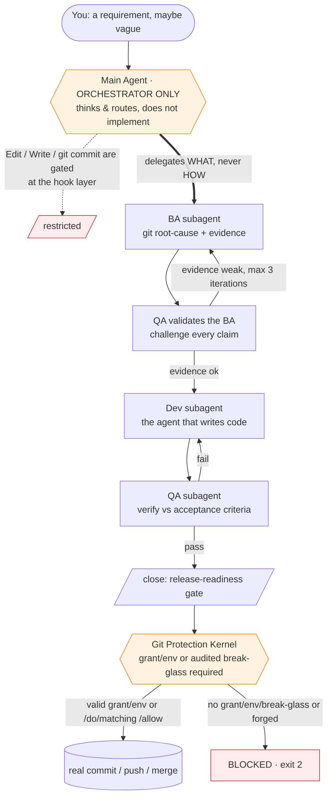

# `awesome-claude-harness` — A Self-Governing Agent Operating System for Claude Code

**In plain English: this turns Claude Code into a disciplined software team that gates every dangerous git operation, reviews its own analysis before writing a line of code, and can fix bugs overnight while you sleep — reducing the risk of nuking `main` through hook-enforced gates and audited break-glass paths.**

> **By default, the main agent does not write your code (the `/do` break-glass is the audited exception). It hires specialists, gates every dangerous move at a git kernel, and ships verified work while you sleep.**

This repository is a complete, battle-tested **Claude Code configuration** that turns a single chat agent into a disciplined software team. A main agent that *orchestrates* and delegates every real change to single-purpose subagents; an evidence-gated `/spec → /dev → /close → /commit → /push` pipeline where the *analysis* is reviewed before a line of code is written; a defense-in-depth wall of lifecycle hooks that make the most expensive mistakes mechanically hard — gated by hooks that fail closed by default, with narrow audited human break-glass paths (`/do`, `/allow`); and an autonomous overnight loop that explores a codebase, finds bugs, fixes them, verifies them, and commits them — unattended, until a wall-clock end time.

It is not a prompt pack. It is an operating system for agents — with a scheduler, a permission model, a filesystem layout, a self-updating documentation layer, and a git protection kernel paid for in real lost work. Every mechanism below traces to a file in this repo, and several trace to a specific catastrophe that forced it into existence.

<p>


</p>

**Version**: v1.0.0 · [CHANGELOG](CHANGELOG.md)

---

## Install in 30 seconds

**Prerequisites:** Python 3, `git`, and `jq` must be installed before cloning. Run `python3 --version && git --version && jq --version` to verify.

```bash
# (optional) back up any existing ~/.claude config first:
# mv ~/.claude ~/.claude.bak-"$(date +%Y%m%d-%H%M%S)"

# 1. Clone
git clone https://github.com/Yugoge/awesome-claude-harness.git ~/.claude

# 2. Bootstrap — creates the venv, installs dependencies, makes hooks executable
~/.claude/scripts/bootstrap

# 3. Start Claude Code — hooks activate on the next session
claude
```

**Abridged sample output (paths differ per machine):**

```text
Harness home (live):  <repo-root>
Demo home (ephemeral): <tmp-demo-home>/dot-claude
Shared resolver resolved the demo home by structural sentinel (basename 'dot-claude', not '.claude').

=== STEP 1 — attempt a DANGEROUS operation (must be BLOCKED) ===
An agent (role: dev) attempts to write to a protected target:
  <tmp-demo-home>/dot-claude/work/DEMO-FORBIDDEN-overwrite-a-guard.txt
BLOCKED (exit 2) by the guard, fail-closed:
  BLOCKED by tool-policy.v1: {"role":"dev","tool":"Write","target":"...DEMO-FORBIDDEN...","deny_reason":"write target matches deny rule"}

=== STEP 2 — apply a properly-AUTHORIZED fix (must be ALLOWED) ===
The same agent now performs the authorized, in-scope fix:
  <tmp-demo-home>/dot-claude/work/fix-applied.txt
ALLOWED (exit 0) by the guard — the operation is within policy.

=== STEP 3 — the authorized fix COMPLETES ===
Fix write landed on disk:
  <tmp-demo-home>/dot-claude/work/fix-applied.txt -> guard demo: fix applied after grant-gated authorization

=== RESULT ===
PASS — dangerous op BLOCKED (exit 2), then grant-gated fix COMPLETED (exit 0 + write landed).
Re-run this script under any non-root $HOME for the same deterministic result.
```

Run it yourself: `bash examples/guard-demo/run-demo.sh`

---

## Why this exists

Powerful coding agents fail in three predictable, expensive ways. Two of these are not hypothetical here — they are scars, with dates and commit hashes, in the source of this repo.

1. **They do too much themselves.** A single context window tries to analyze, implement, test, *and* commit — and quality silently collapses under the load. Agents fix plausible problems instead of proven ones (a mobile bug "fixed" on desktop for six cycles; a CSS symptom patched six times when the real fix was a data-hydration layer underneath).
2. **They make irreversible mistakes.**
   - On **2026-04-19 23:02:22**, a dev subagent ran `git stash && cd packages/happy-app && git checkout` [`925f5960`](https://github.com/Yugoge/awesome-claude-harness/commit/925f5960) `-- .`. The wide-path `-- .` checkout overwrote the entire directory with old baseline content and **erased 17 days of UI work** — then reported it like a minor accident. (`hooks/pretool-bash-safety.sh`)
   - On **2026-04-21 17:45 UTC**, in an ordinary *interactive* session (`962de59f`), the user typed "全部commit push" and the orchestrator answered by authoring a **93-file `commit` + `push` with zero human signoff** (regression [`b5d447e`](https://github.com/Yugoge/awesome-claude-harness/commit/b5d447e)). (`hooks/pretool-git-privilege-guard.py` docstring)
3. **They drift from the requirement.** The thing that ships is a confident-sounding cousin of the thing you actually asked for.

This configuration attacks all three with **structure, not vibes** — and crucially, with mechanisms enforced in code rather than requested in prose:

- **An orchestrator-only main agent.** A `PreToolUse` gate restricts the main agent so the work goes to a fresh, single-purpose specialist. (`hooks/pretool-orchestrator-gate.py`)
- **A git protection kernel.** Layered hooks refuse `commit / push / merge / reset --hard` from an agent unless a single-use, per-operation authorization is present (a **time-boxed** nonce grant for commit; a branch/head/remote-bound grant for push; a `/merge` env var for merge) — or a human break-glass path (`/do`, `/allow`) authorizes it. (`hooks/pretool-git-privilege-guard.py`, `hooks/pretool-bash-safety.sh`)
- **An evidence-gated BA → QA-of-BA → Dev → QA pipeline.** The analysis is QA'd *before* coding; every factual claim needs proof; the user's verbatim words are the binding spec. (`commands/dev.md`, `agents/ba.md`, `agents/qa.md`)

The result: an agent you can hand a vague bug report to at midnight and find a verified, committed fix for in the morning — without ever worrying it nuked `main`.

---

## The big idea, in one diagram



The main agent's job is to *think and route*. Code is written by a `dev` subagent in its own clean context. Every git mutation must pass through the kernel. This separation is enforced by hooks — not by asking the model nicely.

---

## The full pipeline

The harness is one lifecycle, not a bag of commands. Each stage hands a verified artifact to the next.

```
   /spec                                  capture the requirement verbatim, split into per-agent briefs
     │
     ▼
   /do · /dev · /dev-command · /dev-overnight     do the work (direct, orchestrated, or autonomous)
     │
     ▼
   /close                                 release-readiness gate (QA, optionally a Codex debate)
     │
     ▼
   /commit                                surgical staging + conventional message + commit grant
     │
     ▼
   /merge · /push                         bridge to the target branch · single-process gated push
```

`--codex` rides alongside `/dev`, `/close`, and `/commit` as an opt-in adversarial second opinion. The git protection kernel sits *under* `/commit`, `/merge`, and `/push`, and **default-denies** covered privileged git mutations unless the wrapper authorization is present — a single-use grant for commit/push, the `/merge` env var for merge — or an audited human break-glass path (`/do` for the main agent, or a matching `/allow`) applies.

---

## Feature highlights

| Capability | What it gives you | Grounded in |
|---|---|---|
| **Orchestrator-only architecture** | The main agent routes; each real edit goes to a fresh subagent with one job and a clean context, so quality stays high. | `hooks/pretool-orchestrator-gate.py`, `CLAUDE.md` |
| **Durable specs** | `/spec` captures the requirement verbatim, persists design + evidence, and splits the monolith into per-agent briefing books with Gawande-style checkpoints. Feeds the `/dev` pipeline as the authoritative source of truth. | `commands/spec.md`, `agents/spec.md` |
| **Evidence-gated BA → Dev → QA pipeline** | The analysis is QA'd *before* coding; every claim needs proof (git blame, grep, import-chain); the user's verbatim words are the binding spec. The pipeline runs as `/spec → /dev → /close → /commit → /push` — each stage hands a verified artifact to the next. | `commands/dev.md`, `agents/ba.md`, `agents/qa.md` |
| **Release-readiness gate** | `/close` proves not just "the code works" but "the system can ship it" — four Workflow-Integrity checks, optionally a multi-round QA↔Codex debate — before `/commit` and `/push` are allowed to proceed. | `commands/close.md` |
| **Git protection kernel** | `commit / push / merge / reset --hard` from an agent are refused unless a single-use, per-operation authorization is present (a **time-boxed** nonce grant file for commit; a branch/head/remote-bound grant for push; the `/merge` env var for merge); wide-path checkout, stash-as-buffer, and all hard resets are blocked **by default** — `bash-safety` and the privilege-guard refuse these destructive forms unless a human break-glass path (`/do`, or a matching `/allow` grant) authorizes the specific command. Every guard traces to a real incident with a date and commit hash. | `hooks/pretool-git-privilege-guard.py`, `hooks/pretool-bash-safety.sh` |
| **Autonomous overnight pipeline** | `/dev-overnight 6:00` runs an unattended explore → triage → fix → verify → commit loop in a dedicated linked worktree until a wall-clock end time. The Stop-hook physically refuses to end the session early, so the loop cannot be short-circuited. (See limitation note in that section.) | `commands/dev-overnight.md`, `hooks/stop-overnight-timelock.py` |
| **Structured break-glass grants** | `/allow` writes a *structured* grant (`{op, target, args_contain}`) matched by command **structure** — the sanctioned path — rather than the fragile substring grep of the legacy fallback that still lingers; it is consumed on any terminal result. | `hooks/lib/allowlist.py`, `commands/allow.md` |
| **Branch / PR / worktree firewall** | Creating a branch, PR, or worktree is forbidden by default everywhere, with explicit human escape hatches and a live-overnight exception. | `hooks/pretool-block-branch-pr-worktree.py`, `hooks/pretool-block-enterworktree.sh` |
| **Crash-proof checkpoints** | Automated snapshots are written to `refs/checkpoints/<branch>` via git plumbing — recoverable, audit-friendly, and they **never move `HEAD`**, so `git blame` always points at a real semantic commit. | `hooks/lib/checkpoint-core.sh`, `docs/reference/checkpoint-mechanism.md` |
| **Self-updating documentation** | Edit a command or agent and the `INDEX.md` files and README/CLAUDE stat blocks regenerate automatically — your hand-written prose outside the `AUTO` markers is preserved. | `hooks/posttool-doc-sync.py`, `hooks/doc_sync/` |
| **Adversarial second opinion** | Add `--codex` to `/dev`, `/close`, or `/commit` to run an OpenAI Codex round against the draft, through a fail-closed isolation wrapper. Catches over-engineering, missed edge cases, and scope drift before QA inherits the mistake. | `commands/codex.md`, `commands/close.md` |
| **UI-audit skill suite** | A Playwright-driven UI review suite — axe-core injection, APCA contrast, a 58-rule anti-pattern catalog, a state matrix, token conformance, and a weighted beauty score. | `skills/` |

---

## How it actually works

### Walkthrough 1 — `/dev "the login button is misaligned on mobile"`

1. **The orchestrator parses, then delegates — it does not investigate.** A `UserPromptSubmit` hook pre-creates the per-agent sentinel files and writes your verbatim requirement to disk as the source of truth. (`commands/dev.md`)
2. **Specialists are consulted when relevant.** A misalignment-on-mobile report trips the `ui-specialist` trigger; the orchestrator must justify, per specialist, RELEVANT-or-SKIP — silently skipping is itself a violation.
3. **The BA subagent builds the spec.** It does git root-cause analysis, finds the *actual* file (not a plausible cousin), and emits a Markdown ticket plus a JSON context, scored on five clarity dimensions (What / Why / Where / Scope / Success). (`agents/ba.md`)
4. **QA validates the BA *before any code is written*.** It cross-examines every claim: is there git-blame evidence? do these files exist? did the scope quietly narrow? did this contradict a prior cycle's attempt? If the map is weak, BA is sent back — a one-hour analysis correction is far cheaper than six implementation loops on the wrong layer. The QA→BA iteration loop runs for up to 3 rounds; after 3, unresolved objections are appended to the context JSON and the workflow proceeds with documented assumptions rather than blocking indefinitely. (`commands/dev.md`, `agents/ba.md`)
5. **The Dev subagent implements** the vetted plan, with a minimum-diff discipline and a self-verification (build + smoke) step. (`agents/dev.md`)
6. **QA verifies against the acceptance criteria.** On failure, QA returns a structured objection (closed-enum categories: wrong_layer, missing_evidence, over_diff, etc.) and Dev is re-invoked with the objection as explicit context — not just "try again." If the QA objects that the fix lands at the wrong abstraction layer (e.g., patching a CSS symptom when the real bug is in data hydration), the BA may be re-invoked to revisit the root-cause analysis before Dev tries again. The Dev→QA loop is bounded at 5 attempts; if attempts 1 and 2 both targeted the same fix layer and failed, attempt 3 must target a different layer. After 5 Dev→QA failures the orchestrator surfaces the impasse to the user.
7. **`/close → /commit → /push`** lands the change. `/close` is the release-readiness gate (a QA verdict, not a git grant); then `/commit` and `/push` each pass the git kernel under their own single-use grant.

### Walkthrough 2 — a hook firing

You (the agent) try the obvious shortcut:

```bash
CLAUDE_PUSH_COMMAND_ACTIVE=1 git push
```

`hooks/pretool-git-privilege-guard.py` runs *before* the tool executes. For push it scans the raw command text for the literal `CLAUDE_PUSH_COMMAND_ACTIVE=` prefix and recognizes it as an env-injection attempt — the sanctioned env var must be set by the `/push` wrapper in the child's real environment, not pasted onto the command line — and returns exit 2: **BLOCKED** before any `/push` grant or `/allow` is consulted — absent main-agent `/do` (under main-agent `/do` the guard exits 0 before inline-env detection runs). The **normal automated** honored path is a `/push` wrapper grant file (a nonce-keyed file the guard locates by glob), validated by single-use unlink and matched against the current branch, expected head, and remote (the push grant carries no `expires_at` — unlike the commit grant it is branch/head/remote-bound rather than time-boxed); separately, a human-created matching `/allow` sentinel can authorize a matching git command, and main-agent `/do` is the audited break-glass. Absent a `/push` grant, a matching `/allow`, or main-agent `/do`, a bare agent `git push` is refused. (A bare agent `git commit` is likewise refused — there it is the default-deny-without-a-grant rule, not inline-env detection, that blocks it.) (`hooks/pretool-git-privilege-guard.py`)

That is the whole philosophy in miniature: the model is *encouraged* toward the right path and *physically prevented* from the wrong one — and when it is prevented, the evidence is left on disk.

**The success path for the same push:** the `/push` command writes a nonce-keyed grant file to `/tmp/claude-push-grant-<sid>-<nonce>.json` carrying the expected branch name, expected HEAD SHA, and target remote. The privilege-guard locates this file by glob, validates those three fields against the current git state, and only then allows the `git push` to execute — consuming (unlinking) the grant immediately so it cannot be reused. A bare `git push` without this grant is blocked the same way as the inline-env injection above.

---

## The git protection kernel

This is the part that was paid for in lost work. Two real incidents shaped it:

> **The 17-days-erased disaster.** On 2026-04-19, a dev subagent used `git stash` as a throwaway buffer, then ran `git checkout` [`925f5960`](https://github.com/Yugoge/awesome-claude-harness/commit/925f5960) `-- .` inside `packages/happy-app/`, silently overwriting 17 days of UI work with an old baseline. So `hooks/pretool-bash-safety.sh` now blocks **stash-as-buffer** (`git stash push/save/-u/--all` and bare `git stash`), **wide-path checkout-from-a-ref** (`git checkout <ref> -- .` / `-- *` / `-- dir/`), its modern `git restore --source=… -- .` equivalent, and **every `git reset --hard` form** — each blocked **by default**, absent a main-agent `/do` or a matching `/allow` grant. Single-file checkout (`git checkout <ref> -- path/to/file.ts`) stays allowed.
>
> **Concrete example:** if an agent tries `git checkout abc123 -- .`, bash-safety blocks it with exit 2 and logs the incident date. To restore a single file: `git checkout abc123 -- hooks/pretool-bash-safety.sh` — that is allowed. To widen the checkout back to a whole directory, a human must first `/allow git checkout` with the matching `args_contain`.

> **The 93-file sweep.** On 2026-04-21 17:45 UTC, in an *interactive* (not overnight) session, the prompt "全部commit push" produced regression [`b5d447e`](https://github.com/Yugoge/awesome-claude-harness/commit/b5d447e): a 93-file `commit` + `push` authored by the orchestrator with no human signoff. The lesson was that gating on overnight-context alone would let this exact class through. So `hooks/pretool-git-privilege-guard.py` was made **always-on** — it runs on every Bash call in both subagent and main-agent contexts — and now requires a single-use authorization for each privileged verb (a **time-boxed** nonce grant file for commit; a single-use branch/head/remote-bound grant for push; an env var set by `/merge` for merge).

```mermaid
flowchart TD
    B[Bash: a git verb] --> H1[orchestrator-gate<br/>rate-limit, /do bypass]
    H1 --> H2[bash-safety<br/>blocks by default: stash-buffer · wide checkout · reset --hard<br/>(/do or matching /allow break-glass)]
    H2 --> H3[bulk-commit-detector<br/>warns on the 93-file 'sync' shape]
    H3 --> H4[git-privilege-guard<br/>ALWAYS-ON · the verb that actually blocks]

    H4 --> C{which verb?}
    C -->|commit| G1{grant file present + unexpired (ISO expiry),<br/>single-use unlink?}
    C -->|push| G2{grant file: branch + expected-head<br/>+ remote, single-use?}
    C -->|merge| G3{CLAUDE_MERGE_COMMAND_ACTIVE env<br/>set by /merge?}
    C -->|reset --hard| G4[blocked by default in agent flow]

    G1 & G2 -->|yes| OK[(allow, then unlink the grant)]
    G3 -->|yes| OK
    G1 & G2 & G3 -->|no grant/env and no break-glass| NO[BLOCKED · exit 2]
    G4 --> NO

    classDef block fill:#ffebee,stroke:#c62828
    classDef ok fill:#e3f2fd,stroke:#1565c0
    class NO block
    class OK ok
```

**How the chain divides labor (described accurately):**

- **`pretool-bash-safety.sh`** is the blunt instrument: it refuses the destructive shell forms above **by default**, by command shape (a main-agent `/do` or matching `/allow` grant is the audited exception), with the incident dates quoted in the block message.
- **`pretool-bulk-commit-detector.py`** independently recognizes the 93-file "sync all uncommitted…" fan-out shape (3+ subsystems touched + a `sync…uncommitted` / `chore(claude): sync` subject). Per current user policy it is **warn-only** — it emits a loud stderr warning and exits 0; it does not block. The *blocking* of an agent commit/push is the privilege-guard's job.
- **`pretool-git-privilege-guard.py`** is the always-on kernel. It default-denies agent `commit` (unless the message is the blessed `auto-bulk: end-of-cycle commit for …` bridge, which itself requires a `/commit --bulk` sentinel), `merge` (unless `/merge` set its env var), `push` (any form), `reset --hard` (every form), and direct ref mutation. The sanctioned escapes for commit and push are single-use grant manifests at `/tmp/claude-{commit,push}-grant-<sid>-<nonce>.json`, each carrying a nonce; only the **commit** grant additionally carries an ISO-8601 UTC `expires_at` (the **push** grant has no `expires_at`). The two grants differ in what the guard checks: a **commit** grant is validated only for expiry and single-use consumption (it does *not* re-check allowed files or a message SHA at the guard); a **push** grant is validated against the current branch, expected head, and remote, and single-use consumption only — no expiry. Grants are consumed (unlinked) on use.
- **The privilege-guard default-denies every agent absent a sanctioned path.** A subagent never benefits from `/do` (the guard refuses the consent flag whenever an `agent_id` is present). The human break-glass paths are `/do` (main-agent only, audited) and a matching structured `/allow` sentinel grant (honored even in subagent context); legacy git-allowlist grants remain main-agent only. `/do` also leaves the orchestrator-gate streak state untouched, keeping its semantics clean.

Read-only git (`status`, `log`, `show`, `diff`, `blame`, `ls-files`, `branch` listing, `stash list/show`) stays freely available. A handful of non-read-only verbs are also permitted by policy — `add`, single-file working-tree `restore`, and `stash pop` — they mutate the index or working tree but never history or the remote.

---

## The overnight autonomous pipeline


`/dev-overnight` runs a todo-completion-driven loop inside a dedicated worktree. A `Stop` hook (`hooks/stop-overnight-timelock.py`) physically refuses to end the conversation until your wall-clock end time, so the loop cannot be short-circuited — the hook compares the current time against the declared end time and returns exit 2 (blocking the Stop event) until the deadline passes, defaulting to an 8-hour session if no end time is provided. Each issue gets its own one-issue-per-subagent pipeline; cycles deduplicate against state and end with a real, merge-ready commit. Cancel any time with `/stop`.

> **Honestly-documented limitation.** The overnight session runs in a *linked* worktree that **shares the repository `.git` common-dir** with the main checkout. The current locks (a git reference-transaction keystone for HEAD/ref moves, plus a per-Bash-command bind-mount boundary for main-tree writes) are treated as sufficient for the cycle, **but the shared-`.git` residual is an accepted deviation, not a clean isolation guarantee** — an actor that mutates shared git config/hooks could in principle disable the keystone. The repo says so plainly rather than hiding it: *"Do NOT claim protection against shared-`.git` mutation."* (`commands/dev-overnight.md`)

---

## The cast: 23 subagents

The orchestrator dispatches specialists by *describing the problem* — never the tooling (`hooks/pretool-orchestrator-prompt-purity.py` watches for leaked "HOW"). Each picks its own approach and returns a structured report.

| Agent | Availability | Dispatch trigger |
|---|---|---|
| **`ba`** | always-on | Every `/dev` invocation — requirements analyst; git root-cause analysis → Markdown ticket + JSON context. |
| **`dev`** | always-on | After QA validates the BA spec — implementation specialist; writes the change under minimum-diff discipline. |
| **`qa`** | always-on | Twice per `/dev` cycle: once to validate the BA, once to verify the implementation. |
| **`test-writer`** | always-on (conditional) | When task complexity ≥ STANDARD or risk is high — emits pytest skeletons with `pytest.fail("TEST_INCOMPLETE:…")` hard-stops. |
| **`graphify`** | always-on (optional dep) | Between BA and Dev — incremental code-graph enrichment; injects a focused subgraph into the Dev context. Skipped gracefully if binary absent. |
| **`spec`** | on-demand | `/spec` invocation — splits a monolithic spec into per-agent views + Gawande-style checkpoints. |
| **`architect`** | overnight + on-demand | During overnight specialist scan — structural issues, tech debt, dependency and pattern problems. |
| **`product-owner`** | overnight + on-demand | During overnight specialist scan — feature completeness, user flows, business-logic bugs. |
| **`user`** | overnight + on-demand | During overnight specialist scan — end-user simulation; UX friction and broken flows. |
| **`ui-specialist`** | overnight + on-demand | When a user-facing change is detected or `/test` with UI mode — visual-design quality + Playwright UI audit with a 1–10 beauty score. |
| **`pm`** | overnight | Orchestrates overnight: PLAN (explores live app), TRIAGE (routes issues), RETRO (hand-off to next cycle). |
| **`changelog-analyst`** | on-demand | `/commit` invocation — classifies files, stages surgically (own-hunks only), writes conventional commits, emits the push-gate token. |
| **`push-analyst` / `merge-analyst` / `pull-analyst`** | on-demand | `/push`, `/merge`, `/pull` invocations — pre-push, pre-merge, and post-pull risk analysis with nonce-keyed grants. |
| **`cleaner` / `cleanliness-inspector` / `style-inspector` / `rule-inspector`** | on-demand | `/clean` invocation — the `/clean` cohort: detect, audit, and execute project hygiene. |
| **`prompt-inspector` / `git-edge-case-analyst`** | on-demand | On request — documentation-verbosity and git-history edge-case discovery. |
| **`test-executor` / `test-validator`** | on-demand | `/test` invocation — execute and validate test infrastructure. |

> Full, auto-maintained roster: [`agents/README.md`](agents/README.md).

---

## The command surface: 35 slash commands

| Group | Commands | What they do |
|---|---|---|
| **Spec** | `/spec` · `/spec-update` | Capture the requirement verbatim, persist design + evidence, split into per-agent briefs + checkpoints; append continuation cycles. |
| **Develop** | `/dev` · `/dev-command` · `/dev-overnight` · `/redev` | Orchestrated single-pass dev, command-authoring dev, autonomous overnight loop, and re-dev of a prior cycle. |
| **Ship** | `/close` · `/commit` · `/merge` · `/push` · `/pull` · `/checkpoint` | The release-readiness gate and the grant-gated git pipeline. |
| **Quality** | `/clean` · `/test` · `/code-review` · `/refactor` · `/optimize` · `/security-check` | Cleanup cohort, test workflow, and review passes. |
| **Understand** | `/explain-code` · `/file-analyze` · `/doc-gen` · `/doc-sync` | Code explanation, file analysis (PDF/Excel/Word/images), documentation. |
| **Research** | `/deep-search` · `/research-deep` · `/search-tree` · `/reflect-search` · `/site-navigate` | Fan-out, fact-checked, multi-source web research. |
| **Control** | `/do` · `/allow` · `/stop` · `/codex` · `/quick-commit` · `/quick-prototype` · `/fswatch` · `/playwright-helper` | Break-glass consent, overnight cancel, Codex delegation, and fast paths. |

`/do` and `/allow` are the two human escape hatches:

- **`/do`** lets the *main* agent do direct work for one task and requires a deterministic `do-report` before `/close`. A human's `/do` consent is recognized by the orchestrator gate, bash-safety, and the always-on git-privilege-guard — so it lets the main agent through all three, which is the entire point of break-glass. It applies to the **main agent only**: a subagent never benefits from the consent flag. It does **not** quiet the bulk-commit detector's warning.
- **`/allow`** writes a single, **structured** break-glass grant for one specific operation, matched by command **structure** (`op` / `target` / `args_contain`) — the sanctioned path, in preference to the fragile substring matching that a legacy fallback in `hooks/lib/allowlist.py` still retains. Refuse-by-default is the rule (the exact match-all hole was closed in commit `7dbdd307`, "/allow consent is refuse-by-default — close match-all grant hole"). The grant is single-use and consumed on any terminal result.

  Example grant file at `/tmp/claude-grants/<task_id>.json` (for `git checkout abc123 -- hooks/pretool-bash-safety.sh`):
  ```json
  {"task_id": "20260705-113208", "session_id": "dev-...", "allowed_operations": [{"op": "git", "args_contain": ["checkout", "abc123", "--", "hooks/pretool-bash-safety.sh"]}], "created_at": "2026-07-05T11:32:08Z", "expires_at": "2026-07-05T12:32:08Z"}
  ```
  The hook matches on `op` (first whitespace-separated token of the sub-command, skipping leading `KEY=VAL` env-var tokens) and optionally on `args_contain` (leading argument sequence from that token onward — prefix match, not arbitrary containment) — command-text substring grep is not the match channel.

Most release commands carry `disable-model-invocation: true` so an agent can't self-invoke them via SlashCommand. Because that flag does **not** block the `Skill` tool, every human-only command is *also* denied as `Skill(<name>:*)` in `permissions.deny` — the human is the trust root.

> Full, auto-maintained list: [`commands/README.md`](commands/README.md).

---

## Setup details

### Try it in 30 seconds (no Claude Code required)

The project ships a runnable demo that exercises the real guard (`pretool-tool-policy.py`) against an isolated ephemeral home — no Claude Code session needed. Run it from any non-root `$HOME`:

```bash
examples/guard-demo/run-demo.sh
```

Expected output:

```
=== STEP 1 — attempt a DANGEROUS operation (must be BLOCKED) ===
BLOCKED (exit 2) by the guard, fail-closed:
  ...

=== STEP 2 — apply a properly-AUTHORIZED fix (must be ALLOWED) ===
ALLOWED (exit 0) by the guard — the operation is within policy.

=== STEP 3 — the authorized fix COMPLETES ===
Fix write landed on disk: ...

=== RESULT ===
PASS — dangerous op BLOCKED (exit 2), then grant-gated fix COMPLETED (exit 0 + write landed).
```

Exit 0 means the block-then-grant-then-complete sequence worked as designed. See [`examples/guard-demo/run-demo.sh`](examples/guard-demo/run-demo.sh) for details.

### Dependencies (REQUIRED vs OPTIONAL)

A newcomer can run the core development pipeline with just the **REQUIRED** rows; every optional integration degrades gracefully when its dependency is absent.

<details>
<summary>Dependency requirements</summary>

| Dependency | Tier | What needs it | Degrades when missing |
|---|---|---|---|
| [Claude Code](https://claude.com/claude-code) | **REQUIRED** | The host. Must be recent enough to fire `UserPromptSubmit` / `Notification` / `SubagentStop` hook events, honor `disable-model-invocation` frontmatter, and enforce `Skill(*)` permission denies — older clients silently skip these and the guardrails won't engage. | All hooks fail silently — the entire guardrail stack disengages. |
| Python 3 + a venv at `~/.claude/venv` | **REQUIRED** | Runs every Python hook (the git kernel, gates) and helper script. The venv ships empty — `scripts/bootstrap` creates it and installs the manifest (Quickstart step 3). | Python hooks fail at import time; git kernel inactive. |
| `git` | **REQUIRED** | The whole harness is git-native (checkpoints, grants, keystone). Any recent git (2.4x+) works for normal use; the overnight keystone's structural HEAD-switch protection needs **git ≥ 2.46** (verified by `scripts/overnight-git-selftest.sh`). | No checkpoints, no grant-gated git operations, no overnight loop. |
| `git reference-transaction` hook (keystone) | **REQUIRED keystone** | The overnight keystone (`hooks/git-keystone/`) installs a `reference-transaction` hook into `<git-common-dir>/keystone-hooks/` and sets `core.hooksPath` to point there; it fires atomically on every HEAD/ref move and structurally prevents unauthorized ref rewrites during overnight sessions. Needs git ≥ 2.46. | Without it, the overnight linked worktree has no structural protection against unauthorized `HEAD` rewrites — the shared-`.git` residual is exposed. Core `/dev` pipeline is unaffected. |
| `jq` | **REQUIRED** | JSON parsing in shell hooks/scripts across the pipeline. | Shell hooks that parse grant files or settings.json silently fail or misparse JSON. |
| Bash + GNU userland (coreutils, util-linux/`flock`, findutils, `grep`, `sed`, `awk`/gawk) | **REQUIRED** | `realpath`, `flock`, `stat`, `sha256sum`, `date`, `grep`, `sed`, `awk`, `find` are used pervasively across the `#!/bin/bash` hooks/scripts. The GNU forms are assumed — BSD/macOS variants differ in flags and can break hooks; install the GNU userland there. | Hook failures on BSD/macOS with wrong flag variants; `flock`-based serialization unavailable. |
| `pytest`, `jsonschema`, `pyyaml` (the test/runtime manifest) | **REQUIRED** for `/test` + generated tests | `/test` and the test-writer's generated AC tests run under pytest and parse schema/YAML. These are pinned in [`requirements.txt`](requirements.txt) and installed automatically by `scripts/bootstrap`; `scripts/doctor` reports any that are missing before your first run. | `/test` fails; test-writer skeletons cannot be executed; schema validation unavailable. |
| OpenAI Codex CLI + an isolation wrapper (`CODEX_ISO_BIN`) | **REQUIRED** for `--codex` / `/codex` | The adversarial second-opinion rounds shell out to the Codex CLI through a fail-closed isolation wrapper. **You must supply your own** Codex CLI and wrapper and point `CODEX_ISO_BIN` at it (there is no hardcoded author path). Without it, `--codex`/`/codex` are unavailable (the rest of the pipeline is unaffected). | `--codex` / `/codex` unavailable; rest of the pipeline unaffected. |
| `openssl` | **REQUIRED** for `/merge`, `/push` | Nonce / token generation in the grant-gated git release path. | `/merge` and `/push` cannot generate nonce-keyed grants → those commands fail at grant-write step. |
| `bwrap` (bubblewrap) | **REQUIRED** for `/dev-overnight` | The per-Bash bind-mount boundary that isolates overnight main-tree writes. | Overnight launch still works; non-worktree-local write fails closed (security-relevant). |
| `graphify` CLI (`graphifyy` v0.8.25 on PyPI; the binary is `graphify`) | OPTIONAL (graceful) | Incremental code-graph enrichment injected into the Dev context. Default-enabled (`CLAUDE_GRAPHIFY_ENABLED=auto`); if the binary is absent the pipeline degrades and proceeds. Install: `~/.claude/venv/bin/pip install graphifyy`, then point `GRAPHIFY_BIN` at the installed `graphify`. | Code-graph context absent from Dev dispatch; BA blast-radius map skips graph enrichment. Dev still runs without it — quality may be lower on large refactors. |
| [Playwright MCP](https://github.com/microsoft/playwright-mcp) | OPTIONAL overall; **REQUIRED for user-facing QA/E2E + UI audits** | Powers the UI-audit skill suite, the overnight PM's live-app exploration, and QA's live browser verification of user-facing changes (QA fails closed when a user-facing change cannot be browser-verified). Not needed for doc/config/non-user-facing cycles. | Non-user-facing cycles unaffected; QA fails closed only when a user-facing change cannot be browser-verified. |
| Python pkg `websocket-client` | OPTIONAL (graceful) | A few websocket enrichments; hooks fall back to lenient paths when missing. (`jsonschema` + `pyyaml` are now REQUIRED via the manifest above.) | Websocket enrichments silently skipped; fallback path active. |
| `fswatch` | OPTIONAL | Backs `/fswatch` file-watching; not needed by the core pipeline. | `/fswatch` command unavailable; core pipeline unaffected. |
| `node` + a user-supplied `EXCEL_ANALYZER` | OPTIONAL | `/file-analyze` spreadsheet/document analysis. You provide the analyzer; absent → that file type is skipped. | Spreadsheet/document analysis unavailable; other file types still work. |

</details>

> **One-line summary:** install Claude Code + Python 3 + git + jq + the GNU userland + openssl, then run `scripts/bootstrap` — it creates the venv and installs the manifest (`pytest` + `jsonschema` + `pyyaml`), which covers the core `/dev → /close → /commit → /push` pipeline (`/push` needs `openssl`). Run `scripts/doctor` first if you want a preflight of what's missing. Add the Codex CLI + wrapper (`CODEX_ISO_BIN`) for `--codex`, graphify for code-graph context, Playwright MCP for UI/overnight (and user-facing QA), and `bwrap` for `/dev-overnight` as you need them.

```bash
# 1. Back up any existing config (timestamped + non-destructive; aborts on failure)
[ ! -e ~/.claude ] || mv ~/.claude ~/.claude.bak-"$(date +%Y%m%d-%H%M%S)"

# 2. Clone this repo to ~/.claude
git clone https://github.com/Yugoge/awesome-claude-harness.git ~/.claude

# 3. (optional) Preflight — report any missing required dependencies first
~/.claude/scripts/doctor

# 4. Bootstrap — creates the venv, installs the manifest (pytest + jsonschema +
#    pyyaml), makes the shell hooks executable, and verifies the resolver.
#    It is non-destructive: it refuses to clobber an existing populated home
#    without --force (which backs up the prior venv before applying).
~/.claude/scripts/bootstrap

# 5. Start Claude Code — the SessionStart hooks announce the environment.
claude
```

> The bootstrap resolves the harness home structurally from its own location
> (via `hooks/lib/claude_home.{sh,py}`), so there is no `/root` path to rewrite —
> it works whether your clone lives at `~/.claude` or anywhere else.

The hooks are wired in `settings.json` and activate on the next session. Try them:

```bash
# Orchestrated development (vague requirements welcome)
/dev add a --dry-run flag to the export command

# Adversarial review enabled
/dev --codex fix the off-by-one in pagination

# Autonomous overnight run until 6am, focused on a subsystem
/dev-overnight 6:00 fix flaky tests in the parser

# Cancel an overnight session
/stop
```

### Portability contract

This section is a **contract**, not a warning: it states what the harness *guarantees* on a fresh non-root clone versus what needs external setup, and it is backed by an executable test.

**The core harness runs on a fresh non-root clone.** Clone to `$HOME/.claude` on any Linux box (non-root user, `$HOME` not under `/root`), populate the venv (Quickstart), and the core flows — `/dev`, `/spec`, `/commit`, the always-on security guards — resolve to *your* home with **zero author-path literals load-bearing**. The harness locates its own home structurally (the shared `hooks/lib/claude_home.{sh,py}` resolver walks up to the `settings.json` + `hooks/` + `policies/` + `scripts/` sentinel set), so there is no `/root` to rewrite. This is **verified by the fresh-clone smoke test** (`tests/` WS2), which runs under a synthetic non-root `$HOME` with the author's home absent and asserts both *"core is runnable"* and *"the security guards engage"*.

**These specific extras require external setup** (their absence never breaks the core — it degrades to a one-line "unavailable" message and the flow continues):

| Extra | Needed for | When absent |
|---|---|---|
| OpenAI Codex CLI + an isolation wrapper (`CODEX_ISO_BIN`) | `--codex` / `/codex` adversarial rounds | `--codex`/`/codex` unavailable; rest of the pipeline unaffected — **never** falls back to a bare unsafe `codex` |
| `graphify` CLI (`GRAPHIFY_BIN`) | code-graph enrichment of the Dev context | enrichment skipped; pipeline proceeds degraded |
| `bwrap` (bubblewrap) + user namespaces | the per-command write boundary in `/dev-overnight` | overnight launch still works; a non-worktree-local write **fails closed** (the write guarantee is security-relevant) |
| Playwright MCP | live-browser UI audits / user-facing QA | non-user-facing cycles unaffected; QA fails closed only when a user-facing change cannot be browser-verified |
| `~/.claude` symlink onto a RAM disk; `SESSION_PROMOTE_BIN`, `UI_EVIDENCE_AUDIT_BIN` | the author's RAM-disk + session-promote / ui-evidence conveniences | the structural resolver ignores the symlink convention; optional helpers print "unavailable" |

#### Trust model

**The human is the trust root.** Every release verb (`/commit`, `/push`, `/merge`, `/close`) and every human-only command is denied to agents both via `disable-model-invocation: true` *and* an explicit `Skill(<name>:*)` entry in `permissions.deny` — the only technical barrier against an agent self-invoking a privileged command. The harness assumes the agent itself is the adversary, so guards are enforced in code (a `PreToolUse`/`Stop` hook returning exit 2), never in prose.

#### Fail-closed vs. skip semantics

Absence is handled by exactly one of these outcomes, per the kind of thing that is missing:

| Missing thing | Class | Behavior on absence |
|---|---|---|
| The tool-policy registry (role-scoped deny enforcement) | security | **FAIL CLOSED for every role except the default `dev` role** — a present, valid `tool-policy.v1` enforces its denials normally; if that policy is missing/unparseable or the registry throws, non-`dev` roles fail closed (exit 2) while the default `dev` role gets a sanctioned fail-safe ALLOW. (`pretool-tool-policy.py` fail-closes only on deny-logic bootstrap import failure; an unresolved role or an unexpected top-level hook exception allows.) |
| The always-on git-privilege / bash-safety guards | security | **Block their covered operations in normal operation** — with documented human break-glass paths (`/do`, `/allow`) and a few selected fail-open exception paths that keep a hook bug from bricking the pipeline |
| An optional integration (Codex wrapper, `graphify`, Playwright, session-promote) | optional | **SKIP** — one-line "unavailable" message, core flow continues; no unsafe fallback |
| The spec-coverage verifier (an advisory coverage check, not a blocking guard) | advisory | **SKIP** — an absent verifier allows the stop with a note; when the verifier *is* present, under-coverage still blocks |
| An invalid generated `settings.json` (bad render / dropped required hook) | config | **ABORT** — the install renderer refuses to apply and leaves the live settings unchanged |

Each row maps to a capability in the Dependencies table above, so you can see at a glance which rule applies to anything you have not installed. (The historical hardcoded-path caveat — `git grep -l '/root/\|/dev/shm'` and hand-rewrite — is **superseded** by the resolver above and retained only as background in [`NESTED-REPO.md`](NESTED-REPO.md) / [`CLAUDE.md`](CLAUDE.md).)

### Troubleshooting

| Symptom | Fix |
|---|---|
| **A hook isn't firing** | Shell hooks must be executable: `chmod +x ~/.claude/hooks/*.sh`. Python hooks run through the venv at `~/.claude/venv`. |
| **A slash command doesn't appear** | Check the YAML frontmatter at the top of the file in `commands/`; a malformed `---` block hides the command. |
| **`settings.json` won't load** | Validate it: `python3 -m json.tool ~/.claude/settings.json` — a trailing comma or unquoted key surfaces here. |
| **Helper scripts fail to import** | They expect the venv at `~/.claude/venv`; recreate it with `python3 -m venv ~/.claude/venv` if it's missing. |
| **A commit/push is being blocked** | That's the kernel doing its job — an agent needs a grant from `/commit` or `/push`. As a human, run the git command from your own shell, or use `/do` / `/allow`. |
| **A command is blocked and I don't know why** | The blocking hook writes its reason to stderr (visible in the Claude Code tool output). Look for `BLOCKED by` lines — they name the hook and the rule. Check `/tmp/claude-grants/` for any pending structured grants. If a hook is blocking unexpectedly, inspect the raw hook file referenced in the error: `cat ~/.claude/hooks/<hook-name>`. For grant-related blocks, `ls /tmp/claude-push-grant-*.json /tmp/claude-commit-grant-*.json 2>/dev/null` shows any live grant files and their contents. |
| **Bootstrap / venv failure** | Verify Python 3 is installed: `python3 --version`. If the venv creation fails, check disk space and that `python3-venv` is installed (`apt install python3-venv` on Debian/Ubuntu). Re-run bootstrap with `--force` to back up and recreate the venv: `~/.claude/scripts/bootstrap --force`. If `pip install` fails, check network connectivity — the bootstrap requires internet access to install the manifest packages. |
| **Resolver failure / wrong home detected** | The harness resolves its own home structurally via `hooks/lib/claude_home.{sh,py}` — it walks up from the script location looking for the `settings.json + hooks/ + scripts/` sentinel set. If it reports the wrong path, run `scripts/doctor` for a preflight diagnostics report (it checks the resolver, venv, and required deps). Common cause: the repo was cloned to a non-standard location without `settings.json` present at the root. |

---

## Project structure

```text
.claude/
├── CLAUDE.md          # The constitution: non-negotiable rules the agent must obey
├── ARCHITECTURE.md    # System architecture, verified against the current code
├── NESTED-REPO.md     # Why ~/.claude is its own git repo on a RAM disk
├── settings.json      # 65 wired hook entries (64 distinct files) across 7 lifecycle events
├── agents/            # 23 subagent definitions (BA, dev, QA, architect, …)
├── commands/          # 35 slash-command workflows (/spec, /dev, /close, /commit, …)
├── hooks/             # SessionStart / UserPromptSubmit / PreToolUse / PostToolUse / Notification / Stop / SubagentStop gates
│   ├── lib/           #   shared libs: allowlist (structured sentinel grants), checkpoint-core
│   ├── doc_sync/      #   self-updating INDEX/README/CLAUDE regeneration
│   └── git-keystone/  #   git-native reference-transaction protection
├── scripts/           # 72 helper scripts (graphify, spec resolver, grant writers, execute-push, …)
├── skills/            # 8 skills: the Playwright UI-audit suite (+ ui-shared support)
├── schemas/           # JSON schemas (e.g. cycle-contract.v1.json)
├── policies/          # tool-policy and role-restriction definitions
├── templates/         # spec + settings templates
├── tests/             # test infra; tests/generated/ holds AC-driven pytest skeletons
└── docs/              # architecture, incidents, references, design philosophy, codex research
```

**Core vs. optional:** There are two levels of "required":

- **Git mutation kernel minimum** (security guardrails engage): `settings.json` (wires all hooks) + `hooks/` (the gate layer) + `scripts/bootstrap` + `hooks/lib/` (shared resolver, allowlist, checkpoint). Without these, hooks fail at import time and the kernel is inactive.
- **Full subagent + tool-policy security** (all role-based deny rules active): everything above **plus** `policies/` (contains `tool-policy.v1.json`). Without `policies/`, the pretool-tool-policy gate fail-opens for the `dev` role; other roles fail-closed. If you want the full deny-rule matrix to engage, `policies/` is required.

Everything else is an advisor or convenience: `agents/` and `commands/` define the orchestration behaviors but are not security-critical; `skills/`, `schemas/`, `templates/`, and `tests/` are optional layers that enrich or verify the pipeline. You can remove any optional directory and the security kernel continues to operate — though the `/dev` pipeline will be degraded without `agents/` and the grant-gated release path needs `scripts/`.

A `PostToolUse` doc-sync hook keeps the `INDEX.md` files and the inventory block below current automatically; manual prose outside the `<!-- AUTO:… -->` markers is always preserved.

<!-- AUTO:readme-stats -->

## Overview
- **Total files**: 20
- **Subdirectories**: 11
- **Naming convention**: lower

## Files
- `ARCHITECTURE.md` - Architecture — `.claude` Agent Operating System
- `CLAUDE.md` - CLAUDE.md
- `LICENSE` - LICENSE file
- `NESTED-REPO.md` - Nested Repo Sentinel
- `NOTICE` - NOTICE file
- `push.sh` - push.sh - Global pre-push checks: git identity + fetch/pull/status
- `requirements.txt` - Python dependency manifest for the Claude Code harness venv
- `settings.json` - Claude Code harness configuration (permissions, hooks, env, model)
- `settings.template.json` - Distributable harness settings template (uses CLAUDE_HOME placeholders)

## Subdirectories
- `agents/`
- `commands/`
- `docs/`
- `examples/`
- `hooks/`
- `policies/`
- `schemas/`
- `scripts/`
- `skills/`
- `templates/`
- `tests/`

---
*Auto-generated by doc-sync hook.*
<!-- /AUTO:readme-stats -->

---

## Design philosophy

Six principles run through every file here. They are the taste behind the project — and each is a consequence of something that went wrong before it went right.

**Rules, not stories.** Agent and command prompts state what is *required* and what is *forbidden*, tersely. Positive instructions alone proved insufficient: incident analysis showed an agent told only "what's allowed" will infer permission for adjacent dangerous actions. So every infrastructure-touching subagent prompt carries an explicit **DO NOT** section.

> *Concrete example:* the dev subagent's prompt says "FORBIDDEN: editing any file other than those listed in `files_to_modify`" — not "please try to stay focused." `/commit` reclassifies the live diff, stages only files inside the QA-approved ceiling, and aborts on material drift. "Please" is a story; a diff check is a rule.

**Enforce in code, not in prose.** "Please don't force-push" is a wish; a `PreToolUse` hook returning exit 2 makes the rule mechanically enforced for the paths that reach that decision — subject to the documented human break-glass grants and the few intentional fail-open exception paths that keep a hook bug from bricking the pipeline. Wherever a rule *can* be a hook, it *is* a hook — and even the human escape hatches (`/do`, `/allow`) are narrow, audited, and single-use.

**The orchestrator describes WHAT; the subagent decides HOW.** Dispatch prompts never name a tool or a shell command; `hooks/pretool-orchestrator-prompt-purity.py` watches for leaked "HOW". This keeps specialists free to choose their own toolchain and keeps the orchestrator out of the work.

**One subagent, one task.** Never bundle issues. N issues → N parallel subagents, each with a clean context. Multitasking inside one subagent is banned — it is how a "fix the button" task quietly also "refactors the router," and how quality silently degrades (`CLAUDE.md` lesson #13).

**The user's verbatim words are the contract.** The literal requirement is written to disk and re-read by every downstream agent. Paraphrase is drift; drift is how you ship a confident-sounding cousin of what was asked.

**Fail closed, leave forensics.** Ambiguous grant? Reject. Unparseable QA verdict? Treat as failure. But on rejection, leave the evidence — the grant file, the raw output — so a human can see exactly what happened and why.

---

## FAQ

**Is this a framework I import?** No. It is a *configuration* for Claude Code specifically — not a library, not an npm package, not an LLM SDK. You drop it at `~/.claude`, and its hooks + commands + agents change how Claude Code behaves in every session from that point forward. There is nothing to `npm install` into your app and no API to call: the harness runs entirely inside Claude Code's hook and command system. It is Claude Code-specific — it will not work with other LLM clients or agent frameworks without substantial adaptation. The only "installation" is `git clone ... ~/.claude && scripts/bootstrap`.

**Does the orchestrator-only rule make simple edits slow?** For a one-line fix you can `/do` to let the main agent act directly for a turn. The delegation overhead is the price of consistent quality on real tasks — and the autonomous loop pays for itself overnight.

**Can the agent disable its own guardrails?** That is the threat model the kernel is built against, and the honest answer is: the design makes it *hard*, not metaphysically impossible. Release commands are `disable-model-invocation: true` *and* denied as `Skill(<name>:*)`; the git-privilege-guard is always-on and default-denies every agent — a matching structured `/allow` sentinel is honored even for subagents (only legacy git-allowlist grants are main-agent-only) and subagents never get `/do`; the commit grant is single-use and time-boxed while the push grant is single-use and branch/head/remote-bound (no expiry); the bash-safety hook blocks the destructive shell forms by shape. The one residual that is called out rather than hidden: during overnight runs the linked worktree shares the `.git` common-dir, so an actor that mutated shared git config/hooks could in principle disable the keystone — `commands/dev-overnight.md` documents this as an accepted deviation, and the sound fix (fresh-clone isolation) is deferred future work.

**Is everything in this README real?** Yes — every capability traces to a file cited inline, and the war-stories carry their incident dates and commit hashes. A couple of things deliberately *omitted* for accuracy: the bulk-commit detector is described as **warn-only** (it is, despite older comments saying "refuses"); a now-removed `orchestrator.md` agent referenced in some internal drafts does not exist and is not claimed; and the cp-state `SubagentStop` enforcement, whose blocking behavior is mode-dependent, is left out of the kernel claims rather than overstated.

> **Enforcement asymmetry note:** the schema contract validation (`hooks/lib/contract_runtime.py`, Draft7 JSON Schema validator, `exit(2)` on mismatch) fires **only under `/dev-overnight`** — because only the overnight loop writes the `cycle-contract.json` file that the validator reads. Interactive `/dev` invocations do not produce `cycle-contract.json`, so the validator runs in passthrough mode (exits 0) for those cycles. The README's description of "schema-enforced agent contracts" is accurate but applies to overnight mode; it does not imply that every `/dev` invocation is schema-validated.

**Can I use this with a team or in CI?** The harness is designed for single-developer use and works best as a personal `~/.claude` config. For team use, each developer clones it to their own `~/.claude`; the hooks and grants are per-session and use `$HOME`-relative paths, so they do not conflict across users. CI use (e.g., in GitHub Actions) is possible but requires the full Claude Code environment — the hooks fire only when Claude Code runs. The test suite (`pytest hooks/tests tests`) is CI-safe and runs without Claude Code.

**What about parallel Claude Code sessions?** Multiple Claude Code sessions on the same machine share the same `~/.claude` working tree and git repo. The grant files in `/tmp/` are session-keyed by session ID, so grants from one session are not consumed by another. The `flock`-based serialization in checkpoint writes prevents concurrent corruption. The overnight loop runs in a dedicated linked worktree and should not be started alongside an interactive session editing the same files. The doc-sync hook is idempotent; concurrent regenerations may cause minor `INDEX.md` churn but will not corrupt content.

**Where do I go deeper?**
- The constitution: [`CLAUDE.md`](CLAUDE.md)
- System architecture: [`ARCHITECTURE.md`](ARCHITECTURE.md)
- Git protection kernel: [`hooks/pretool-git-privilege-guard.py`](hooks/pretool-git-privilege-guard.py), [`hooks/pretool-bash-safety.sh`](hooks/pretool-bash-safety.sh)
- Checkpoint mechanism: [`docs/reference/checkpoint-mechanism.md`](docs/reference/checkpoint-mechanism.md)

---

## Extending it

Everything here is plain Markdown and small scripts — adding your own piece is intentionally low-ceremony. A `PostToolUse` doc-sync hook re-inventories the roster the moment you save, so new commands and agents show up in the INDEX/README blocks without manual bookkeeping.

**Add a slash command** — drop a file in `commands/`:

```bash
cat > ~/.claude/commands/my-command.md << 'EOF'
---
description: My custom command
---

Your command instructions here…
EOF
```

**Add a subagent** — drop a file in `agents/`:

```bash
cat > ~/.claude/agents/my-agent.md << 'EOF'
---
name: my-agent
description: When the orchestrator should dispatch this agent
tools: Read, Write, Bash
---

Your agent system prompt here…
EOF
```

**Add a hook** — write the script, make it executable, then wire it into `settings.json` under the lifecycle event you want (`PreToolUse`, `PostToolUse`, `Stop`, …):

```bash
cat > ~/.claude/hooks/my-hook.sh << 'EOF'
#!/bin/bash
# Your hook logic here — exit 2 to block the tool call.
EOF
chmod +x ~/.claude/hooks/my-hook.sh
```

> Mirror the conventions of the existing files: command/agent prompts state what is **required** and what is **forbidden**, and a hook that guards anything dangerous should *fail closed* (block on doubt) and leave its evidence behind.

**Test and validate your new hook:**

After writing a hook, verify it with the existing test infrastructure:

```bash
# Run the full hook test suite (excludes test-artifact dirs):
scripts/test

# Or run just the hooks/ tests:
python3 -m pytest hooks/tests -q

# For a new hook `my-hook.sh`, write a test in hooks/tests/test_my_hook.py:
# - Use repo-relative paths (Path(__file__).parent.parent / "my-hook.sh")
# - Use pytest's tmp_path fixture for ephemeral state
# - Assert exit code behavior: exit 0 = allow, exit 2 = block
```

The guard-demo (`examples/guard-demo/run-demo.sh`) is a standalone behavioral test of the policy layer — run it after any hook changes to verify the block-then-grant-then-complete sequence still works end-to-end.

---

## Acknowledgements

This configuration grew out of, and remains grateful to:

- [Claude Code](https://claude.com/claude-code) and the official [documentation](https://docs.claude.com/en/docs/claude-code).
- [fcakyon/claude-codex-settings](https://github.com/fcakyon/claude-codex-settings) — an early real-world configuration reference.
- The broader Claude Code community, whose shared patterns and hard-won lessons are baked into the hooks and agents here.

---

## License

Released under the **MIT License** — free to use, copy, modify, and adapt for your own `~/.claude`. Source: [`Yugoge/awesome-claude-harness`](https://github.com/Yugoge/awesome-claude-harness).

---

<sub>Built and hardened over 500+ commits of daily use. Hooks, agents, and commands are auto-inventoried by the doc-sync system; the stat block above regenerates itself. Manual edits outside the `<!-- AUTO:… -->` markers are preserved.</sub>
