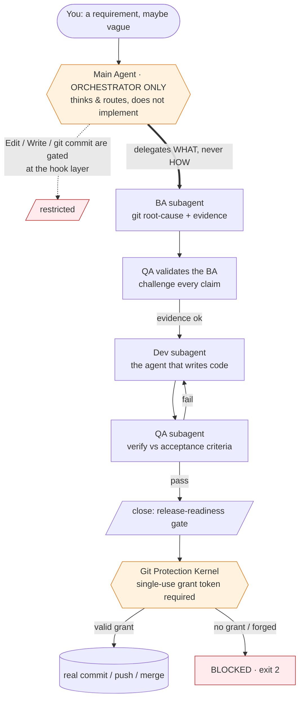
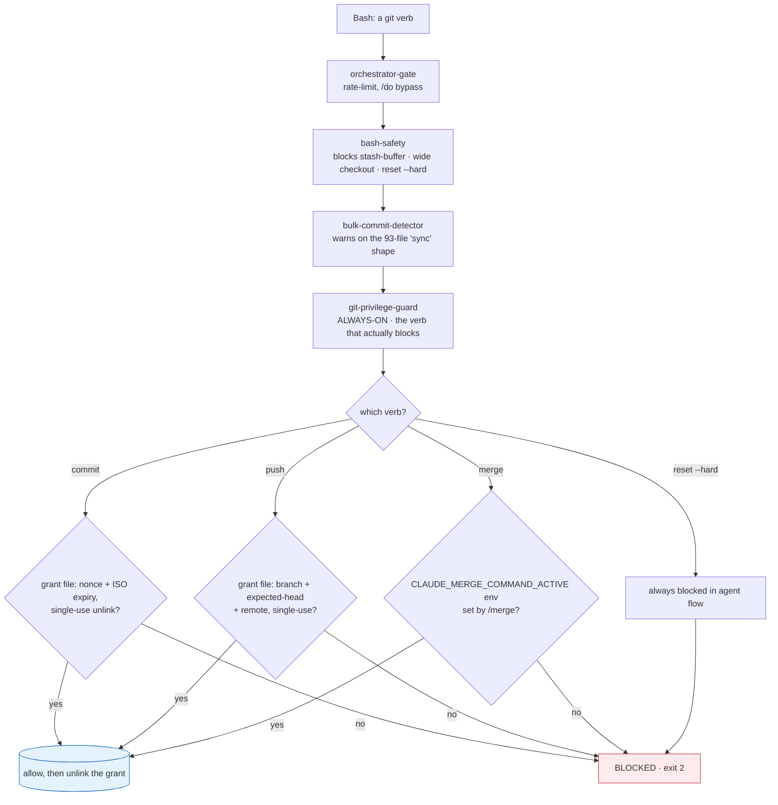
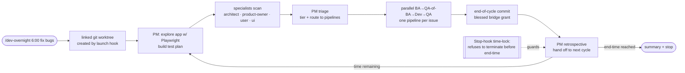

# `awesome-claude-harness` — A Self-Governing Agent Operating System for Claude Code

> **By default, the main agent does not write your code (the `/do` break-glass is the audited exception). It hires specialists, gates every dangerous move at a git kernel, and ships verified work while you sleep.**

This repository is a complete, battle-tested **Claude Code configuration** that turns a single chat agent into a disciplined software team. A main agent that *orchestrates* and delegates every real change to single-purpose subagents; an evidence-gated `/spec → /dev → /close → /commit → /push` pipeline where the *analysis* is reviewed before a line of code is written; a defense-in-depth wall of lifecycle hooks that make the most expensive mistakes structurally impossible; and an autonomous overnight loop that explores a codebase, finds bugs, fixes them, verifies them, and commits them — unattended, until a wall-clock end time.

It is not a prompt pack. It is an operating system for agents — with a scheduler, a permission model, a filesystem layout, a self-updating documentation layer, and a git protection kernel paid for in real lost work. Every mechanism below traces to a file in this repo, and several trace to a specific catastrophe that forced it into existence.

<p>


</p>

---

## Why this exists

Powerful coding agents fail in three predictable, expensive ways. Two of these are not hypothetical here — they are scars, with dates and commit hashes, in the source of this repo.

1. **They do too much themselves.** A single context window tries to analyze, implement, test, *and* commit — and quality silently collapses under the load. Agents fix plausible problems instead of proven ones (a mobile bug "fixed" on desktop for six cycles; a CSS symptom patched six times when the real fix was a data-hydration layer underneath).
2. **They make irreversible mistakes.**
   - On **2026-04-19 23:02:22**, a dev subagent ran `git stash && cd packages/happy-app && git checkout 925f5960 -- .`. The wide-path `-- .` checkout overwrote the entire directory with old baseline content and **erased 17 days of UI work** — then reported it like a minor accident. (`hooks/pretool-bash-safety.sh`)
   - On **2026-04-21 17:45 UTC**, in an ordinary *interactive* session (`962de59f`), the user typed "全部commit push" and the orchestrator answered by authoring a **93-file `commit` + `push` with zero human signoff** (regression `b5d447e`). (`hooks/pretool-git-privilege-guard.py` docstring)
3. **They drift from the requirement.** The thing that ships is a confident-sounding cousin of the thing you actually asked for.

This configuration attacks all three with **structure, not vibes** — and crucially, with mechanisms enforced in code rather than requested in prose:

- **An orchestrator-only main agent.** A `PreToolUse` gate restricts the main agent so the work goes to a fresh, single-purpose specialist. (`hooks/pretool-orchestrator-gate.py`)
- **A git protection kernel.** Layered hooks refuse `commit / push / merge / reset --hard` from an agent unless a single-use, time-boxed, per-operation authorization is present — a nonce grant file for commit and push, an env var set by `/merge`. (`hooks/pretool-git-privilege-guard.py`, `hooks/pretool-bash-safety.sh`)
- **An evidence-gated BA → QA-of-BA → Dev → QA pipeline.** The analysis is QA'd *before* coding; every factual claim needs proof; the user's verbatim words are the binding spec. (`commands/dev.md`, `agents/ba.md`, `agents/qa.md`)

The result: an agent you can hand a vague bug report to at midnight and find a verified, committed fix for in the morning — without ever worrying it nuked `main`.

---

## The big idea, in one diagram



The main agent's job is to *think and route*. Code is written by a `dev` subagent in its own clean context. Every git mutation must pass through the kernel. This separation is enforced by hooks — not by asking the model nicely.

---

## The full pipeline

The harness is one lifecycle, not a bag of commands. Each stage hands a verified artifact to the next.

```
   /spec                                  capture the requirement verbatim, split into per-agent briefs
     │
     ▼
   /do · /dev · /dev-command · /dev-overnight     do the work (direct, orchestrated, or autonomous)
     │
     ▼
   /close                                 release-readiness gate (QA, optionally a Codex debate)
     │
     ▼
   /commit                                surgical staging + conventional message + commit grant
     │
     ▼
   /merge · /push                         bridge to the target branch · single-process gated push
```

`--codex` rides alongside `/dev`, `/close`, and `/commit` as an opt-in adversarial second opinion. The git protection kernel sits *under* `/commit`, `/merge`, and `/push`, and refuses any agent-authored git mutation that lacks the required per-operation authorization (a single-use grant for commit/push; the `/merge` env var for merge).

---

## Feature highlights

| Capability | What it gives you | Grounded in |
|---|---|---|
| **Orchestrator-only architecture** | The main agent routes; each real edit goes to a fresh subagent with one job and a clean context, so quality stays high. | `hooks/pretool-orchestrator-gate.py`, `CLAUDE.md` |
| **Git protection kernel** | `commit / push / merge / reset --hard` from an agent are refused unless a single-use, time-boxed, per-operation authorization is present (a nonce grant file for commit/push; the `/merge` env var for merge); wide-path checkout, stash-as-buffer, and all hard resets are blocked outright. | `hooks/pretool-git-privilege-guard.py`, `hooks/pretool-bash-safety.sh` |
| **Evidence-gated BA → Dev → QA** | The analysis is QA'd *before* coding; every claim needs proof (git blame, grep, import-chain); the user's verbatim words are the binding spec. | `commands/dev.md`, `agents/ba.md`, `agents/qa.md` |
| **Durable specs** | `/spec` captures the requirement verbatim, persists design + evidence, and splits the monolith into per-agent briefing books with Gawande-style checkpoints. | `commands/spec.md`, `agents/spec.md` |
| **Autonomous overnight pipeline** | `/dev-overnight 6:00` runs an unattended explore → triage → fix → verify → commit loop in a dedicated linked worktree (it shares the repo's `.git` common-dir — see the limitation note below) until a wall-clock end time. | `commands/dev-overnight.md`, `hooks/stop-overnight-timelock.py` |
| **Release-readiness gate** | `/close` proves not just "the code works" but "the system can ship it" — four Workflow-Integrity checks, optionally a multi-round QA↔Codex debate. | `commands/close.md` |
| **Structured break-glass grants** | `/allow` writes a *structured* grant (`{op, target, args_contain}`) matched by command **structure** — the sanctioned path — rather than the fragile substring grep of the legacy fallback that still lingers; it is consumed on any terminal result. | `hooks/lib/allowlist.py`, `commands/allow.md` |
| **Branch / PR / worktree firewall** | Creating a branch, PR, or worktree is forbidden by default everywhere, with explicit human escape hatches and a live-overnight exception. | `hooks/pretool-block-branch-pr-worktree.py`, `hooks/pretool-block-enterworktree.sh` |
| **Crash-proof checkpoints** | Automated snapshots are written to `refs/checkpoints/<branch>` via git plumbing — recoverable, audit-friendly, and they **never move `HEAD`**, so `git blame` always points at a real semantic commit. | `hooks/lib/checkpoint-core.sh`, `docs/reference/checkpoint-mechanism.md` |
| **Self-updating documentation** | Edit a command or agent and the `INDEX.md` files and README/CLAUDE stat blocks regenerate automatically — your hand-written prose outside the `AUTO` markers is preserved. | `hooks/posttool-doc-sync.py`, `hooks/doc_sync/` |
| **Adversarial second opinion** | Add `--codex` to `/dev`, `/close`, or `/commit` to run an OpenAI Codex round against the draft, through a fail-closed isolation wrapper. | `commands/codex.md`, `commands/close.md` |
| **UI-audit skill suite** | A Playwright-driven UI review suite — axe-core injection, APCA contrast, a 58-rule anti-pattern catalog, a state matrix, token conformance, and a weighted beauty score. | `skills/` |

---

## How it actually works

### Walkthrough 1 — `/dev "the login button is misaligned on mobile"`

1. **The orchestrator parses, then delegates — it does not investigate.** A `UserPromptSubmit` hook pre-creates the per-agent sentinel files and writes your verbatim requirement to disk as the source of truth. (`commands/dev.md`)
2. **Specialists are consulted when relevant.** A misalignment-on-mobile report trips the `ui-specialist` trigger; the orchestrator must justify, per specialist, RELEVANT-or-SKIP — silently skipping is itself a violation.
3. **The BA subagent builds the spec.** It does git root-cause analysis, finds the *actual* file (not a plausible cousin), and emits a Markdown ticket plus a JSON context, scored on five clarity dimensions (What / Why / Where / Scope / Success). (`agents/ba.md`)
4. **QA validates the BA *before any code is written*.** It cross-examines every claim: is there git-blame evidence? do these files exist? did the scope quietly narrow? did this contradict a prior cycle's attempt? If the map is weak, BA is sent back — a one-hour analysis correction is far cheaper than six implementation loops on the wrong layer. (`commands/dev.md`, `agents/ba.md`)
5. **The Dev subagent implements** the vetted plan, with a minimum-diff discipline and a self-verification (build + smoke) step. (`agents/dev.md`)
6. **QA verifies against the acceptance criteria,** looping back to Dev on failure within bounded retries.
7. **`/close → /commit → /push`** lands the change. `/close` is the release-readiness gate (a QA verdict, not a git grant); then `/commit` and `/push` each pass the git kernel under their own single-use grant.

### Walkthrough 2 — a hook firing

You (the agent) try the obvious shortcut:

```bash
CLAUDE_PUSH_COMMAND_ACTIVE=1 git push
```

`hooks/pretool-git-privilege-guard.py` runs *before* the tool executes. For push it scans the raw command text for the literal `CLAUDE_PUSH_COMMAND_ACTIVE=` prefix and recognizes it as an env-injection attempt — the sanctioned env var must be set by the `/push` wrapper in the child's real environment, not pasted onto the command line — and returns exit 2: **BLOCKED**. The only honored path is a grant file written by the `/push` wrapper, validated by nonce + ISO-8601 UTC expiry + single-use unlink, and matched against the current branch, expected head, and remote. (A bare agent `git commit` is likewise refused — there it is the default-deny-without-a-grant rule, not inline-env detection, that blocks it.) (`hooks/pretool-git-privilege-guard.py`)

That is the whole philosophy in miniature: the model is *encouraged* toward the right path and *physically prevented* from the wrong one — and when it is prevented, the evidence is left on disk.

---

## The git protection kernel

This is the part that was paid for in lost work. Two real incidents shaped it:

> **The 17-days-erased disaster.** On 2026-04-19, a dev subagent used `git stash` as a throwaway buffer, then ran `git checkout 925f5960 -- .` inside `packages/happy-app/`, silently overwriting 17 days of UI work with an old baseline. So `hooks/pretool-bash-safety.sh` now blocks **stash-as-buffer** (`git stash push/save/-u/--all` and bare `git stash`), **wide-path checkout-from-a-ref** (`git checkout <ref> -- .` / `-- *` / `-- dir/`), its modern `git restore --source=… -- .` equivalent, and **every `git reset --hard` form**. Single-file checkout (`git checkout <ref> -- path/to/file.ts`) stays allowed.

> **The 93-file sweep.** On 2026-04-21 17:45 UTC, in an *interactive* (not overnight) session, the prompt "全部commit push" produced regression `b5d447e`: a 93-file `commit` + `push` authored by the orchestrator with no human signoff. The lesson was that gating on overnight-context alone would let this exact class through. So `hooks/pretool-git-privilege-guard.py` was made **always-on** — it runs on every Bash call in both subagent and main-agent contexts — and now requires a single-use, time-boxed authorization for each privileged verb (a nonce grant file for commit and push; an env var set by `/merge` for merge).



**How the chain divides labor (described accurately):**

- **`pretool-bash-safety.sh`** is the blunt instrument: it refuses the destructive shell forms above, by command shape, with the incident dates quoted in the block message.
- **`pretool-bulk-commit-detector.py`** independently recognizes the 93-file "sync all uncommitted…" fan-out shape (3+ subsystems touched + a `sync…uncommitted` / `chore(claude): sync` subject). Per current user policy it is **warn-only** — it emits a loud stderr warning and exits 0; it does not block. The *blocking* of an agent commit/push is the privilege-guard's job.
- **`pretool-git-privilege-guard.py`** is the always-on kernel. It default-denies agent `commit` (unless the message is the blessed `auto-bulk: end-of-cycle commit for …` bridge, which itself requires a `/commit --bulk` sentinel), `merge` (unless `/merge` set its env var), `push` (any form), `reset --hard` (every form), and direct ref mutation. The sanctioned escapes for commit and push are single-use grant manifests at `/tmp/claude-{commit,push}-grant-<sid>-<nonce>.json`, each carrying a nonce and an ISO-8601 UTC `expires_at`. The two grants differ in what the guard checks: a **commit** grant is validated only for expiry and single-use consumption (it does *not* re-check allowed files or a message SHA at the guard); a **push** grant is additionally validated against the current branch, expected head, and remote. Grants are consumed (unlinked) on use.
- **The privilege-guard blocks every agent by default.** A subagent can *never* bypass it. The only bypass is a human's `/do` consent flag, and it lets the **main agent only** through — break-glass, audited (the guard refuses the consent flag whenever an `agent_id` is present, i.e. for any subagent). `/do` also leaves the orchestrator-gate streak state untouched, keeping its semantics clean.

Read-only git (`status`, `log`, `show`, `diff`, `blame`, `ls-files`, `branch` listing, `stash list/show`) stays freely available. A handful of non-read-only verbs are also permitted by policy — `add`, single-file working-tree `restore`, and `stash pop` — they mutate the index or working tree but never history or the remote.

---

## The overnight autonomous pipeline



`/dev-overnight` runs a todo-completion-driven loop inside a dedicated worktree. A `Stop` hook (`hooks/stop-overnight-timelock.py`) physically refuses to end the conversation until your wall-clock end time, so the loop cannot be short-circuited. Each issue gets its own one-issue-per-subagent pipeline; cycles deduplicate against state and end with a real, merge-ready commit. Cancel any time with `/stop`.

> **Honestly-documented limitation.** The overnight session runs in a *linked* worktree that **shares the repository `.git` common-dir** with the main checkout. The current locks (a git reference-transaction keystone for HEAD/ref moves, plus a per-Bash-command bind-mount boundary for main-tree writes) are treated as sufficient for the cycle, **but the shared-`.git` residual is an accepted deviation, not a clean isolation guarantee** — an actor that mutates shared git config/hooks could in principle disable the keystone. The repo says so plainly rather than hiding it: *"Do NOT claim protection against shared-`.git` mutation."* (`commands/dev-overnight.md`)

---

## The cast: 23 subagents

The orchestrator dispatches specialists by *describing the problem* — never the tooling (`hooks/pretool-orchestrator-prompt-purity.py` watches for leaked "HOW"). Each picks its own approach and returns a structured report.

**Development pipeline**
- **`ba`** — requirements analyst; git root-cause analysis → Markdown ticket + JSON context.
- **`dev`** — implementation specialist; receives a vetted plan and writes the change under a minimum-diff discipline.
- **`qa`** — verifier; validates the *analysis* (pre-code) and the *implementation* (post-code) against acceptance criteria.
- **`test-writer`** — emits pytest skeletons with `pytest.fail("TEST_INCOMPLETE:…")` hard-stops for risky/complex tasks.
- **`graphify`** — incremental code-graph enrichment; injects a focused subgraph into the Dev context.
- **`spec`** — splits a monolithic spec into per-agent views + Gawande-style checkpoints.

**Exploration specialists (overnight + on-demand)**
- **`architect`** — structural issues, tech debt, dependency and pattern problems.
- **`product-owner`** — feature completeness, user flows, business-logic bugs.
- **`user`** — end-user simulation; UX friction and broken flows.
- **`ui-specialist`** — visual-design quality + Playwright UI audit with a 1–10 beauty score.
- **`pm`** — test-plan manager with PLAN / TRIAGE / RETRO modes (explores the live app first).

**Git & release analysts**
- **`changelog-analyst`** — classifies files, stages surgically (own-hunks only), writes conventional commits, emits the push-gate token.
- **`push-analyst` / `merge-analyst` / `pull-analyst`** — pre-push, pre-merge, and post-pull risk analysis with nonce-keyed grants.

**Cleanup & audit**
- **`cleaner` / `cleanliness-inspector` / `style-inspector` / `rule-inspector`** — the `/clean` cohort: detect, audit, and execute project hygiene.
- **`prompt-inspector` / `git-edge-case-analyst`** — documentation-verbosity and git-history edge-case discovery.
- **`test-executor` / `test-validator`** — execute and validate test infrastructure.

> Full, auto-maintained roster: [`agents/README.md`](agents/README.md).

---

## The command surface: 35 slash commands

| Group | Commands | What they do |
|---|---|---|
| **Spec** | `/spec` · `/spec-update` | Capture the requirement verbatim, persist design + evidence, split into per-agent briefs + checkpoints; append continuation cycles. |
| **Develop** | `/dev` · `/dev-command` · `/dev-overnight` · `/redev` | Orchestrated single-pass dev, command-authoring dev, autonomous overnight loop, and re-dev of a prior cycle. |
| **Ship** | `/close` · `/commit` · `/merge` · `/push` · `/pull` · `/checkpoint` | The release-readiness gate and the grant-gated git pipeline. |
| **Quality** | `/clean` · `/test` · `/code-review` · `/refactor` · `/optimize` · `/security-check` | Cleanup cohort, test workflow, and review passes. |
| **Understand** | `/explain-code` · `/file-analyze` · `/doc-gen` · `/doc-sync` | Code explanation, file analysis (PDF/Excel/Word/images), documentation. |
| **Research** | `/deep-search` · `/research-deep` · `/search-tree` · `/reflect-search` · `/site-navigate` | Fan-out, fact-checked, multi-source web research. |
| **Control** | `/do` · `/allow` · `/stop` · `/codex` · `/quick-commit` · `/quick-prototype` · `/fswatch` · `/playwright-helper` | Break-glass consent, overnight cancel, Codex delegation, and fast paths. |

`/do` and `/allow` are the two human escape hatches:

- **`/do`** lets the *main* agent do direct work for one task and requires a deterministic `do-report` before `/close`. A human's `/do` consent is recognized by the orchestrator gate, bash-safety, and the always-on git-privilege-guard — so it lets the main agent through all three, which is the entire point of break-glass. It applies to the **main agent only**: a subagent never benefits from the consent flag. It does **not** quiet the bulk-commit detector's warning.
- **`/allow`** writes a single, **structured** break-glass grant for one specific operation, matched by command **structure** (`op` / `target` / `args_contain`) — the sanctioned path, in preference to the fragile substring matching that a legacy fallback in `hooks/lib/allowlist.py` still retains. Refuse-by-default is the rule (the exact match-all hole was closed in commit `7dbdd307`, "/allow consent is refuse-by-default — close match-all grant hole"). The grant is single-use and consumed on any terminal result.

Most release commands carry `disable-model-invocation: true` so an agent can't self-invoke them via SlashCommand. Because that flag does **not** block the `Skill` tool, every human-only command is *also* denied as `Skill(<name>:*)` in `permissions.deny` — the human is the trust root.

> Full, auto-maintained list: [`commands/README.md`](commands/README.md).

---

## Quickstart

### Dependencies (REQUIRED vs OPTIONAL)

A newcomer can run the core development pipeline with just the **REQUIRED** rows; every optional integration degrades gracefully when its dependency is absent.

| Dependency | Tier | What needs it |
|---|---|---|
| [Claude Code](https://claude.com/claude-code) | **REQUIRED** | The host. Must be recent enough to fire `UserPromptSubmit` / `Notification` / `SubagentStop` hook events, honor `disable-model-invocation` frontmatter, and enforce `Skill(*)` permission denies — older clients silently skip these and the guardrails won't engage. |
| Python 3 + a venv at `~/.claude/venv` | **REQUIRED** | Runs every Python hook (the git kernel, gates) and helper script. The venv ships empty — you create it (Quickstart step 3). |
| `git` | **REQUIRED** | The whole harness is git-native (checkpoints, grants, keystone). Any recent git (2.4x+) works for normal use; the overnight keystone's structural HEAD-switch protection needs **git ≥ 2.46** (verified by `scripts/overnight-git-selftest.sh`). |
| `jq` | **REQUIRED** | JSON parsing in shell hooks/scripts across the pipeline. |
| Bash + GNU userland (coreutils, util-linux/`flock`, findutils, `grep`, `sed`, `awk`/gawk) | **REQUIRED** | `realpath`, `flock`, `stat`, `sha256sum`, `date`, `grep`, `sed`, `awk`, `find` are used pervasively across the `#!/bin/bash` hooks/scripts. The GNU forms are assumed — BSD/macOS variants differ in flags and can break hooks; install the GNU userland there. |
| `pytest` | **REQUIRED** for `/test` + generated tests | `/test` and the test-writer's generated AC tests run under pytest. The Quickstart venv is empty, so install it yourself: `~/.claude/venv/bin/pip install pytest`. |
| OpenAI Codex CLI + the `/root/bin/codex-iso` isolation wrapper | **REQUIRED** for `--codex` / `/codex` | The adversarial second-opinion rounds shell out to the Codex CLI through a fail-closed isolation wrapper. The wrapper path is author-specific — **you must supply your own** Codex CLI and wrapper. Without it, `--codex`/`/codex` are unavailable (the rest of the pipeline is unaffected). |
| `openssl` | **REQUIRED** for `/merge`, `/push` | Nonce / token generation in the grant-gated git release path. |
| `bwrap` (bubblewrap) | **REQUIRED** for `/dev-overnight` | The per-Bash bind-mount boundary that isolates overnight main-tree writes. |
| `graphify` CLI (`graphifyy` v0.8.25 on PyPI; the binary is `graphify`) | OPTIONAL (graceful) | Incremental code-graph enrichment injected into the Dev context. Default-enabled (`CLAUDE_GRAPHIFY_ENABLED=auto`); if the binary is absent the pipeline degrades and proceeds. Install: `~/.claude/venv/bin/pip install graphifyy`, then point `GRAPHIFY_BIN` at the installed `graphify`. |
| [Playwright MCP](https://github.com/microsoft/playwright-mcp) | OPTIONAL overall; **REQUIRED for user-facing QA/E2E + UI audits** | Powers the UI-audit skill suite, the overnight PM's live-app exploration, and QA's live browser verification of user-facing changes (QA fails closed when a user-facing change cannot be browser-verified). Not needed for doc/config/non-user-facing cycles. |
| Python pkgs `jsonschema`, `yaml` (PyYAML), `websocket-client` | OPTIONAL (graceful) | Stricter schema validation and a few enrichments; hooks fall back to lenient paths when missing. |
| `fswatch` | OPTIONAL | Backs `/fswatch` file-watching; not needed by the core pipeline. |
| `node` + a user-supplied `EXCEL_ANALYZER` | OPTIONAL | `/file-analyze` spreadsheet/document analysis. You provide the analyzer; absent → that file type is skipped. |

> **One-line summary:** install Claude Code + Python 3 + git + jq + the GNU userland + openssl, create the venv, and `pip install pytest` — that covers the core `/dev → /close → /commit → /push` pipeline (`/push` needs `openssl`). Add the Codex CLI + wrapper for `--codex`, graphify for code-graph context, Playwright MCP for UI/overnight (and user-facing QA), and `bwrap` for `/dev-overnight` as you need them.

```bash
# 1. Back up any existing config
mv ~/.claude ~/.claude.bak 2>/dev/null || true

# 2. Clone this repo to ~/.claude
git clone https://github.com/Yugoge/awesome-claude-harness.git ~/.claude

# 3. Create the Python venv the scripts/hooks expect (it ships empty)
python3 -m venv ~/.claude/venv

# 4. Install pytest into the venv (REQUIRED for /test and generated AC tests)
~/.claude/venv/bin/pip install pytest

# 5. Make the shell hooks executable
chmod +x ~/.claude/hooks/*.sh

# 6. Start Claude Code — the SessionStart hooks announce the environment.
claude
```

The hooks are wired in `settings.json` and activate on the next session. Try them:

```bash
# Orchestrated development (vague requirements welcome)
/dev add a --dry-run flag to the export command

# Adversarial review enabled
/dev --codex fix the off-by-one in pagination

# Autonomous overnight run until 6am, focused on a subsystem
/dev-overnight 6:00 fix flaky tests in the parser

# Cancel an overnight session
/stop
```

### Portability contract

This section is a **contract**, not a warning: it states what the harness *guarantees* on a fresh non-root clone versus what needs external setup, and it is backed by an executable test.

**The core harness runs on a fresh non-root clone.** Clone to `$HOME/.claude` on any Linux box (non-root user, `$HOME` not under `/root`), run the bootstrap, and the core flows — `/dev`, `/spec`, `/commit`, the always-on security guards — resolve to *your* home with **zero author-path literals load-bearing**. The harness locates its own home structurally (the shared `hooks/lib/claude_home.{sh,py}` resolver walks up to the `settings.json` + `hooks/` + `policies/` + `scripts/` sentinel set), so there is no `/root` to rewrite. This is **verified by the fresh-clone smoke test** (`tests/` WS2), which runs under a synthetic non-root `$HOME` with the author's home absent and asserts both *"core is runnable"* and *"the security guards engage"*.

**These specific extras require external setup** (their absence never breaks the core — it degrades to a one-line "unavailable" message and the flow continues):

| Extra | Needed for | When absent |
|---|---|---|
| OpenAI Codex CLI + an isolation wrapper (`CODEX_ISO_BIN`) | `--codex` / `/codex` adversarial rounds | `--codex`/`/codex` unavailable; rest of the pipeline unaffected — **never** falls back to a bare unsafe `codex` |
| `graphify` CLI (`GRAPHIFY_BIN`) | code-graph enrichment of the Dev context | enrichment skipped; pipeline proceeds degraded |
| `bwrap` (bubblewrap) + user namespaces | the per-command write boundary in `/dev-overnight` | overnight launch still works; a non-worktree-local write **fails closed** (the write guarantee is security-relevant) |
| Playwright MCP | live-browser UI audits / user-facing QA | non-user-facing cycles unaffected; QA fails closed only when a user-facing change cannot be browser-verified |
| `~/.claude` symlink onto a RAM disk; `SESSION_PROMOTE_BIN`, `UI_EVIDENCE_AUDIT_BIN` | the author's RAM-disk + session-promote / ui-evidence conveniences | the structural resolver ignores the symlink convention; optional helpers print "unavailable" |

#### Trust model

**The human is the trust root.** Every release verb (`/commit`, `/push`, `/merge`, `/close`) and every human-only command is denied to agents both via `disable-model-invocation: true` *and* an explicit `Skill(<name>:*)` entry in `permissions.deny` — the only technical barrier against an agent self-invoking a privileged command. The harness assumes the agent itself is the adversary, so guards are enforced in code (a `PreToolUse`/`Stop` hook returning exit 2), never in prose.

#### Fail-closed vs. skip semantics

Absence is handled by exactly one of two rules, per the kind of thing that is missing:

| Missing thing | Class | Behavior on absence |
|---|---|---|
| A security guard's helper/policy (e.g. the tool-policy registry, the spec-coverage verifier) | security | **FAIL CLOSED** — the guard blocks with exit 2 and a block marker; it never silently allows |
| An optional integration (Codex wrapper, `graphify`, Playwright, session-promote) | optional | **SKIP** — one-line "unavailable" message, core flow continues; no unsafe fallback |
| An invalid generated `settings.json` (bad render / dropped required hook) | config | **ABORT** — the install renderer refuses to apply and leaves the live settings unchanged |

Run `scripts/doctor` to see, per capability, which rule applies on your machine. (The historical hardcoded-path caveat — `git grep -l '/root/\|/dev/shm'` and hand-rewrite — is **superseded** by the resolver above and retained only as background in [`NESTED-REPO.md`](NESTED-REPO.md) / [`CLAUDE.md`](CLAUDE.md).)

### Troubleshooting

| Symptom | Fix |
|---|---|
| **A hook isn't firing** | Shell hooks must be executable: `chmod +x ~/.claude/hooks/*.sh`. Python hooks run through the venv at `~/.claude/venv`. |
| **A slash command doesn't appear** | Check the YAML frontmatter at the top of the file in `commands/`; a malformed `---` block hides the command. |
| **`settings.json` won't load** | Validate it: `python3 -m json.tool ~/.claude/settings.json` — a trailing comma or unquoted key surfaces here. |
| **Helper scripts fail to import** | They expect the venv at `~/.claude/venv`; recreate it with `python3 -m venv ~/.claude/venv` if it's missing. |
| **A commit/push is being blocked** | That's the kernel doing its job — an agent needs a grant from `/commit` or `/push`. As a human, run the git command from your own shell, or use `/do` / `/allow`. |

---

## Project structure

```text
.claude/
├── CLAUDE.md          # The constitution: non-negotiable rules the agent must obey
├── ARCHITECTURE.md    # System architecture, verified against the current code
├── NESTED-REPO.md     # Why ~/.claude is its own git repo on a RAM disk
├── settings.json      # 65 wired hook entries (64 distinct files) across 7 lifecycle events
├── agents/            # 23 subagent definitions (BA, dev, QA, architect, …)
├── commands/          # 35 slash-command workflows (/spec, /dev, /close, /commit, …)
├── hooks/             # SessionStart / UserPromptSubmit / PreToolUse / PostToolUse / Notification / Stop / SubagentStop gates
│   ├── lib/           #   shared libs: allowlist (structured sentinel grants), checkpoint-core
│   ├── doc_sync/      #   self-updating INDEX/README/CLAUDE regeneration
│   └── git-keystone/  #   git-native reference-transaction protection
├── scripts/           # 72 helper scripts (graphify, spec resolver, grant writers, execute-push, …)
├── skills/            # 8 skills: the Playwright UI-audit suite (+ ui-shared support)
├── schemas/           # JSON schemas (e.g. cycle-contract.v1.json)
├── policies/          # tool-policy and role-restriction definitions
├── templates/         # spec + settings templates
├── tests/             # test infra; tests/generated/ holds AC-driven pytest skeletons
└── docs/              # architecture, incidents, references, design philosophy, codex research
```

A `PostToolUse` doc-sync hook keeps the `INDEX.md` files and the inventory block below current automatically; manual prose outside the `<!-- AUTO:… -->` markers is always preserved.

<!-- AUTO:readme-stats -->

## Overview
- **Total files**: 17
- **Subdirectories**: 10
- **Naming convention**: lower

## Files
- `ARCHITECTURE.md` - Architecture — `.claude` Agent Operating System
- `CLAUDE.md` - CLAUDE.md
- `LICENSE` - LICENSE file
- `NESTED-REPO.md` - Nested Repo Sentinel
- `NOTICE` - NOTICE file
- `push.sh` - 
- `settings.json` - json config

## Subdirectories
- `agents/`
- `commands/`
- `docs/`
- `hooks/`
- `policies/`
- `schemas/`
- `scripts/`
- `skills/`
- `templates/`
- `tests/`

---
*Auto-generated by doc-sync hook.*
<!-- /AUTO:readme-stats -->

---

## Design philosophy

Six principles run through every file here. They are the taste behind the project — and each is a consequence of something that went wrong before it went right.

**Rules, not stories.** Agent and command prompts state what is *required* and what is *forbidden*, tersely. Positive instructions alone proved insufficient: incident analysis showed an agent told only "what's allowed" will infer permission for adjacent dangerous actions. So every infrastructure-touching subagent prompt carries an explicit **DO NOT** section.

**Enforce in code, not in prose.** "Please don't force-push" is a wish; a `PreToolUse` hook returning exit 2 is a guarantee. Wherever a rule *can* be a hook, it *is* a hook — and even the human escape hatches (`/do`, `/allow`) are narrow, audited, and single-use.

**The orchestrator describes WHAT; the subagent decides HOW.** Dispatch prompts never name a tool or a shell command; `hooks/pretool-orchestrator-prompt-purity.py` watches for leaked "HOW". This keeps specialists free to choose their own toolchain and keeps the orchestrator out of the work.

**One subagent, one task.** Never bundle issues. N issues → N parallel subagents, each with a clean context. Multitasking inside one subagent is banned — it is how a "fix the button" task quietly also "refactors the router," and how quality silently degrades (`CLAUDE.md` lesson #13).

**The user's verbatim words are the contract.** The literal requirement is written to disk and re-read by every downstream agent. Paraphrase is drift; drift is how you ship a confident-sounding cousin of what was asked.

**Fail closed, leave forensics.** Ambiguous grant? Reject. Unparseable QA verdict? Treat as failure. But on rejection, leave the evidence — the grant file, the raw output — so a human can see exactly what happened and why.

---

## FAQ

**Is this a framework I import?** No. It is a *configuration* for Claude Code. You drop it at `~/.claude`, and its hooks + commands + agents change how the agent behaves. There is nothing to `npm install` into your app.

**Does the orchestrator-only rule make simple edits slow?** For a one-line fix you can `/do` to let the main agent act directly for a turn. The delegation overhead is the price of consistent quality on real tasks — and the autonomous loop pays for itself overnight.

**Can the agent disable its own guardrails?** That is the threat model the kernel is built against, and the honest answer is: the design makes it *hard*, not metaphysically impossible. Release commands are `disable-model-invocation: true` *and* denied as `Skill(<name>:*)`; the git-privilege-guard is always-on and subagents can never bypass it; grants are single-use and time-boxed; the bash-safety hook blocks the destructive shell forms by shape. The one residual that is called out rather than hidden: during overnight runs the linked worktree shares the `.git` common-dir, so an actor that mutated shared git config/hooks could in principle disable the keystone — `commands/dev-overnight.md` documents this as an accepted deviation, and the sound fix (fresh-clone isolation) is deferred future work.

**Is everything in this README real?** Yes — every capability traces to a file cited inline, and the war-stories carry their incident dates and commit hashes. A couple of things deliberately *omitted* for accuracy: the bulk-commit detector is described as **warn-only** (it is, despite older comments saying "refuses"); a now-removed `orchestrator.md` agent referenced in some internal drafts does not exist and is not claimed; and the cp-state `SubagentStop` enforcement, whose blocking behavior is mode-dependent, is left out of the kernel claims rather than overstated.

**Where do I go deeper?**
- The constitution: [`CLAUDE.md`](CLAUDE.md)
- System architecture: [`ARCHITECTURE.md`](ARCHITECTURE.md)
- Git protection kernel: [`hooks/pretool-git-privilege-guard.py`](hooks/pretool-git-privilege-guard.py), [`hooks/pretool-bash-safety.sh`](hooks/pretool-bash-safety.sh)
- Checkpoint mechanism: [`docs/reference/checkpoint-mechanism.md`](docs/reference/checkpoint-mechanism.md)

---

## Extending it

Everything here is plain Markdown and small scripts — adding your own piece is intentionally low-ceremony. A `PostToolUse` doc-sync hook re-inventories the roster the moment you save, so new commands and agents show up in the INDEX/README blocks without manual bookkeeping.

**Add a slash command** — drop a file in `commands/`:

```bash
cat > ~/.claude/commands/my-command.md << 'EOF'
---
description: My custom command
---

Your command instructions here…
EOF
```

**Add a subagent** — drop a file in `agents/`:

```bash
cat > ~/.claude/agents/my-agent.md << 'EOF'
---
name: my-agent
description: When the orchestrator should dispatch this agent
tools: Read, Write, Bash
---

Your agent system prompt here…
EOF
```

**Add a hook** — write the script, make it executable, then wire it into `settings.json` under the lifecycle event you want (`PreToolUse`, `PostToolUse`, `Stop`, …):

```bash
cat > ~/.claude/hooks/my-hook.sh << 'EOF'
#!/bin/bash
# Your hook logic here — exit 2 to block the tool call.
EOF
chmod +x ~/.claude/hooks/my-hook.sh
```

> Mirror the conventions of the existing files: command/agent prompts state what is **required** and what is **forbidden**, and a hook that guards anything dangerous should *fail closed* (block on doubt) and leave its evidence behind.

---

## Acknowledgements

This configuration grew out of, and remains grateful to:

- [Claude Code](https://claude.com/claude-code) and the official [documentation](https://docs.claude.com/en/docs/claude-code).
- [fcakyon/claude-codex-settings](https://github.com/fcakyon/claude-codex-settings) — an early real-world configuration reference.
- The broader Claude Code community, whose shared patterns and hard-won lessons are baked into the hooks and agents here.

---

## License

Released under the **MIT License** — free to use, copy, modify, and adapt for your own `~/.claude`. Source: [`Yugoge/awesome-claude-harness`](https://github.com/Yugoge/awesome-claude-harness).

---

<sub>Built and hardened over 500+ commits of daily use. Hooks, agents, and commands are auto-inventoried by the doc-sync system; the stat block above regenerates itself. Manual edits outside the `<!-- AUTO:… -->` markers are preserved.</sub>
