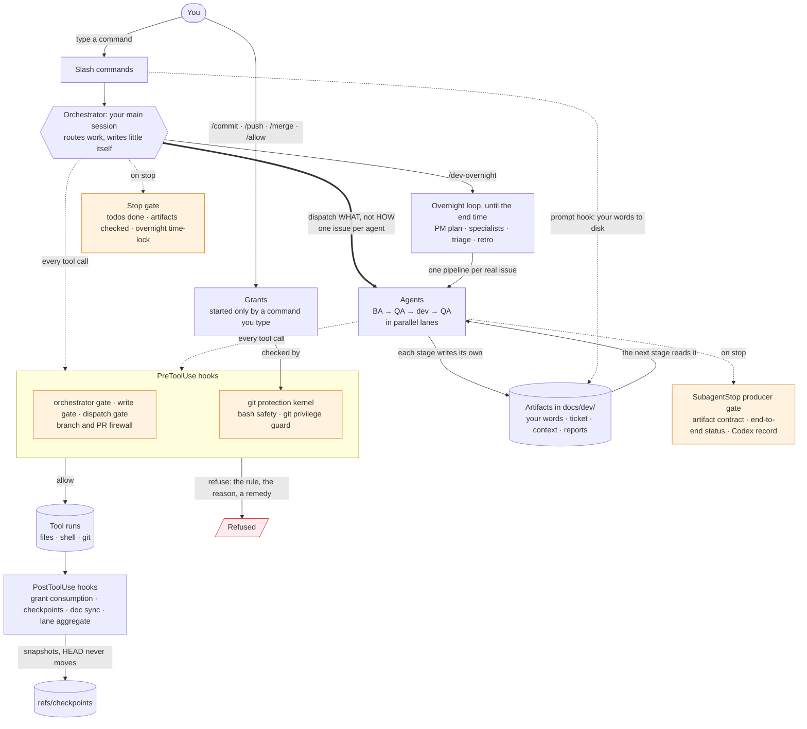
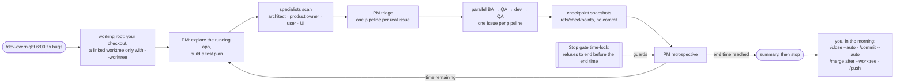
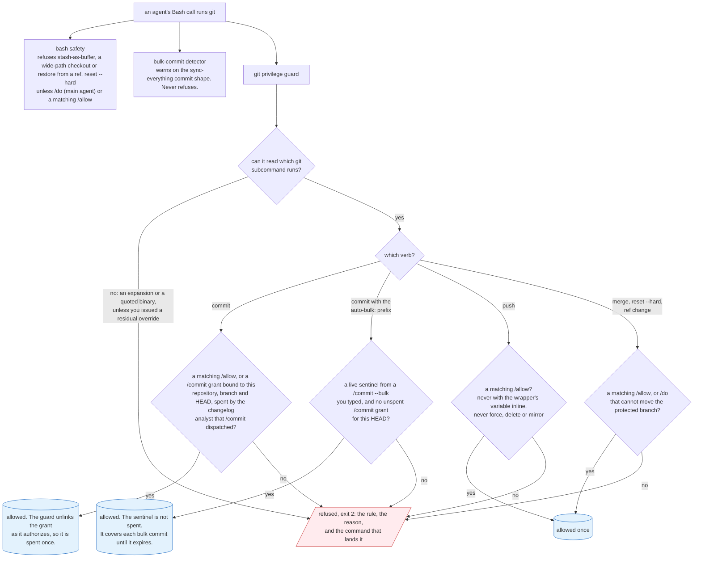

# awesome-claude-harness

**A self-governing agent operating system for Claude Code.**

<p>

</p>

## Install

You need `python3`, `git` and `jq`. You need Claude Code to use the harness. Codex is optional. Only `--codex` and `/codex` use it. They need the OpenAI Codex CLI and an isolation wrapper you supply (`CODEX_ISO_BIN`).

### Full install: clone + init

```bash
git clone https://github.com/Yugoge/awesome-claude-harness.git ~/.claude   # needs an empty ~/.claude
~/.claude/scripts/bootstrap                                # init: asks once per optional module, ends with the preflight
python3 ~/.claude/scripts/capture-hero-run.py --check-only # sandboxed demo: a push refused, allowed once by a grant, refused again
```

`git clone` refuses a target that is not empty. If `~/.claude` already holds your settings, move it aside. Or use one of the [other install locations](docs/installation.md#other-install-locations).

The demo needs no Claude Code. It runs the real hooks in a sandbox. It writes nothing into the checkout. It prints where it saved its log. Then, in Claude Code, type `/dev <your requirement>`.

After init, `git status` stays clean. Overlay values never show up as a diff and never reach a commit.

### Guardrails only: the installer core profile

This profile installs the guardrails without the agents and commands. Run it from a checkout:

```bash
scripts/install/install --profile core   # guardrails in an isolated directory, hook registrations merged additively
```

The [installation guide](docs/installation.md) covers the settings overlay, optional modules, dependencies and troubleshooting.

## The full pipeline

You give it a requirement. It finds the root cause. It asks you only the decisions that are yours. Then it builds the change and checks it.

```
interactive   /spec (optional) → /dev → /close → /commit → /push
overnight     /dev-overnight 6:00 → you, in the morning: /close --auto → /commit --auto → /push
```

| You type | You get |
|---|---|
| `/spec` | Optional. It asks you first. Then a durable spec with per-agent briefs. `/dev` and `/dev-overnight` build from it. |
| `/dev <requirement>` | It asks you first. BA finds the root cause. QA checks the analysis before any code. Dev builds in one-issue lanes, in parallel. QA verifies until it passes. |
| `/close` | Release readiness. Inspectors and QA judge the diff. `CLOSE: YES` or the findings. After `CLOSE: YES` it asks for your rating. |
| `/commit` | QA reviews the commit first. The changelog analyst stages the task's own files and commits them. |
| `/merge` | Optional, for work on a branch. A real merge into the default branch, after a pre-merge analysis. |
| `/push` | The push analyst checks what would go out. The wrapper publishes it. It needs a commit made by `/commit`. |
| `/dev-overnight 6:00` | Unattended until the end time. Nobody is asked. It commits nothing. You land it in the morning. |

`/redev` starts a fresh `/dev` cycle in the same conversation. `/dev-command` is `/dev` for a command, an agent or another harness file. `/do` lets the main agent do one task itself, for one turn.

Each stage hands a checked artifact to the next. You start each stage with one command. Agents do the work inside it. Only `/dev-overnight` needs no command from you until its end time.

- **One cycle, parallel lanes.** `/dev` splits your requirement into outcomes that each verify alone. One lane per outcome. BA, QA, dev and QA run once per lane, in parallel. A failing lane retries alone. The cycle passes only when every lane's QA passes.
- **A loop ends on a pass, or when you stop it.** No round cap. Your `/stop` or Esc interrupts either loop at any time. So a stubborn failure loops until you stop it.
- **Adversarial second opinion, one loop.** Add `--codex` to `/dev` and its variants, `/spec`, `/clean`, `/close` or `/commit`. An agent asks Codex once for a complete review. After that, only a capped number of fix checks. Claude classifies each finding as a real bug, a minor point, out of scope or a nitpick.
- **Asked first, then only when it matters.** Without a spec, a panel of independent BAs analyses the requirement from separate angles. Panel QA checks the evidence each one cites. Only a verified root cause becomes an option. With a spec, one BA asks what the spec left open. No agent is dispatched until the round is asked. Later, an agent that needs a decision writes one question with options and a default. Nothing is asked in plain text.
- **Overnight, the same pipeline unattended.** `/dev-overnight` explores and triages. It runs one BA → QA → dev → QA pipeline per real issue until the end time. Nobody is asked. It commits nothing. In the morning you type `/close --auto`, `/commit --auto` and `/push`. A `--worktree` run adds `/merge` before `/push`. [The overnight pipeline](#the-overnight-pipeline) below has the loop.

## Pipeline in action

### Walkthrough: `/dev "the login button is misaligned on mobile"`

| Step | Who acts | What happens |
|---|---|---|
| Capture | `UserPromptSubmit` hook | Your words go to `docs/dev/user-requirement-<id>.md`. The cycle is armed before any agent runs. |
| Plan | Orchestrator | One outcome, one lane. Each specialist marked RELEVANT or SKIP with a reason. A layout bug makes `ui-specialist` relevant. Its findings go to BA. |
| Ask first | BA panel, panel QA, you | No spec, so BAs analyse from separate angles. Root cause, smallest change, your intent. Panel QA drops a cause it cannot verify. Their disagreements become one round of questions. What you should see on a phone. How far the fix goes. Which screens count as done. You answer or skip. |
| Analyse | BA | The file and the cause that actually produce the misalignment, not a plausible cousin. Cited file and line, search results, git history. The ticket, the context and the acceptance criteria. |
| Check the analysis | QA | Before any code. Real evidence? The scope you asked for? Anything narrowed, renamed or deferred? A failing analysis goes back to BA until QA passes. |
| Build | Dev | The smallest change that meets the acceptance criteria. A report of what it changed and ran. One dev per lane, in parallel. |
| Verify | QA | It drives the running product against the criteria, on desktop and mobile. A warning or a failure sends dev back, until QA passes or you stop it. |
| Hold | Stop gate | The session cannot end while a todo is open or an artifact fails its check. `/stop` ends it at any time. |
| Land | You | `/close` has inspectors and QA judge the diff. It asks for your rating. It shows each agent's score, rank and trend. `/commit` commits the task's files under a single-use grant. `/push` publishes through the wrapper. |

### Usage examples

```bash
# Orchestrated development. A vague requirement is fine.
/dev add a --dry-run flag to the export command

# Several outcomes in one cycle: parallel lanes, never phases
/dev fix the pagination off-by-one and add a CSV export to the report page

# With a Codex review of each agent's draft
/dev --codex fix the off-by-one in pagination

# Land the work
/close
/commit
/push

# Unattended until 6am, focused on one subsystem. Land it in the morning.
/dev-overnight 6:00 fix flaky tests in the parser

# End an overnight run early
/stop
```

## System architecture

> **The main session routes. It hires specialists. A git kernel gates every agent commit, push, merge and hard reset. The overnight run works while you sleep. You land it in the morning.**

Not a prompt pack. An operating system for agents. The orchestrator schedules one-issue agents. Grants and role write paths are the permission model. `docs/dev/` is the filesystem layout. A git protection kernel guards history.

The whole system in one picture. Each part has its own section below.


```mermaid
graph TD
    U([You]) -->|type a command| CMD[Slash commands]
    U -->|"/commit · /push · /merge · /allow"| G["Grants<br/>started only by a command you type"]
    CMD --> ORC{{"Orchestrator: your main session<br/>routes work, writes little itself"}}
    ORC ==>|"dispatch WHAT, not HOW<br/>one issue per agent"| SUB["Agents<br/>BA → QA → dev → QA<br/>in parallel lanes"]
    ORC -->|"/dev-overnight"| OVN["Overnight loop, until the end time<br/>PM plan · specialists · triage · retro"]
    OVN -->|"one pipeline per real issue"| SUB
    SUB -->|"each stage writes its own"| ART[("Artifacts in docs/dev/<br/>your words · ticket · context · reports")]
    ART -->|"the next stage reads it"| SUB
    CMD -.->|"prompt hook: your words to disk"| ART

    subgraph PRE["PreToolUse hooks"]
        GATES["orchestrator gate · write gate · dispatch gate<br/>branch and PR firewall"]
        KER["git protection kernel<br/>bash safety · git privilege guard"]
    end
    ORC -.->|every tool call| PRE
    SUB -.->|every tool call| PRE
    G -->|checked by| KER
    PRE -->|allow| TOOL[("Tool runs<br/>files · shell · git")]
    PRE -->|"refuse: the rule, the reason, a remedy"| BLK[/Refused/]
    TOOL --> POST["PostToolUse hooks<br/>grant consumption · checkpoints · doc sync · lane aggregate"]
    POST -->|"snapshots, HEAD never moves"| CK[("refs/checkpoints")]

    SUB -.->|on stop| SS["SubagentStop producer gate<br/>artifact contract · end-to-end status · Codex record"]
    ORC -.->|on stop| SG["Stop gate<br/>todos done · artifacts checked · overnight time-lock"]

    classDef restricted fill:#ffebee,stroke:#c62828
    classDef gate fill:#fff3e0,stroke:#e67e22
    class BLK restricted
    class GATES,KER,SS,SG gate
```

| Part | What it does | Section |
|---|---|---|
| You | The trust root. You type each command. Only a command you type starts a grant. | [Trust model](#trust-model-in-practice) |
| Slash commands | Start each stage. An agent cannot start an owner-only one. | [The command surface](#the-command-surface) |
| Orchestrator | Your main session. It splits the work into lanes, dispatches agents and keeps the todo list. A hook caps what it does itself. | [Context-engineering guardrails](#context-engineering-guardrails) |
| Agents | One issue each, in a clean context. Each writes only to its role's paths and returns a structured report. | [The cast of agents](#the-cast-of-agents) |
| Artifacts | Files under `docs/dev/`. Your words, the ticket, the context, the acceptance criteria, each report. Each stage reads the last one's checked output. | [The full pipeline](#the-full-pipeline) |
| Hooks | Code at every prompt, every tool call and every stop. A prompt hook writes your words to disk before any agent runs. PreToolUse refuses before a call runs. PostToolUse spends grants, takes checkpoints and syncs docs. SubagentStop checks what an agent owes. The Stop gate holds the session while a todo is open or an artifact fails its check. | [Failure modes](#failure-modes) and the [enforcement ledger](docs/ENFORCEMENT-LEDGER.md) |
| Git protection kernel | Refuses an agent's commit, push, merge and hard reset. Only something you typed lets one through. Checkpoints snapshot the tree to `refs/checkpoints/<branch>`. | [The git protection kernel](#the-git-protection-kernel) |
| Grants | Each expires. A commit, push or `/allow` grant works once. Who may use which is in the trust model. | [Trust model](#trust-model-in-practice) |
| Overnight loop | The same pipeline, unattended until a clock time. Nobody is asked. It commits nothing. | [The overnight pipeline](#the-overnight-pipeline) |
| Deny list | `settings.json` denies destructive shell forms and reads of secret files. No grant and no `/do` lifts it. | [Feature highlights](#feature-highlights) |

## Why a harness

Long chats lose context. Agents run destructive shell and git commands. They drift from what you asked. This harness gives each piece of work its own one-issue agent with a clean context. Hooks intercept the tool calls. QA reviews every `/commit` first. `/push` needs a commit from `/commit`.

Built from real failures. Two git incidents shaped [the kernel](#the-git-protection-kernel). The code names both. Every registered hook has a row in the [enforcement ledger](docs/ENFORCEMENT-LEDGER.md) that names its file.

The taste behind the project:

- **Enforce in code, not in prose.** "Please don't force-push" is a wish. A hook that exits `2` refuses the call before it runs. A hook carries each rule that must hold. Prompts carry judgment and point at the hook.
- **Rules, not stories.** Every prompt that touches infrastructure says what is forbidden, not only what is allowed.
- **WHAT, not HOW.** The orchestrator describes the problem. The agent picks its tools. A hook warns on a leak. It never blocks.
- **One agent, one issue.** Never bundle. N outcomes become N parallel lanes in one cycle. Nothing is split into phases.
- **Your words are the contract.** The literal requirement is on disk before any agent runs. BA, QA, dev and the specialists get it. Paraphrase is drift. Drift ships the wrong thing with confidence.
- **No flow may strand you.** CI fails a replay that reaches a block no action clears. No hook gates `/stop` or Esc.
- **One producer per fact.** Every artifact has one producer and a reader that decides on it. The repository generates every figure about itself.
- **Fail closed, leave forensics.** Ambiguous grant? Refuse. Unparseable verdict? Fail. The evidence stays on disk.
- **Degrade, never fall back unsafely.** A missing extra loses its own feature. Codex never falls back to a bare `codex`. No bubblewrap, no in-place overnight run.

## Feature highlights

What sits under [the full pipeline](#the-full-pipeline).

| Capability | What it does |
|---|---|
| **Orchestrator-only main session** | The main session routes. A fresh one-issue agent does each piece of work in a clean context. Quality does not decay as the chat grows. A hook caps what the main session does itself. Enforced, not asked nicely. |
| **Git protection kernel** | On in every session, interactive or overnight, for the main agent and every subagent. An agent's `commit`, `push`, `merge` and `reset --hard` are refused. Only something you typed lets one through. |
| **Autonomous overnight pipeline** | `/dev-overnight 6:00` explores, triages, fixes and verifies until a clock time. Nobody is asked. It commits nothing. You land the work in the morning. |
| **QA before code** | BA cites evidence for the root cause. QA checks the analysis before any code exists. Fixing an analysis is cheaper than build loops on the wrong layer. QA checks the build after. A loop ends only on a QA pass, or when you stop it. |
| **Verbatim contract** | A hook writes your words to disk before any agent runs. BA, QA, dev and the specialists get the file. Paraphrase is drift. |
| **Durable specs** | `/spec` asks you first and writes a durable spec. It splits it into per-agent briefs with Gawande-style checkpoints. `/dev` and `/dev-overnight` build from it. |
| **Release-readiness gate** | `/close` checks that the system can ship it, not only that the code works. Inspectors and QA judge the diff. Plus workflow-integrity checks. It ends on `CLOSE: YES` or the findings. |
| **Adversarial second opinion** | `--codex` sends each agent's draft to OpenAI Codex through an isolation wrapper you supply (`CODEX_ISO_BIN`). No wrapper, no call. Never a bare `codex`. It hunts real defects and missed edge cases before QA inherits them. Claude classifies every finding. Codex never sets the verdict. |
| **Branch, PR and worktree firewall** | Agents create no branch, pull request or worktree. The exceptions: a live `/dev-overnight`, `/do` for the main agent, an `/allow` grant for that command. |
| **Short-lived grants** | Only a command you type starts one: `/commit`, `/push`, `/merge` or `/allow`. Each expires. A commit, push or `/allow` grant works once. A `/commit --bulk` run covers its whole batch. A commit grant names the repository, branch and HEAD. `/allow` matches the command's structure, never a substring. |
| **Crash-proof checkpoints** | Snapshots go to `refs/checkpoints/<branch>` through git plumbing. HEAD never moves. `git blame` points at real commits. |
| **Self-updating docs** | A session edits a command, agent or hook. A hook regenerates the marked sections of the folder's `INDEX.md` and `README.md` and of `CLAUDE.md`. Your prose outside the markers stays. CI fails when a folder's generated sections drift. |
| **Generated acceptance tests** | For standard or risky tasks, `test-writer` writes failing skeletons from the acceptance criteria. A `TEST_INCOMPLETE` stop left in a test is a critical QA finding. |
| **Shell and secrets deny list** | `settings.json` denies `sudo`, `rm -rf`, `dd`, `mkfs`, force-push, `git reset --hard`, `systemctl restart`, `kubectl delete` and package publish. It denies `Read` on `.env` files, keys, credentials and secret files. `Edit` and a shell redirect are refused on all of them but keys. A shell read is not refused. |
| **UI-audit skills** | Playwright review: axe-core injection, APCA contrast, an anti-pattern catalog, a state matrix, token conformance, a weighted beauty score. |
| **Ask-first round** | `/spec`, `/dev`, `/redev` and `/dev-command` ask you first. Intent, scope, edge cases, acceptance. In Claude Code's question dialog. A skipped question settles to its stated default. |
| **Hard Stop gate** | `/dev`, `/close`, `/commit` and the other gated commands cannot end until code confirms their todo list and artifacts. `/stop` is your exit. `CLAUDE_COMMAND_GATE=off` switches it off. The shipped settings never set it. |
| **Parallel lanes, no phases** | Several outcomes run as parallel lanes in one cycle. QA fails a plan that phases or defers one. |
| **Declared obligations** | Each dispatch declares the artifacts its agent owes. A hook checks them when the agent stops, while its context still exists. |
| **Usage-limit resume** | `/restart` resumes each interrupted agent by its original id. Never a replacement. |
| **Fact-based scores** | A hook scores each agent from what its dispatch did. No agent reports its own score. Your `/close` rating counts too. The two lowest ranks add a QA round or a Codex debate. |
| **Generated claims** | The repository computes every figure about itself. CI fails when one drifts or is typed by hand. |

## The cast of agents

The orchestrator dispatches each agent by describing the problem. It never names the tooling. A hook warns when a dispatch names a tool. Before `/dev` dispatches BA, it marks each specialist RELEVANT or SKIP with a reason. A silent skip is invalid. Each agent works one issue in a clean context and returns a structured report. The table below is generated from each agent's own file.

<!-- BEGIN canonical-region id=agents — generated by scripts/generate-hero-status.py; do not hand-edit -->
| Agent | What it does |
|---|---|
| `architect` | Reviews architecture: structural issues, technical debt, dependency problems and inconsistent patterns. |
| `ba` | Writes the requirement round's questions, finds the root cause with cited evidence, alone or on a panel, and writes the ticket, context and acceptance criteria. |
| `changelog-analyst` | Stages a task's files, writes the conventional commit message and the push-gate token; dispatched only by /commit. |
| `cleaner` | Applies the cleanup actions approved from the inspectors' reports and reports what it did. |
| `cleanliness-inspector` | Finds misplaced docs, duplicates, temporary files and build artifacts, and recommends a cleanup. |
| `dev` | Implements the analysed plan with the smallest change that passes the acceptance criteria, and reports what it changed and ran. |
| `git-edge-case-analyst` | Mines git history for edge cases and past violations, and recommends how to prevent them. |
| `graphify` | Refreshes the optional code-graph cache and extracts the subgraph around the change for dev and QA; it analyses nothing itself. |
| `merge-analyst` | Checks divergence, conflicts and overnight state before a merge and writes a short-lived merge grant; dispatched only by /merge. |
| `pm` | Runs the overnight cycle's planning: a test plan from exploring the running app, triage of the specialists' issues, and the retrospective. |
| `product-owner` | Checks product logic: consistency, feature completeness, user flows and business-logic bugs. |
| `prompt-inspector` | Finds verbose, non-functional text in command and agent prompts. |
| `pull-analyst` | Summarizes the risk of the commits a pull brought in; advisory, it writes no grant and blocks nothing. |
| `push-analyst` | Checks what a push would publish for sensitive files, divergence and branch protection, and writes the push grant; dispatched only by /push. |
| `qa` | Checks a BA panel's evidence and writes your first questions; verifies the analysis before any code and the implementation after it; when in doubt it fails. |
| `rule-inspector` | Discovers each folder's organisation rules from git history and documents them. |
| `spec` | Splits a spec into the briefs each agent needs and adds checkpoints; dispatched by /spec. |
| `style-inspector` | Audits development standards: no hardcoding, naming, environment use, step numbering, language and concise documentation. |
| `test-executor` | Runs the project's script and instruction tests and reports the results. |
| `test-validator` | Checks the tests' syntax, dependencies and quality before they run. |
| `test-writer` | Writes failing test skeletons from the acceptance criteria and keeps the task's test manifest; dispatched for standard or risky tasks. |
| `ui-specialist` | Reviews visual design: design-system adherence, consistent styling, responsive layout and component quality, with a beauty score. |
| `user` | Simulates an end user: tries real usage scenarios and reports broken flows, friction and confusing behaviour. |

23 agents, generated from the frontmatter of `agents/*.md`.
<!-- END canonical-region id=agents -->

## The command surface

These are the commands you type. An owner-only command carries `disable-model-invocation: true` and a `Skill(...)` deny in `settings.json`. An agent cannot start one itself. The table below is generated from each command's own file.

<!-- BEGIN canonical-region id=commands — generated by scripts/generate-hero-status.py; do not hand-edit -->
| Command | Group | Typed by | What it does |
|---|---|---|---|
| `/spec [--codex] [<requirement>]` | Spec | owner only | Ask you about the requirement first, then write a durable spec and split it into per-agent briefs with checkpoints, for /dev or /dev-overnight to build from. |
| `/spec-update [--update --spec <path> \| --continue \| --temp] [--spec <path>] [what the next session should focus on]` | Spec | owner only | Turn unfinished work into a continuation spec for a fresh session, enrich an existing spec, or write a short session note. |
| `/dev [--codex] [--spec <path>] <requirement>` | Develop | owner only | Build a requirement end to end: ask you first, then BA finds the root cause, QA checks it, dev builds in parallel one-issue lanes, QA verifies until it passes. |
| `/dev-command` | Develop | owner only | The /dev workflow for building a slash command, a subagent or another harness file, with the differences such a file needs. |
| `/dev-overnight` | Develop | owner only | Run unattended until an end time: explore, fix each real issue in its own pipeline, decide without the owner, and commit nothing. |
| `/redev [--codex] [--spec <path>] [<requirement>]` | Develop | owner only | Start a fresh /dev cycle in the same conversation without repeating the text of /dev, to save context. |
| `/checkpoint` | Ship | owner only | Snapshot the working tree to the safety ref `refs/checkpoints/<branch>` without moving HEAD, touching the index or pushing. |
| `/close [--codex \| --auto \| --late-repair] [<task-id>\|<path>]` | Ship | owner only | Close the cycle: finish what is unfinished, have inspectors and QA judge it, end on `CLOSE: YES` or the findings, then ask you to rate it. |
| `/commit` | Ship | owner only | Commit a task's changes through the changelog analyst, closing an unfinished cycle first and staging only the task's own files. |
| `/merge` | Ship | owner only | Merge a branch or commit into the default branch with a real merge that keeps the full history, after a pre-merge analysis. |
| `/pull` | Ship | owner only | Pull with rebase, stashing and restoring local changes and stopping on conflicts, then summarize the risk of what arrived. |
| `/push` | Ship | owner only | Publish the current branch through the push wrapper after the push analyst reviews what would go out; it needs a commit made by /commit. |
| `/clean [--codex]` | Quality | owner only | Clean up the project: inspectors find misplaced docs, byproducts and style violations, and the cleaner applies the approved fixes. |
| `/test` | Quality | owner only | Check the project's tests against edge cases found in its git history, then run them and report. |
| `/allow` | Control | owner only | Grant one single-use permission for an operation a grant-aware safety hook refused; it never overrides a settings deny rule. |
| `/codex [prompt or --review or --model <model> <prompt>]` | Control | owner or agent | Ask OpenAI Codex for a second opinion, a code review or a delegated coding task, through an isolated wrapper. |
| `/do` | Control | owner only | Let the main agent do one task itself for this turn, past the orchestrator gate; it does not cover commits or pushes. |
| `/harness off \| on \| status` | Control | owner only | Switch the whole harness off or back on for this harness home, or show its state; on restores exactly what off removed. |
| `/rating` | Control | owner only | Show every agent's score, rank, trend and latest scored events for this project, then your latest ratings; it writes nothing. |
| `/restart` | Control | owner only | Resume every subagent a usage limit interrupted, by its original agent id; with none to resume, continue the main agent. |
| `/stop` | Control | owner only | End the overnight run before its end time, or any command the Stop gate holds; only the owner can type it. |
| `/tickets [--format table\|json]` | Control | owner or agent | Print a read-only table of every ticket, spec and lane, with its state and next action. |

22 commands, generated from the frontmatter of `commands/*.md`. An optional module's own commands are described with the module in the [installation guide](docs/installation.md).
<!-- END canonical-region id=commands -->

Did you hit a usage limit? `/restart` resumes every recoverable interrupted child in the current parent transcript by its original agent id. It never creates a replacement agent. It claims recovery only on response evidence from every candidate.

## The overnight pipeline

The unattended stage of [the full pipeline](#the-full-pipeline). Hand it a vague bug report at midnight. It works while you sleep. [The git kernel](#the-git-protection-kernel) stays on all night. You land the work in the morning.


```mermaid
flowchart LR
    S(["/dev-overnight 6:00 fix bugs"]) --> WT["working root: your checkout,<br/>a linked worktree only with --worktree"]
    WT --> PM["PM: explore the running app,<br/>build a test plan"]
    PM --> SP["specialists scan<br/>architect · product owner · user · UI"]
    SP --> TR["PM triage<br/>one pipeline per real issue"]
    TR --> PARA["parallel BA → QA → dev → QA<br/>one issue per pipeline"]
    PARA --> CP["checkpoint snapshots<br/>refs/checkpoints, no commit"]
    CP --> RT["PM retrospective"]
    RT -->|time remaining| PM
    RT -->|end time reached| SUM(["summary, then stop"])
    SUM --> LAND["you, in the morning:<br/>/close --auto · /commit --auto<br/>/merge after --worktree · /push"]
    TL[["Stop gate time-lock:<br/>refuses to end before the end time"]] -.guards.-> RT
```

`/dev-overnight` runs until a clock time. With no time given, it uses the default in `commands/dev-overnight.md`. The Stop gate refuses to end the session before that time. After it, the session ends once the PM retrospective and the overnight summary are on disk.

Nobody is asked anything. A pipeline may need a decision. An experiment makes it, else the question's default does. The summary lists each one under "Decisions made without the owner". Nothing is committed. The work waits in `refs/checkpoints/<branch>` until you land it. A typed `/stop` ends the run at once.

It runs in your checkout by default, with no worktree boundary. A `--worktree` run shares the repository's git directory. [The overnight pipeline](docs/overnight-pipeline.md) says what each mode does and does not protect.

## The git protection kernel

Scars, not hypotheticals. Two incidents shaped it. The code names both, with dates.

- A dev agent used `git stash` as a scratch buffer. Then it ran a wide-path checkout. It erased seventeen days of UI work. It reported that as an accident.
- An orchestrator answered "commit and push everything" with a ninety-three-file commit and push. Nobody signed off. It happened in an interactive session. So the guard is not limited to overnight runs.

The guard covers the main agent and every subagent, interactive or overnight. Only `/harness off` switches it off. Every agent `git` command passes through the Bash hooks below. They run in parallel. The diagram shows what each one does, not an order.


```mermaid
flowchart TD
    B["an agent's Bash call runs git"] --> S["bash safety<br/>refuses stash-as-buffer, a wide-path checkout or restore from a ref, reset --hard<br/>unless /do (main agent) or a matching /allow"]
    B --> W["bulk-commit detector<br/>warns on the sync-everything commit shape. Never refuses."]
    B --> G["git privilege guard"]
    G --> L{"can it read which git<br/>subcommand runs?"}
    L -->|"no: an expansion or a quoted binary,<br/>unless you issued a residual override"| NO
    L -->|yes| V{which verb?}
    V -->|commit| C{"a matching /allow, or a /commit grant bound to this<br/>repository, branch and HEAD, spent by the changelog<br/>analyst that /commit dispatched?"}
    V -->|"commit with the<br/>auto-bulk: prefix"| K{"a live sentinel from a /commit --bulk<br/>you typed, and no unspent /commit grant<br/>for this HEAD?"}
    V -->|push| P{"a matching /allow?<br/>never with the wrapper's variable inline,<br/>never force, delete or mirror"}
    V -->|"merge, reset --hard,<br/>ref change"| R{"a matching /allow, or /do<br/>that cannot move the protected branch?"}
    C -->|yes| OK[("allowed. The guard unlinks the grant<br/>as it authorizes, so it is spent once.")]
    P -->|yes| OK2[("allowed once")]
    R -->|yes| OK2
    K -->|yes| OK3[("allowed. The sentinel is not spent.<br/>It covers each bulk commit until it expires.")]
    C & P & R & K -->|no| NO[/"refused, exit 2: the rule, the reason,<br/>and the command that lands it"/]

    classDef block fill:#ffebee,stroke:#c62828
    classDef ok fill:#e3f2fd,stroke:#1565c0
    class NO block
    class OK,OK2,OK3 ok
```

Something you typed must allow each agent commit, push, merge or hard reset. `/commit` or `/allow` for a commit. `/push` or `/allow` for a push. `/allow` or `/do` for the rest. A command that starts with `git reset --hard` also hits the `settings.json` deny. No grant and no `/do` lifts it. `/do` never covers a commit or a push. It covers the main agent for one turn, and only when the change cannot move the protected branch.

`/push` and `/merge` run git inside their own wrappers. No hook sees inside. `/push` spends the push analyst's grant first. `/merge` runs only after the merge analyst's grant passes its check. These stay free:

- read-only git: `status`, `log`, `diff`, `show`, `blame`
- `add`
- a checkout or `restore` of a single file
- `stash list`, `show` and `pop`

[The git protection kernel](docs/git-protection-kernel.md) lists what each guard does not see.

### Walkthrough: a hook firing

An agent tries the obvious shortcut. It sets the push wrapper's own variable on the command line:

```bash
CLAUDE_PUSH_COMMAND_ACTIVE=1 git push
```

The git privilege guard runs before the tool executes. It finds the wrapper's variable in the raw command text. It refuses with exit code `2` and prints `BLOCKED: agent git push - inline-env injection blocked`. This check runs before the guard reads any grant. `/do` does not cover pushes. Nothing the agent can arrange lets this form through.

| What the agent runs | Result |
|---|---|
| `CLAUDE_PUSH_COMMAND_ACTIVE=1 git push` | Refused, exit `2`. Inline environment injection. Decided before any grant is read. |
| `git push` | Refused, exit `2`. Agents may not push. The message points to `/push`. |
| `/push`, typed by you | The push analyst checks what would go out and writes a grant. The push script spends it once, then hands over to the wrapper. The wrapper exits `3` unless a `/commit` token names an ancestor of HEAD. It refuses force, delete and mirror pushes. |

The whole philosophy in miniature. Steered toward the right path. Stopped on the wrong one. The refusal names the right path. The install's demo replays the plain `git push` case in a sandbox. Refused. A single-use `/allow` grant lets it through once, and the real consumer spends the grant. Refused again. The [status page](docs/status.md) holds the recording.

## Trust model in practice

You are the trust root. The threat model treats the agent itself as the adversary. The table shows who may do what, and which grant lets an operation through. [The git protection kernel](docs/git-protection-kernel.md) has the full grant lifecycle.

| Actor | Edit, Write | git commit | git push | git reset --hard | Break-glass |
|---|---|---|---|---|---|
| You, in your own shell | yes | yes | yes | yes | not needed |
| Main agent | Once per tool per turn. Free under `/do`. | Not itself. Only the changelog analyst that `/commit` dispatches spends the `/commit` grant. Or a matching `/allow`. | Through `/push`, or a matching `/allow` | Under `/do` when it cannot move the protected branch. Or a matching `/allow`. Never a command that starts with `git reset --hard`. | `/do` for one turn. Never for commit, push or protected files. `/allow` for one operation. |
| Subagent | Its role's write paths | Only the changelog analyst that `/commit` dispatched, under that grant | A matching `/allow` only | A matching `/allow` only. Never a command that starts with `git reset --hard`. | `/allow` only. Subagents never get `/do`. |

The commit grant works once and expires. The guard spends it as it authorizes the commit. An `/allow` grant matches the command's structure, or an anchored pattern on one sub-command. Never a substring of the raw text. It expires. It is consumed once the matched call ends, whatever the result.

## Failure modes

| Failure mode | Rule |
|---|---|
| One context does too much. Quality silently degrades. | The main session routes. A one-issue agent with a clean context does each piece of work. |
| The build drifts from the requirement | Your words are on disk before any agent runs. BA cites evidence. QA checks the analysis before any code. |
| Agents build what they guessed you meant | The requirement round asks you first, in the question dialog. A hook writes your answers to disk. The Stop gate refuses to end a turn on a question in plain text. |
| A requested outcome quietly becomes "phase two" | One cycle, parallel lanes. QA fails a plan that phases or defers an outcome. |
| A missing artifact shows up only at `/close` | Each dispatch declares what its agent owes. A hook checks it when that agent stops. |
| QA runs before every lane has returned | Under the shipped settings, the dispatch gate refuses QA until the aggregate report names every declared lane and each lane has a report. |
| A false pass ships a broken feature | QA starts from doubt and fails when in doubt. Its report must record the end-to-end status. |
| QA inherits a draft's mistakes | `--codex` puts each draft through an adversarial Codex review first. Claude keeps the verdict. |
| Unfinished work is handed off as done | The Stop gate refuses the stop until every todo is done and the artifact chain passes. |
| An agent writes outside its job | Each subagent writes only to its role's paths. |
| An irreversible git operation | Agent commit, push, merge and `reset --hard` are refused by default. Stash-as-buffer and wide-path checkout are refused by shape. |

## Context-engineering guardrails

The main session's context stays small. The real work happens in the agents' clean contexts.

| Guardrail | What it refuses | Why |
|---|---|---|
| Bash streak cap | The main agent's next `Bash` call after a short run. It lifts on an agent dispatch or your next prompt. | Delegate before shell output floods the context. |
| Once per turn | A second call in one turn of a capped tool such as `Edit`, `Write` or `WebFetch` | Real edits belong in an agent's clean context. |
| Read-size cap | The main agent reading a large file whole | Delegate and ask for a summary. |
| Write over existing | `Write` onto an existing file. Use `Edit`. | A rewrite from memory loses content. No diff catches it. |
| No background dispatch | An agent dispatch without `run_in_background: false`, and every ordinary `SendMessage` | A background agent escapes the pipeline's checks. |
| Gitignored deliverable | A dispatch whose dev report names a deliverable that `.gitignore` matches | It would pass QA and never ship through git. |
| Todo sequence | A `TodoWrite` that skips, reorders, edits or bulk-completes steps | The plan stays auditable, one step at a time. |

## Proof and limits

The [status page](docs/status.md) says what is proven and what is not. The measured proof, the demo recording, the claim rows and the known limits. The repository generates every figure on it. CI checks each one again.

The [enforcement ledger](docs/ENFORCEMENT-LEDGER.md) has one row per registered hook. It says what each hook does and how far that is proven. A script that exits `2` is evidence about the script, not about a Claude Code host honouring it.

What still needs you:

- your answers to the requirement round at the start of a cycle
- the decisions only you can make
- your rating of the work

`/close` asks for the rating after a cycle lands. You may skip it. `/dev-overnight` asks nobody. It decides by experiment, else by the question's default, and lists each decision in its summary.

## FAQ

**Is this a framework I import?** No. A configuration for Claude Code. Its hooks, commands and agents change how every session behaves. No package. No API. Other agent clients need substantial changes.

**Does the orchestrator-only rule make small edits slow?** Not for a one-line fix. Type `/do <task>`. The main agent does it itself for one turn. Commits and pushes still go through `/close`, `/commit` and `/push`.

**Can an agent switch off its own guardrails?** That is the threat model the kernel is built against. The design makes it hard, not impossible:

- An agent cannot start an owner-only command.
- The git guard refuses every agent by default.
- Each grant expires. A commit, push or `/allow` grant works once.
- A hook refuses agent writes to a project's `.claude/hooks/` and `.claude/commands/`. The owner allows them with a sentinel file.

The [status page](docs/status.md) lists what is not covered.

**Is everything in this README real?** Every hook here has a row in the [ledger](docs/ENFORCEMENT-LEDGER.md): its file, what it does and how far that is proven.

**Can I use it with a team or in CI?** Built for one developer per `~/.claude`. Grants live in one machine's state directory. Hooks fire only when Claude Code runs. The test suite runs without Claude Code (`scripts/test`). CI runs it on every pull request.

## Extending it

Plain Markdown and scripts. Each piece has a checked contract. A prompt states what is required and what is forbidden. A hook that guards anything dangerous fails closed and says why. [Extending the harness](docs/extending.md) has details and examples.

| Extension | Required | Checked by |
|---|---|---|
| Slash command, `commands/<name>.md` | `description:`, plus `summary:` and `group:` for the command table | Generation fails on a missing or over-long summary, or an unknown group. |
| Agent, `agents/<name>.md` | `name:` and `description:`, plus `summary:` for the cast table | The same generation, for the cast |
| Hook, `hooks/<name>.py` or `.sh`, registered in `settings.json` | Exit `2` to refuse, `0` to allow. Register it through the harness-home path. A row in the enforcement ledger. | `scripts/doctor` fails when a registered hook path does not resolve. `scripts/check-enforcement-evidence.py` fails without its ledger row. |
| Owner-only command, as above with `disable-model-invocation: true` | A `Skill(<name>:*)` entry in the deny list of `settings.json` | A coverage test fails without it. |

## Documentation

- [Status](docs/status.md): the measured proof, the demo recording, the claim rows and the known limits.
- [Installation](docs/installation.md): clone and init, the settings overlay, optional modules, the guardrails-only profile, dependencies and troubleshooting.
- [How it works](docs/how-it-works.md): the architecture, the agents, the guardrails and the project structure.
- [The git protection kernel](docs/git-protection-kernel.md): what git operations are refused, how grants work, and what each guard does not see.
- [The overnight pipeline](docs/overnight-pipeline.md): `/dev-overnight` until a clock time.
- [Extending the harness](docs/extending.md) and the longer [FAQ](docs/faq.md).
- [The enforcement ledger](docs/ENFORCEMENT-LEDGER.md), the [threat model](docs/THREAT-MODEL.md) and the [adversarial corpus](docs/ADVERSARIAL-CORPUS.md).
- [`CLAUDE.md`](CLAUDE.md), [`ARCHITECTURE.md`](ARCHITECTURE.md) and the [changelog](CHANGELOG.md).

## Acknowledgements

This configuration grew out of these sources, and remains grateful to them:

- [Claude Code](https://claude.com/claude-code) and the official [documentation](https://docs.claude.com/en/docs/claude-code).
- [fcakyon/claude-codex-settings](https://github.com/fcakyon/claude-codex-settings), an early real-world configuration reference.
- The broader Claude Code community. Its shared patterns and hard-won lessons shaped the hooks and agents here.

## License

Released under the **MIT License**. Use, copy, modify and adapt it for your own `~/.claude`. Source: [this repository](./).
