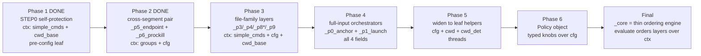

# Core Context Refactor Plan (Plan-of-Record)

> Phased, behavior-preserving conversion of the `_core.py` decision engine from a
> HAND-THREADED positional-parameter chain into a **thin ordering engine over an
> explicit `Context`** (per-evaluation inputs) and a future `Policy` (decision knobs).
> Anchored on the **phase-1 adoption executed 2026-07-16** (STEP0 self-protection cluster).
> Companion to [monolith-split-plan.md](monolith-split-plan.md) (the module-extraction
> sequence that carried `_core.py` 5136 → 4637 lines). That plan moved leaf *code* into
> siblings; **this** plan reshapes how *data* travels through the code that stayed.

---

## Why this plan (the codex finding)

A world-class review of the decomposed engine concluded: the module split is done, but
`_core.py` still "declares remaining coupling irreducible" when much of it is not
structural coupling at all — it is **parameter plumbing**. The remedy:

> "introduce explicit context/policy objects and make `_core` a thin ordering engine."

The decision layers do not depend on each other; they each depend on the **same four
per-evaluation inputs**, passed by hand. Bundle those into one object and the engine
reads as pure ordering:

```python
# today — evaluate() hand-threads 2–4 positional inputs into every layer
v = _p0_anchor(simple_cmds, cfg, cwd_base, groups)
v = _p1_launch(simple_cmds, cfg, cwd_base, groups)
v = _p3_hotfile(simple_cmds, cfg, cwd_base)
v = _p5_endpoint(groups, cfg)
# target — evaluate() orders layers over ONE shared context
v = _p0_anchor(ctx)
v = _p1_launch(ctx)
v = _p3_hotfile(ctx)
v = _p5_endpoint(ctx)
```

---

## The parameter-threading problem (baseline, 2026-07-16)

`evaluate()` computes a handful of per-evaluation values ONCE, then threads them
positionally through ~14 decision orchestrators and dozens of leaf helpers.

| Threaded input | In N `def` signatures | What it is | Grain |
|---|---:|---|---|
| `cfg` | **30** | the loaded config dict (protected-* lists + policy knobs) | per-evaluation (post-STEP1) |
| `simple_cmds` | **15** | pipeline-split simple commands (working set) | per-evaluation |
| `cwd_base` | **10** | base cwd seed (payload/process cwd) | per-evaluation (constant) |
| `cwd_det` | **10** | cwd-determinism flag | **per-command** (derived from `cwd_base`) |
| `groups` | **4** | pipeline groups preserving `\|` connectivity | per-evaluation |

Secondary threading load: **24** per-command `cwd, cwd_det = …` derivations and **18**
`_resolve_rel(val, cwd, cwd_det)` call sites. The `(cwd, cwd_det)` pair is the highest-
frequency positional couplet in the engine.

### Two grains — the load-bearing distinction

| Grain | Values | Lifetime | Belongs in Context? |
|---|---|---|---|
| **Per-evaluation** | `cfg`, `cwd_base`, `simple_cmds`, `groups` | one whole `evaluate()` call | **YES** — these are the Context |
| **Per-command** | `cwd`, `cwd_det` | one simple command (keyed on its index) | **NO** — derived inside each layer via `_effective_cwd_after(simple_cmds, idx, cwd_base)` + `_fold_wrapper_cwd`, so they VARY across the simple commands of a single evaluation |

Conflating the two is the trap: `cwd`/`cwd_det` cannot live on a per-evaluation Context
because a pipeline `cd a && rm x ; cd b && rm y` resolves a DIFFERENT cwd per segment.
The Context carries the **seed** (`cwd_base`); the per-command cwd stays a local derivation.

---

## The two objects

| Object | Bundles | Nature | Status |
|---|---|---|---|
| **`Context`** | the per-EVALUATION INPUTS (`cwd_base`, `simple_cmds`, `groups`, `cfg`) | a frozen snapshot threaded read-only through the layers | **Phase 1 DONE** — `context.py` |
| **`Policy`** | the configurable DECISION KNOBS currently read ad-hoc from `cfg` (`script_run_policy`, `bare_build_guard`, the protected-* families) | a typed view over `cfg` that names each knob once, so a layer reads `policy.script_run_policy` not `cfg.get("script_run_policy")` | **Proposed** — a LATE phase (see phase 6) |

`Context` answers "what am I deciding about?"; `Policy` answers "by what rules?".
Phase 1 delivers `Context` only — `Policy` is a distinct, higher-risk phase because it
touches how EVERY layer reads config, whereas `Context` only touches how inputs arrive.

### `Context` design (shipped — `hooks/lib/runtime_guard/context.py`)

```python
@dataclass(frozen=True)
class Context:
    cwd_base: Optional[str]      # base cwd seed; constant per evaluation
    simple_cmds: list            # working set (peel yields a NEW ctx)
    groups: list                 # pipeline groups (P5/P6 connectivity)
    cfg: Optional[dict]          # loaded config; None before STEP1 (STEP0 passes cfg=None)
```

> **Phase-2 hardening (post-audit, 2026-07-16).** All four fields are now
> **MANDATORY — no defaults**. An adversarial audit showed the former permissive
> defaults (`cwd_base=None`, `simple_cmds`/`groups` `default_factory=list`,
> `cfg=None`) let a construction that OMITS a field succeed with an empty working
> set: a `Context` built without `groups` made `_p5_endpoint` / `_p6_prockill`
> ABSTAIN and flipped a modeled BLOCK to a final ALLOW (the INV-6 fail-OPEN
> hazard). Removing every default makes an incomplete construction raise
> TypeError at build time. That raise is only **link 1** of the fail-CLOSED chain
> — see the [2026-07-17 audit](#fail-closed-chain-audit--fix-2026-07-17) for what
> the raise does and does NOT guarantee. The three existing sites are
> behavior-preserving: the two STEP0 sites now pass `cfg=None` EXPLICITLY, and
> the P5/P6 site already passed all four fields.

| Design choice | Rationale |
|---|---|
| **frozen** | a Context is an immutable snapshot of one evaluation stage. The front-end peel and the STEP1 config load each build a NEW Context, never mutate one — so a Context always faithfully describes exactly one stage. |
| **fields MANDATORY** | no field has a default → omitting one raises TypeError at construction, so a mis-built Context can never SILENTLY disable a guard (INV-6). The raise is not by itself a deny — it resolves to one only via the [fail-CLOSED chain](#fail-closed-chain-audit--fix-2026-07-17), and only for the verb families the hook's fallback covers. `cfg` keeps its `Optional[dict]` type (it may be None for pre-config STEP0) but STEP0 passes `cfg=None` EXPLICITLY — a pre-config Context is still `cfg=None`; the post-load Context carries the dict. |
| **`cwd_det` NOT a field** | per-command, not per-evaluation (see two-grains table). Layers derive it locally, unchanged. |
| **pure data, zero engine import** | `context.py` imports only `dataclasses` + `typing`. No import back into `_core` → no cycle. Mirrors the `shell_lex`/`constants`/… sibling contract. |
| **new module, not inline** | a lib module (like the six phase-1..6 siblings) — does NOT affect the top-level-script helper-count self-check. |

### `Policy` design (proposed — NOT shipped)

A later phase MAY introduce a `Policy` frozen dataclass built once from `cfg`, exposing
the decision knobs by name. Illustrative shape (subject to phase-6 design):

```python
@dataclass(frozen=True)
class Policy:
    script_run_policy: str        # "default_deny" | "allow_all"
    bare_build_guard: bool
    # protected-* families remain in cfg (data), accessed via typed getters
```

`Policy` is deferred because it changes ~30 `cfg`-reading sites — high blast radius,
low structural payoff until `Context` adoption is complete. It is the LAST phase, not phase 1.

---

## Behavior-preservation invariants (every phase MUST meet)

Inherited from [monolith-split-plan.md](monolith-split-plan.md) INV-1..INV-6, plus the
context-specific INV-7. A Context/Policy phase is a **signature/plumbing** refactor, not a
byte-move, so INV-4 is reframed as verdict-invariance rather than byte-identity.

| ID | Invariant | How verified |
|---|---|---|
| INV-1 | Test-green, exact | `test_runtime_guard.py` == **755 passed**; full `hooks/tests/` shows no new fail/skip vs baseline |
| INV-2 | Public surface ⊇ before | every name previously importable from `_core` still is; ADDING `Context`/`Policy` is allowed (superset). MISSING must be empty |
| INV-3 | Tri-context load | `_core` loads as (a) `lib.runtime_guard._core` submodule, (b) direct script via the `runtime_guard.py` shim `os.execv`, (c) `python -m lib.runtime_guard`. The new sibling import uses the **dual form** (relative, then absolute fallback) |
| INV-4 | Zero-logic move → **verdict-invariance** | since this refactor changes SIGNATURES not logic, "byte-identical" is replaced by: `evaluate()` returns the identical verdict for a representative command battery (ALLOW + every BLOCK family), env unset, before vs after |
| INV-5 | No project identifiers | new module `grep -Ei 'happy\|/root\|slopus'` → clean |
| INV-6 | No new fail-open | the Context must carry the SAME values the positional params carried. A field silently defaulting where a real value was expected (e.g. `cfg=None` reaching a post-STEP1 layer) is a fail-OPEN regression — forbidden. Constructed contexts populate every field the target stage owns |
| INV-7 | **Pure relocation of travel** | no threshold, ordering, or decision changed. A field on the Context holds byte-for-byte what the positional param held; the layer's body computes identically. The ONLY change is how the value arrives |

**INV-6 is the context-refactor near-miss.** Unlike the module split (where a bad relative
import fail-CLOSED), a mis-populated Context fails **OPEN**: a layer that reads
`ctx.cfg` when the constructor left it `None`, or `ctx.simple_cmds` from the pre-peel
snapshot after a peel, would silently under-block. Every phase MUST construct the Context
at the point where all the fields that stage owns are available, and rebuild it (not
mutate — it is frozen) whenever the working set changes (peel, config load).

---

## `_core.py` — phased sequence (ascending risk)

Risk is driven by **how many inputs the cluster threads** and **whether it runs pre- or
post-config**. STEP0 (pre-config, threads 2 inputs, called at 2 sites) is the leaf;
the full-input orchestrators and the `Policy` cut are last.



| Phase | Cluster | Fields adopted | Call sites | Risk | Key note |
|---|---|---|---|---|---|
| **1 ✅** | `_step0_self_protection` + `_step0_mutation_anchor_hits` | `simple_cmds`, `cwd_base` | 2 (evaluate) + 1 (internal) | **Low** | DONE 2026-07-16. Pre-config (`cfg=None`), self-contained, 0 external importers. Leaf helpers threading per-command `cwd`/`cwd_det` (`_step0_targets_config_redirect`, `_step0_find_destructive_hits`) STAY positional — they take per-command values, not per-evaluation inputs |
| **2 ✅** | `_p5_endpoint` + `_p6_prockill` | `groups`, `cfg` | 2 (evaluate) | Low | DONE 2026-07-16. Natural pair — both cross-segment primitives on pipeline GROUPS, both took exactly `(groups, cfg)`. One post-config Context snapshot orders both. Cleanest coarse-Context demo after STEP0 |
| 3 | `_p3_hotfile`, `_p4_statefile`, `_p8_build`, `_p8_explicit_protected_path`, `_p8_bare_build`, `_p9_pkgscript`, `_p2_service`, `_p7_globalbin` | `simple_cmds`, `cfg`, `cwd_base` | ~8 (evaluate) | Med | The file/build/service family. Adopt in coherent sub-batches (hotfile+statefile, then build arms, then service/globalbin), landing green between each |
| 4 | `_p0_anchor`, `_p1_launch` | all 4 (`simple_cmds`, `cfg`, `cwd_base`, `groups`) | 2 (evaluate) | Med-High | The load-bearing anchor + launch orchestrators. Highest-value: after this, `evaluate()`'s P0..P9 block is pure `_pN(ctx)` ordering |
| 5 | secondary leaf helpers | `cfg` + `cwd`/`cwd_det` couplets | ~30 `cfg` sites | High | OPTIONAL widening. Diminishing returns; the per-command `(cwd, cwd_det)` pair may stay positional (it is genuinely per-command). Consider a per-command `CmdContext` only if it pays for itself |
| 6 | `Policy` over `cfg` knobs | — | ~30 cfg reads | High | Introduce `Policy`; convert `cfg.get("script_run_policy")` → `policy.script_run_policy`. Distinct object, distinct phase |
| — | Final state | — | — | — | `_core` = `evaluate` ordering `_pN(ctx)` + the irreducible per-command helpers. A final rename to `engine.py` with a re-export shim is optional |

**Adoption-safety rule (every phase).** Before converting cluster *C*: (1) confirm every
value *C* reads is a Context FIELD (per-evaluation) not a per-command derivation; (2)
construct the Context at the point all of *C*'s fields are populated (post-STEP1 for `cfg`
readers); (3) after a working-set change (peel/reload) build a FRESH Context — never reuse
a stale snapshot (INV-6). Land green (INV-1 + INV-4) before starting the next cluster.

---

## Phase 1 — DONE (2026-07-16): STEP0 self-protection cluster

The lowest-risk adoption: the config-self-protection guard, which runs BEFORE config load
(so it threads only `simple_cmds` + `cwd_base`, never `cfg`/`groups`), is called at exactly
two `evaluate()` sites, and has ZERO external importers — the tests exercise it only through
`evaluate()`.

| Field | Value |
|---|---|
| New module | `hooks/lib/runtime_guard/context.py` (53 lines) — frozen `Context` dataclass, pure data + stdlib |
| Functions adopted | `_step0_self_protection(ctx)` (was `(simple_cmds, cwd_base)`), `_step0_mutation_anchor_hits(ctx, idx, sc, tokens)` (was `(simple_cmds, idx, sc, tokens, cwd_base)`) |
| Read pattern | `_step0_self_protection` binds local aliases `simple_cmds = ctx.simple_cmds` / `cwd_base = ctx.cwd_base` (byte-for-byte body match); `_step0_mutation_anchor_hits` reads `ctx.simple_cmds` / `ctx.cwd_base` at its one derivation site |
| Call-site change | evaluate()'s two STEP0 calls now build `Context(cwd_base=…, simple_cmds=…, groups=…)` (original + front-end-peeled snapshot); `cfg` left `None` (pre-config, by design) |
| STAYED positional | `_step0_targets_config_redirect`, `_step0_find_destructive_hits`, `_step0_mutation_targets`, `_step0_redirect_target` — they thread per-COMMAND `cwd`/`cwd_det` (or none), not per-evaluation inputs, so they are outside the Context grain. The cluster boundary stops exactly at the two per-evaluation-input functions |
| Re-import site | `_core.py` in-place, dual-context try/except (`from .context import Context` → `from context import Context`), `# noqa: F401`. No reload needed (pure data, no import-time env read, unlike `config.py`) |
| Script-context collision check | new sibling `context.py`; `find_spec('context')` from a neutral cwd → `None` (no stdlib `context`; `contextlib`/`contextvars` do not collide). In script context `sys.path[0]` is the package dir, so the shim-exec'd `_core.py`'s `from context import Context` resolves THIS module |
| Coupling | Outbound: `dataclasses` + `typing` only — no `_core` import (no cycle). Inbound: `Context` referenced only inside `_core` (evaluate + the two STEP0 functions); re-exported via `__init__`'s `dir(_core)` sweep so the package surface is a superset |
| Diff | `_core.py`: +32 / −7 (import block + 2 signatures + 2 docstrings + 1 derivation line + 2 alias lines + 1 internal call + 2 call sites). `context.py`: new, 53 lines |
| Result | INV-1 ✓ (755→755) · INV-2 ✓ (224→225 names, 0 missing, `+Context`) · INV-3 ✓ (all 3 contexts; script-ctx STEP0 config-write/tee/rm BLOCK, benign ALLOW — the refactored `_step0_mutation_anchor_hits` emits "mutation of data file" via `ctx`, proving the fallback import + ctx plumbing ACT under `os.execv`) · INV-4 ✓ (17/17 verdicts byte-identical: 6 ALLOW + 11 BLOCK across launch/service/prockill/STEP0-config/destructive-find/destructive-git/build) · INV-5 ✓ (clean) · INV-6 ✓ (`cfg=None` is correct for pre-config STEP0; no post-STEP1 field read) · INV-7 ✓ (pure relocation — `ctx.simple_cmds`/`ctx.cwd_base` hold identical values) |

### Phase-1 verdict-invariance battery (INV-4 evidence)

| Family | Command (representative) | Verdict (before == after) |
|---|---|---|
| ALLOW | `echo hello world` · `cat <datafile>` · `ls -la packages` · `git status` · `find <repo> -name '*.mjs' -print` · `yarn workspace happy-app web` | ALLOW ×6 |
| Launch (P0/P1) | `happy daemon start` · `node … dist/index.mjs daemon start` · `npx happy daemon start` | BLOCK ×3 |
| Service (P2) | `systemctl restart <protected-daemon>` | BLOCK |
| Prockill (P6) | `pkill -f <protected-daemon>` | BLOCK |
| **STEP0 config (refactored cluster)** | `echo x > <datafile>` (redirect) · `rm -f <datafile>` (mutation) | BLOCK ×2 |
| Destructive find | `find <protected-pkg> -name '*.mjs' -delete` | BLOCK |
| Destructive git | `git checkout -- <protected>/dist/index.mjs` | BLOCK |
| Build-into-protected (P8) | `yarn workspace happy build` · `yarn build` | BLOCK ×2 |

`diff verdicts_before.txt verdicts_after.txt` → empty (byte-identical).

---

## Phase 2 — DONE (2026-07-16): cross-segment pair (`_p5_endpoint` + `_p6_prockill`)

The cleanest coarse-Context demo after STEP0: the two cross-segment primitives that
operate on pipeline GROUPS. Both took EXACTLY `(groups, cfg)` — no per-command
derivation, no other per-evaluation input — so the whole cluster reads its inputs from a
single post-config Context. Both run AFTER the STEP1 config load, so the Context carries
a real `cfg` (not `None` as in STEP0), and after the front-end peel, so `groups` /
`simple_cmds` are the CURRENT working set (a fresh snapshot, never a stale pre-peel one).

| Field | Value |
|---|---|
| Module | `hooks/lib/runtime_guard/context.py` UNCHANGED — the `groups` + `cfg` fields shipped in Phase 1 already carry everything P5/P6 read; no new field needed |
| Functions adopted | `_p5_endpoint(ctx)` (was `(groups, cfg)`), `_p6_prockill(ctx)` (was `(groups, cfg)`) |
| Read pattern | each binds local aliases `groups = ctx.groups` / `cfg = ctx.cfg` immediately after the docstring (byte-for-byte body match below — mirrors the Phase-1 STEP0 alias style) |
| Call-site change | evaluate()'s P5+P6 block builds ONE post-config `Context(cwd_base=…, simple_cmds=…, groups=…, cfg=cfg)` (`p5p6_ctx`) and orders both layers over it. cfg is the loaded config (non-None, guaranteed by the STEP1 fail-closed return above); groups/simple_cmds reflect any front-end peel |
| Why ONE context for both | P5 and P6 are adjacent in evaluate() with NO intervening mutation of groups/cfg/simple_cmds/cwd_base, so a single snapshot is complete + consistent for both — no need to rebuild between them |
| STAYED positional | the P5/P6 leaf helpers (`_protected_proc_tokens(cfg)`, `_selector_overlaps_protected`, `_is_kill_executor`, `_endpoint_path_in`, …) keep their existing signatures — they take already-extracted scalars/sub-lists, not per-evaluation inputs, so they are outside the Context grain (same boundary discipline as Phase 1's STEP0 leaves) |
| Public surface | UNCHANGED — only the two internal `_pN` signatures + their evaluate() call sites changed; no name added or removed (`_p5_endpoint` / `_p6_prockill` still importable; `Context` already present from Phase 1) |
| Diff | `_core.py`: +18 / −6 (2 signatures + 2×3 alias/comment lines + the call-site Context construction). `context.py`: 0 (no change) |
| Result | INV-1 ✓ (755→755, no new fail/skip) · INV-2 ✓ (surface unchanged; `_p5_endpoint`/`_p6_prockill`/`evaluate`/`Context` all importable) · INV-3 ✓ (submodule path exercised by the 755 suite; context.py imports stdlib only → no cycle) · INV-4 ✓ (17/17 verdicts byte-identical, incl. P5 ×2 + P6 ×3 BLOCK still BLOCK, benign P5/P6 still ALLOW) · INV-5 ✓ (context.py untouched, clean) · INV-6 ✓ (post-config Context carries the REAL loaded `cfg` — no `None` reaching a post-STEP1 layer; fresh post-peel `groups`) · INV-7 ✓ (pure relocation — `ctx.groups`/`ctx.cfg` hold byte-for-byte what the positional params held; no threshold/branch changed) |

### Phase-2 verdict-invariance battery (INV-4 evidence)

| Family | Command (representative) | Verdict (before == after) |
|---|---|---|
| **P5 endpoint (refactored)** | `printf 'POST /stop …' \| nc 127.0.0.1 8080` (raw-socket, upstream path) · `curl -s http://127.0.0.1:8080/stop` (HTTP, own argv) | BLOCK ×2 |
| **P5 benign (refactored)** | `curl …/health \| grep /stop` (endpoint text only downstream) | ALLOW |
| **P6 prockill (refactored)** | `kill $(pgrep <protected-daemon>)` (cmd-subst) · `pkill -f <protected-daemon>` (name-match verb) · `pgrep -f <protected-daemon> \| xargs kill` (xargs) | BLOCK ×3 |
| **P6 benign (refactored)** | `kill 1234` (bare PID, no selector mechanism) | ALLOW |
| Launch (P0/P1) | `happy daemon start` | BLOCK |
| Service (P2) | `systemctl restart <protected-daemon>` | BLOCK |
| STEP0 config | `rm -f <datafile>` · `echo x > <datafile>` | BLOCK ×2 |
| Destructive find/git | `find <protected>/dist -name '*.mjs' -delete` · `git checkout -- <protected>/dist/index.mjs` | BLOCK ×2 |
| Build (P8) | `yarn workspace happy build` | BLOCK |
| ALLOW | `echo hello world` · `git status` · `ls -la packages` | ALLOW ×3 |

`diff <(cut -f1,2 verdicts_before.txt) <(cut -f1,2 verdicts_after.txt)` → empty (verdict+label byte-identical; the only raw-line delta is the battery's random tmpdir name).

### Phase-2 hardening — mandatory Context fields (post-audit 2026-07-16)

A follow-up adversarial audit of the shipped Context found its permissive field
defaults were an INV-6 fail-OPEN latent: a construction that OMITS `groups`
(e.g. `Context(cfg=…)`) silently succeeded with `groups=[]`, so the cross-segment
guards `_p5_endpoint` and `_p6_prockill` (both read `ctx.groups`) ABSTAINED and a
modeled raw-socket `POST /stop` (P5) and a `pgrep … | xargs kill` (P6) flipped from
BLOCK to a final ALLOW. Fix: all four fields (`cwd_base`, `simple_cmds`, `groups`,
`cfg`) are now MANDATORY (no defaults), so an incomplete construction raises
TypeError at build time instead of silently disabling the guard. Strictly
behavior-preserving: the two STEP0 sites now pass `cfg=None` EXPLICITLY (unchanged
pre-config semantics) and the P5/P6 site already passed all four fields — full suite
stays green and STEP0/P5/P6 verdicts are unchanged.

**Scope of that claim — the TypeError is the FIRST LINK, not the guarantee.** This
hardening converts a *silent wrong answer* into a *loud crash*. It does NOT by itself
make anything fail-CLOSED: a crash is only a denial if something downstream turns it
into one. As shipped it did not, and the audit recorded in the next section reproduced
the resulting fail-OPEN. The complete, current account of what is and is not guaranteed
lives in **Fail-CLOSED chain audit + fix** below — read it as the authority; this
section covers only the construction-time behavior.

### Fail-CLOSED chain audit + fix (2026-07-17)

The Phase-2 hardening above shipped with an **overbroad claim**: that the TypeError
alone made "the guard engine error out and the surrounding hook deny conservatively".
An adversarial audit **reproduced the opposite** — the hardening had converted a
*silent-default* fail-OPEN into a *crash* fail-OPEN, and for the P5 family the
verdict was ALLOW either way:

| Layer | Reproduced BEFORE state |
|---|---|
| `_core.main()` | did NOT wrap `evaluate()` (the `try/except (ValueError, OSError)` above it guards only the cwd lookup). The TypeError escaped → rc=1, **stdout empty**, diagnostic lost |
| `pretool-bash-safety.sh` | `_runtime_guard_fail_closed` covered five verb families (service / kill / package-manager / build / runtime) — **not** the endpoint / raw-socket client family P5 exists to guard → the crashed P5 command matched nothing and fell through |

Reproduction (fault = omit `groups` at the P5/P6 Context site; drive the REAL hook
with a simulated PreToolUse payload — no real endpoint is ever contacted):

| `printf 'POST /stop …' \| nc 127.0.0.1 54321` | engine stdout | hook exit |
|---|---|---|
| healthy guard | `BLOCK` | 2 (BLOCK) |
| BEFORE — crashed guard | `''` (empty) | **0 (ALLOW), stderr empty** |
| AFTER — crashed guard | `INDETERMINATE` | **2 (BLOCK)** |

**Fix, two links.** (1) `_core.main()` now wraps `evaluate()` in a catch-all that
emits the existing `INDETERMINATE` sentinel + a named-exception stderr diagnostic, so
an exception escaping **the decision-engine call** cannot yield an empty verdict or a
bare traceback; deliberate BLOCK/ALLOW returns are untouched. That scope is exact, not
rhetorical — failures *outside* that call (notably non-object JSON, which raises at the
payload field access before it) still exit with empty stdout; see residual gap 5.
(2) `_runtime_guard_fail_closed` gained a sixth family —
`nc|ncat|netcat|socat|telnet|curl|wget` — matching the five existing families'
anchoring / word-boundary / case-insensitivity discipline; its denial message now
names the family list accurately.

### Fail-CLOSED chain — completion + drift guard (2026-07-17, round 2)

An adversarial audit of the fix ABOVE found it **incomplete in two ways**, each
reproduced by fault injection (crash the engine only — the shim passes the hook's own
JSON-parsing `-c` calls through to a real interpreter, so `COMMAND` still parses and
the fallback is measured, not blanked):

| # | Reproduced BEFORE state | Now |
|---|---|---|
| 1 | The shell fallback did **not** mirror the engine. Measured in isolation against the engine's own token sets: **46 coverage gaps**. `_core.NET_HEADS` contains `http` / `https` / `httpie`, which the shell never knew; `_is_kill_executor` treats `fuser` + kill-flag as a termination front-end, which the shell omitted entirely; and **all 14** P5/P6 tokens slipped through in the path-qualified (`/usr/bin/curl`), quoted (`"curl"`), and path-qualified+quoted forms the engine NORMALIZES and still recognizes | **0 gaps across the four tested forms** (bare / quoted-whole / path-qualified / path-qualified+quoted) — *not* universally; see gap 4 |
| 2 | `main()` caught `Exception`, so a direct `BaseException` subclass (notably `SystemExit`) still escaped with an EMPTY verdict; and the diagnostic was rendered BEFORE the sentinel was emitted, so an exception whose `__str__` itself raises escaped before the sentinel was ever written | sentinel emitted + flushed FIRST, `BaseException` caught, diagnostic best-effort |

**Why it recurred twice: nothing tied the two sides together.** The shell helper is
maintained by hand in bash while the token sets evolve in Python; every drift was
invisible because no test compared them. The durable fix is
`hooks/tests/test_fail_closed_drift.py`, which **imports the engine's own definitions**
(`_core.NET_HEADS`, `constants.KILL_VERBS`) and asserts the shell helper denies a
representative command for every token, in each normalized invocation form. It also
AST-parses `_is_kill_executor` and fails on any new head literal the shell was never
taught (the `fuser`-class drift), asserts `NET_HEADS` stays the union the tests
iterate, and asserts the call site stays inside the non-ALLOW branch. Falsified — with
coverage removed it fails, restored it passes:

| Injected drift | Suite |
|---|---|
| engine gains an endpoint client, shell not widened | **fails** |
| shell loses a token the engine still knows (`httpie`) | **fails** |
| engine gains a new termination front-end head literal | **fails** |
| (restored) | all pass |

**Residual gaps — stated, not fixed (verified; do NOT read coverage as blanket).**

1. **Families the fallback does not cover at all.** The filesystem-MUTATION family is
   not among them. With the engine crashed, `cp` / `tee` / `truncate` / `sed -i` /
   `>`-redirect targeting a protected statefile, hotfile, or global bin each still
   yield **ALLOW** (8/8 probed forms). So **STEP0** (config self-protection), **P3**
   (hotfile), **P4** (statefile) and **P7** (global bin) remain fail-OPEN on a crash —
   they depend on the engine being healthy. The families the fallback DOES cover are
   **P5** (endpoint client) and **P6** (process termination), alongside the pre-existing
   service-control, package-manager, build-tool and runtime-launcher families; what it
   lacks is any filesystem-mutation family — which is exactly why STEP0/P3/P4/P7 stay
   fail-OPEN on a crash. And see gap 4: not even the P5/P6 families it covers are
   fail-CLOSED *family-wide*. Widening to the mutation family is **follow-up work**; it
   must not be assumed done.
2. **Normalization tolerance is P5/P6-only.** The path-qualified/quoted tolerance was
   added to the P5 and P6 lines only. The service-control, package-manager, build-tool
   and runtime-launcher families keep their original bare-token anchoring, so
   `/usr/bin/systemctl restart …` is still not matched by the fallback. Out of scope
   here; recorded, not fixed.
3. **The fallback is a best-effort approximation of the engine's lexing, not a
   re-implementation of it.** It greps raw command TEXT; it does not tokenize, expand,
   or resolve. Measured, because the coarse reading was wrong in BOTH directions:

   | Form | Fallback | Status |
   |---|---|---|
   | wrapper prefixes `sudo curl …`, `env FOO=1 curl …` | DENY | matched **incidentally** — the name still appears literally; nothing parses the wrapper |
   | `xargs`-wrapped verb (`… \| xargs kill`) | DENY | matched via the wrapped token |
   | simple quoted-`eval` (`eval 'curl …'`, `eval "curl …"`) | DENY | matched **incidentally**, not parsed |
   | `$(…)` command substitution (`$(echo curl) …`) | ALLOW | genuinely unmatched |
   | variable/alias indirection (`X=curl; $X …`) | ALLOW | genuinely unmatched |
   | base64-encoded text | ALLOW | genuinely unmatched |

   So it is **wrong** to say these forms "cannot be mirrored": the wrapper and simple
   eval forms *do* match today. It is equally wrong to record them as **coverage** —
   they are **not parsed and not guaranteed**, and a variant that breaks the literal
   (eval over a substitution) is not matched. The drift guard asserts **token-set
   coverage and invocation-form tolerance**, not semantic equivalence. Being coarser
   than the engine in the DENY direction is intended (a bare `kill <pid>`, or an
   endpoint client aimed at a benign path, is denied by the fallback though the healthy
   engine ALLOWs it); this path only ever runs when the engine has already failed to
   decide.

4. **No family is fail-CLOSED *family-wide* — not even P5/P6, and this is not
   fixable.** Link 3 is a **regex** over raw text; the engine recognizes a head by real
   **lexing** (`shlex`). A regex can never be semantically equivalent to a lexer, so
   engine-BLOCK / fallback-ALLOW forms exist and always will. Reproduced against the
   real engine + the real helper (2026-07-17) — each **engine=BLOCK, fallback=ALLOW**:

   | Form | Example | shlex normalizes to |
   |---|---|---|
   | quote-concat (prefix) | `"cu"rl <loopback>/stop` | `curl` |
   | quote-concat (suffix) | `cu"rl" <loopback>/stop` | `curl` |
   | quote-concat (single-q) | `'cu'rl <loopback>/stop` | `curl` |
   | quote-concat (mid) | `c"u"rl <loopback>/stop` | `curl` |
   | backslash-escape | `\curl <loopback>/stop` | `curl` |
   | quote-concat (P6) | `"pk"ill -f <ident>` | `pkill` |
   | quote-concat (P6, suffix) | `ki"ll" -9 …` | `kill` |

   **Do not extend the regex to chase this** — that is a treadmill, and it is
   explicitly out of scope. The accurate posture: the fallback is **best-effort
   defense-in-depth over specific tested forms**, *not* a guarantee for any family.

5. **The crash handler is scoped to the decision-engine call, not to the entry point.**
   `main()` wraps only the `evaluate()` call in its `BaseException` catch-all. Verified:
   an exception escaping `evaluate()` yields `INDETERMINATE` on stdout (never empty) —
   that narrow claim holds. But **parseable-but-non-object JSON** (`"hello"`, `[1,2]`,
   `42`, `null`) raises at the payload field access, which runs *before* the protected
   region, and exits with **empty stdout and a bare traceback**. Only *unparseable*
   payloads are handled, by a separate earlier `except (ValueError, OSError)`. A
   genuine stdout write/flush failure cannot be repaired — the verdict channel is what
   failed.

**Regression posture.** The widened denial fires ONLY on the non-ALLOW fallback path,
never when the guard is healthy — asserted structurally by the drift guard and
end-to-end: a healthy-guard benign endpoint client (`curl …/health`) is still ALLOW,
P5/P6 BLOCK cases still BLOCK, benign still ALLOW. Substring safety holds: `httpx-cli`,
`nctool`, `curler`, `my-fuser-report`, and a `node_modules/https-proxy-agent/…` path
are all still ALLOW under a crashed engine (a longer token merely CONTAINING a family
name never matches). Shell stays `bash -n` clean. Suite green at 1379 passed /
9 xpassed + 29 new drift-guard tests.

---

## Global constraints (all phases)

- Edit `_core.py` + the new `context.py` (later: `policy.py`) ONLY. Do **not** hand-edit
  doc-sync-generated `INDEX.md` / `README.md`, `CLAUDE.md`, `settings.json`, or the test
  suite. A new sibling is a lib file — it does NOT affect the top-level-script helper-count
  self-check; the orchestrator regenerates the `runtime_guard` INDEX afterward.
- One cluster per cycle; land it green (INV-1 + INV-4) before the next. This is the SECURITY
  DECISION CORE — the 755-test suite + the verdict-invariance battery are the safety net.
- Construct the Context where its fields are live; rebuild (never mutate) on peel/reload.
  A mis-populated field fails OPEN (INV-6) — the opposite of the module split's fail-closed.
- Use `Edit` (surgical), not a rewrite. If adopting the Context in a cluster cannot be done
  cleanly behavior-preserving, DEFER that cluster and record why — do not ship a risky
  partial refactor of the security core.
