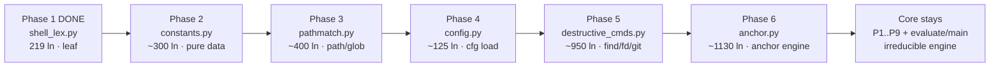
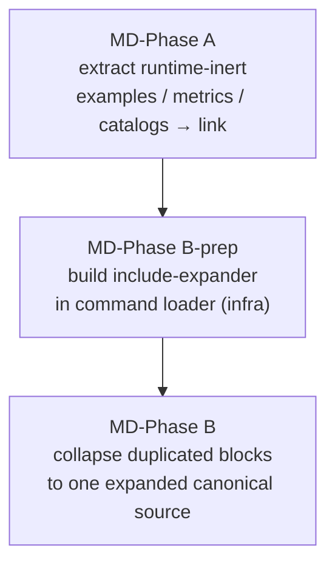

# Monolith Split Plan (Plan-of-Record)

> Phased, behavior-preserving decomposition of the four repo monoliths.
> Anchored on the **phase-1 extraction executed 2026-07-15** (shell-lexing seam).
> Companion to [roadmap-decomposition-productization.md](roadmap-decomposition-productization.md)
> (product identity / layer model); this doc is the concrete extraction sequence.

---

## Monoliths & baseline sizes

| Monolith | Lines | Kind | Runtime-critical | Test safety-net |
|---|---:|---|---|---|
| `hooks/lib/runtime_guard/_core.py` | 5657 (was 5839) | Python engine | Yes — powers the bash-safety guard | `test_runtime_guard.py` = **755 passing** |
| `commands/dev-overnight.md` | 1894 | Prompt (orchestrator) | Yes — autonomous loop | none (prompt) |
| `agents/qa.md` | 1916 | Prompt (subagent) | Yes — QA gate | none (prompt) |
| `commands/dev.md` | 1618 | Prompt (orchestrator) | Yes — `/dev` pipeline | none (prompt) |

---

## Two behavior-preservation regimes

Python and Markdown decompose under **different** invariants — conflating them is the trap.

| | Python (`_core.py`) | Markdown (`dev.md` / `dev-overnight.md` / `qa.md`) |
|---|---|---|
| How consumed | `import` re-assembles full behavior at load | Injected **verbatim** as a prompt |
| Extract + pointer preserves behavior? | **Yes** — re-import the moved names | **No** — a link is not expanded; content leaves the prompt |
| Include/expansion mechanism | native (`import`) | **none exists** (verified: `grep -rE '@include\|{{include}}\|<!--include'` → 0 hits) |
| Safe first move | lift a dependency-leaf cluster | extract only *runtime-inert* reference sections, **or** build an include-expander first |

---

## Behavior-preservation acceptance criteria (every future phase MUST meet)

### Python engine (`_core.py`)

| ID | Invariant | How verified |
|---|---|---|
| INV-1 | Test-green, exact | `test_runtime_guard.py` == **755 passed**; full `hooks/tests/` shows **no new failures, no new skips** vs baseline |
| INV-2 | Public surface unchanged | `set(dir(_core))` after ⊇ before — every name previously importable from `_core` still is (AST-of-old-file vs `dir(new _core)` diff → MISSING must be empty) |
| INV-3 | **Tri-context load** | `_core.py` loads as (a) `lib.runtime_guard._core` submodule, (b) direct script via the `runtime_guard.py` shim `os.execv`, (c) `python -m lib.runtime_guard`. Every intra-package import uses the **dual form** (relative, then absolute fallback) |
| INV-4 | Zero-logic move | Extracted text is **byte-identical** (slice, never retype); no renames, no signature/behavior changes |
| INV-5 | No project identifiers | New module `grep -Ei 'happy\|/root\|<projname>'` → clean (engine purity contract) |
| INV-6 | Leaf-first | Never lift a cluster with an unresolved **outbound** dependency into code that stays in `_core`, unless a documented late-bound import is accepted |

**INV-3 is the phase-1 near-miss.** The first attempt used a bare relative import
`from .shell_lex import …`. It passed compile, package import, and 725/755 tests —
but **30 `TestCycle16LiveHook` tests failed**: the shim `runtime_guard.py` does
`os.execv(python, _core.py)`, running `_core` as a **top-level script with no parent
package**, where a relative import raises `ImportError`, the guard emits `verdict=''`,
and the live hook fail-closes. The fix is the dual-context idiom every future phase inherits:

```python
try:                                   # package context: lib.runtime_guard._core
    from .shell_lex import _strip_quotes, _split_pipeline, ...
except ImportError:                    # script context: sys.path[0] == this dir
    from shell_lex import _strip_quotes, _split_pipeline, ...
```

### Markdown prompts

| ID | Invariant | How verified |
|---|---|---|
| MD-1 | No runtime content loss | Extracted block is either (a) runtime-inert (maintainer-facing example/metrics/catalog), or (b) re-injected by an include-expander |
| MD-2 | Byte-preserved | Moved text is identical; the command still reads as a complete standalone instruction |
| MD-3 | Single canonical source | A block duplicated across files collapses to ONE reference; no divergent copies |

---

## Phase 1 — DONE (2026-07-15): shell-lexing seam

| Field | Value |
|---|---|
| Unit extracted | Shell-command lexing primitives (dependency **leaf**, stdlib-only) |
| New module | `hooks/lib/runtime_guard/shell_lex.py` (242 lines; 219 moved verbatim) |
| Names moved | `_split_pipeline`, `_is_redirect_amp`, `_strip_compound_delims`, `_has_redirect_to`, `_write_redirect_targets`, `_strip_quotes`, `_safe_shlex`, `_WRITE_REDIRECT_RE` |
| Re-import site | `_core.py` top (dual-context try/except), `# noqa: F401` |
| Coupling | Outbound: stdlib `re`/`shlex` only. Inbound: 200 refs, **all inside `_core`** (0 external importers) |
| Result | INV-1 ✓ (755→755, full suite no new fail/skip) · INV-2 ✓ (213 names, 0 missing) · INV-3 ✓ (all 3 contexts ALLOW) · INV-4 ✓ (byte-identical) · INV-5 ✓ (clean) |

---

## `_core.py` — phased sequence (ascending risk)

Risk is driven by **outbound** coupling (how much stays-in-`_core` code the cluster calls).
Leaves first; the decision engine last.



| Phase | Module | Cluster (representative names) | Outbound deps | Risk | Key note |
|---|---|---|---|---|---|
| 2 | `constants.py` | ~20 `frozenset`/dict tables: `PKG_MANAGERS`, `ENV_WRAPPERS`, `RUNTIMES`, `MUTATION_VERBS`, `KILL_VERBS`, `EXEC_FRONTEND_PROFILES`, … | none (pure data) | **Low** | Move data tables only; **keep `_block` + `Verdict`/`ALLOW` in `_core`** (type alias anchors there). Re-import restores every name |
| 3 | `pathmatch.py` | `_normalize_path`, `_expand_leading_home`, `_glob_to_segment_regex`, `_has_shell_glob`, `_glob_parent`, `_glob_literal_prefix`, `_dir_equal_or_under`, `_path_matches_any`, `_path_under_any`, `_any_token_*` | shell_lex + constants | **Low-Med** | One forward ref: `_mutation_cand_hits`→`_destructive_root_contains_protected`. Leave `_mutation_cand_hits` in `_core`, or pass the callee in |
| 4 | `config.py` | `_load_config`, `_config_path_variants`, `_config_ancestor_dirs`, `_config_or_ancestor_variants`, `_targets_config_file`, `_home_tilde_variant`, `REQUIRED_KEYS`, `DATA_FILE_PATH` | pathmatch + constants | **Med** | Owns `DATA_FILE_PATH` (env-overridable) — tests set it via env, so the module-level read must stay import-time |
| 5 | `destructive_cmds.py` | `_fd_*`, `_find_*` (find/fd destructive analysis) + `_git_*` (`_git_destructive_pathspecs`, `_git_is_destructive_invocation`, `_strip_git_pathspec_magic`, …) | pathmatch + config + constants | **Med-High** | Two cohesive command-family parsers; may split into `find_cmds.py` + `git_cmds.py` if the combined diff is unreviewable |
| 6 | `anchor.py` | `_anchor_*` family + `_p0_anchor` (`_anchor_exec_tokens`, `_anchor_in_command_word_position`, `_anchor_mutation_hits`, `_anchor_build_hits_protected`, …) | all shared helpers + `cfg` | **High** | Extract only after 2–5 stabilize the shared-helper surface; heaviest inbound/outbound coupling |
| — | stays in `_core.py` | `_p1_launch`…`_p9_pkgscript`, `_step0_*`, `_step1_indeterminate`, `evaluate`, `main` | — | — | The irreducible decision orchestrator. Not a "lift"; at most a final rename to `engine.py` with a re-export shim |

**Dependency-safety rule for phases 2–6.** Before lifting cluster *C*, run
`git grep -nE '\b<name>\b'` for each name in *C* and confirm every **callee** is either
(a) in *C*, (b) stdlib, or (c) already-extracted (imported back). Any callee that stays
in `_core` and is called *by* *C* creates a cycle → keep that boundary function in `_core`.

---

## Markdown monoliths — seams & shared blocks

The highest-value md finding: large policy blocks are **duplicated across files**. With no
include-expander, they cannot be de-duplicated behavior-preservingly today.

| Block | Appears in | Approx lines | Nature |
|---|---|---|---|
| Four Contracts Awareness (Pre-BA / Post-BA / BA-rejection / Layer vocab) | `dev.md` 266–367 · `dev-overnight.md` 362–435 | ~100 / ~74 | Near-duplicate policy |
| Codex adversarial consultation (procedure + fallback + output) | `qa.md` 1271–1331 · `agents/dev.md` | ~60 | Near-duplicate protocol |
| Score-injection echo contract | `qa.md` 1332–1346 · `agents/dev.md` | ~15 | Duplicate contract |
| JSON Storage Policy | `dev.md` 1321 · `dev-overnight.md` 1846 | ~15 | Duplicate policy |
| Layer vocabulary (L1–L5) | `dev.md` 355 · `dev-overnight.md` 422 | ~12 | Duplicate table |

### Per-file phased sequence

| File | Phase A (runtime-inert → link, safe now) | Phase B (needs include-expander) |
|---|---|---|
| `commands/dev.md` | `Example End-to-End Workflow` (1507), `Success Metrics` (1549), `Agent Development Use Cases` (1374–1506) → `docs/reference/dev-examples.md` | Four Contracts, JSON Storage Policy, Layer vocab → canonical `docs/reference/four-contracts.md` |
| `commands/dev-overnight.md` | `State File Management` (1739–1815), `Edge Cases` (1816), summary template (1612–1665) → `docs/reference/overnight-state-machine.md` | Four Contracts (shared), JSON Storage Policy (shared) |
| `agents/qa.md` | `Forbidden QA Patterns` catalog (1616–1679), `Severity Levels` (1586) → `docs/reference/qa-policy.md` | Codex consult, Score-injection contract → shared `docs/reference/codex-consult-protocol.md` |

### Ordering for markdown



MD-Phase A is safe now (removes only maintainer-facing content from the prompt).
MD-Phase B is **blocked on an infra prerequisite** — an include-expander must exist and be
verified before any *runtime* block leaves a prompt, or agent behavior silently changes.

---

## Global constraints (all phases)

- Do **not** hand-edit doc-sync-generated `INDEX.md` / `README.md`, `CLAUDE.md`, or
  `tests/generated/manifest.json`. New files + the monolith + its new sibling only.
- One seam per cycle; land it green before starting the next (the phase-1 near-miss shows
  why a full suite — incl. live-hook tests — must run, not just the direct-engine subset).
- Byte-exact relocation via slice-and-reassemble, not manual retyping (guarantees INV-4).
