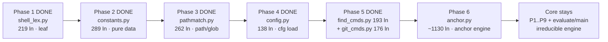
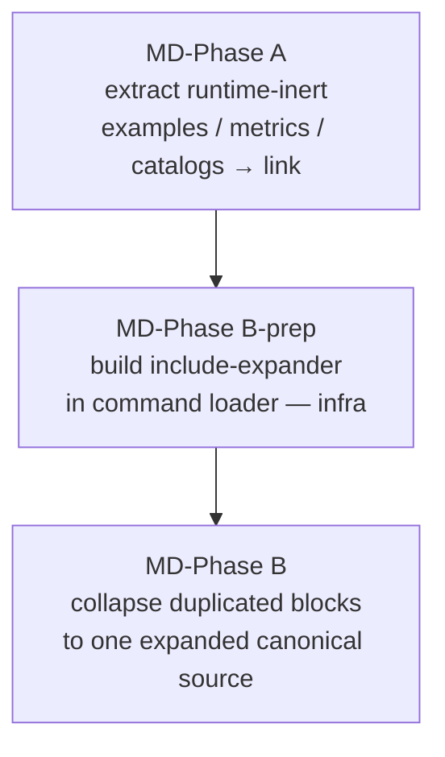

# Monolith Split Plan (Plan-of-Record)

> Phased, behavior-preserving decomposition of the four repo monoliths.
> Anchored on the **phase-1 extraction executed 2026-07-15** (shell-lexing seam).
> Companion to [roadmap-decomposition-productization.md](roadmap-decomposition-productization.md)
> (product identity / layer model); this doc is the concrete extraction sequence.

---

## Monoliths & baseline sizes

| Monolith | Lines | Kind | Runtime-critical | Test safety-net |
|---|---:|---|---|---|
| `hooks/lib/runtime_guard/_core.py` | 4850 (was 5136) | Python engine | Yes — powers the bash-safety guard | `test_runtime_guard.py` = **755 passing** |
| `commands/dev-overnight.md` | 1894 | Prompt (orchestrator) | Yes — autonomous loop | none (prompt) |
| `agents/qa.md` | 1916 | Prompt (subagent) | Yes — QA gate | none (prompt) |
| `commands/dev.md` | 1618 | Prompt (orchestrator) | Yes — `/dev` pipeline | none (prompt) |

---

## Two behavior-preservation regimes

Python and Markdown decompose under **different** invariants — conflating them is the trap.

| | Python (`_core.py`) | Markdown (`dev.md` / `dev-overnight.md` / `qa.md`) |
|---|---|---|
| How consumed | `import` re-assembles full behavior at load | Injected **verbatim** as a prompt |
| Extract + pointer preserves behavior? | **Yes** — re-import the moved names | **No** — a link is not expanded; content leaves the prompt |
| Include/expansion mechanism | native (`import`) | **none exists** (verified: `grep -rE '@include\|{{include}}\|<!--include'` → 0 hits) |
| Safe first move | lift a dependency-leaf cluster | extract only *runtime-inert* reference sections, **or** build an include-expander first |

---

## Behavior-preservation acceptance criteria (every future phase MUST meet)

### Python engine (`_core.py`)

| ID | Invariant | How verified |
|---|---|---|
| INV-1 | Test-green, exact | `test_runtime_guard.py` == **755 passed**; full `hooks/tests/` shows **no new failures, no new skips** vs baseline |
| INV-2 | Public surface unchanged | `set(dir(_core))` after ⊇ before — every name previously importable from `_core` still is (AST-of-old-file vs `dir(new _core)` diff → MISSING must be empty) |
| INV-3 | **Tri-context load** | `_core.py` loads as (a) `lib.runtime_guard._core` submodule, (b) direct script via the `runtime_guard.py` shim `os.execv`, (c) `python -m lib.runtime_guard`. Every intra-package import uses the **dual form** (relative, then absolute fallback) |
| INV-4 | Zero-logic move | Extracted text is **byte-identical** (slice, never retype); no renames, no signature/behavior changes |
| INV-5 | No project identifiers | New module `grep -Ei 'happy\|/root\|<projname>'` → clean (engine purity contract) |
| INV-6 | Leaf-first | Never lift a cluster with an unresolved **outbound** dependency into code that stays in `_core`, unless a documented late-bound import is accepted |

**INV-3 is the phase-1 near-miss.** The first attempt used a bare relative import
`from .shell_lex import …`. It passed compile, package import, and 725/755 tests —
but **30 `TestCycle16LiveHook` tests failed**: the shim `runtime_guard.py` does
`os.execv(python, _core.py)`, running `_core` as a **top-level script with no parent
package**, where a relative import raises `ImportError`, the guard emits `verdict=''`,
and the live hook fail-closes. The fix is the dual-context idiom every future phase inherits:

```python
try:                                   # package context: lib.runtime_guard._core
    from .shell_lex import _strip_quotes, _split_pipeline, ...
except ImportError:                    # script context: sys.path[0] == this dir
    from shell_lex import _strip_quotes, _split_pipeline, ...
```

### Markdown prompts

| ID | Invariant | How verified |
|---|---|---|
| MD-1 | No runtime content loss | Extracted block is either (a) runtime-inert (maintainer-facing example/metrics/catalog), or (b) re-injected by an include-expander |
| MD-2 | Byte-preserved | Moved text is identical; the command still reads as a complete standalone instruction |
| MD-3 | Single canonical source | A block duplicated across files collapses to ONE reference; no divergent copies |

---

## Phase 1 — DONE (2026-07-15): shell-lexing seam

| Field | Value |
|---|---|
| Unit extracted | Shell-command lexing primitives (dependency **leaf**, stdlib-only) |
| New module | `hooks/lib/runtime_guard/shell_lex.py` (242 lines; 219 moved verbatim) |
| Names moved | `_split_pipeline`, `_is_redirect_amp`, `_strip_compound_delims`, `_has_redirect_to`, `_write_redirect_targets`, `_strip_quotes`, `_safe_shlex`, `_WRITE_REDIRECT_RE` |
| Re-import site | `_core.py` top (dual-context try/except), `# noqa: F401` |
| Coupling | Outbound: stdlib `re`/`shlex` only. Inbound: 200 refs, **all inside `_core`** (0 external importers) |
| Result | INV-1 ✓ (755→755, full suite no new fail/skip) · INV-2 ✓ (213 names, 0 missing) · INV-3 ✓ (all 3 contexts ALLOW) · INV-4 ✓ (byte-identical) · INV-5 ✓ (clean) |

---

## Phase 2 — DONE (2026-07-15): data-table constants seam

| Field | Value |
|---|---|
| Unit extracted | Generic verb / keyword / exec-front-end lookup tables (dependency **leaf**, literal data only) |
| New module | `hooks/lib/runtime_guard/constants.py` (305 lines; 289 moved verbatim) |
| Names moved | `PKG_MANAGERS`, `ENV_WRAPPERS`, `_EXEC_OPTS_WITH_ARG`, `_WRAPPER_OPTS_WITH_ARG`, `_WRAPPER_LEADING_POSITIONAL`, `_WRAPPER_POSITIONAL_OPTIONAL`, `RUNTIMES`, `_RUNTIME_SUBCOMMANDS`, `_RUNTIME_OPTS_WITH_ARG`, `EXEC_RUNNER_TOKENS`, `DEP_BUILTINS`, `MUTATION_VERBS`, `KILL_VERBS`, `SERVICE_VERBS`, `BUILD_TOOL_BASENAMES`, `DEP_SHORTHAND_NPM`, `READ_INSPECT_EDIT_ALLOWLIST`, `_GIT_READONLY_SUBCMDS`, `EXEC_FRONTEND_PROFILES` (19 tables) |
| Re-import site | `_core.py` in-place (dual-context try/except), `# noqa: F401` |
| Coupling | Outbound: none (pure literals, zero imports). Inbound: 83 refs, **all inside `_core`** (0 external importers). `_block` + `Verdict`/`ALLOW` anchors kept in `_core` |
| Result | INV-1 ✓ (755→755, full suite no new fail/skip) · INV-2 ✓ (214 names, 0 missing) · INV-3 ✓ (all 3 contexts; shim script-ctx BLOCKs kill/service/pkg via moved tables) · INV-4 ✓ (byte-identical, 16123 B) · INV-5 ✓ (clean) |

---

## Phase 3 — DONE (2026-07-15): path/glob matching seam

| Field | Value |
|---|---|
| Unit extracted | Path-normalization + segment-boundary glob-matching family (near-leaf: imports only `shell_lex._strip_quotes` + stdlib) |
| New module | `hooks/lib/runtime_guard/pathmatch.py` (305 lines; 262 moved verbatim) |
| Names moved | `_expand_leading_home`, `_normalize_path`, `_glob_to_segment_regex`, `_SHELL_GLOB_METACHARS`, `_has_shell_glob`, `_glob_parent`, `_glob_token_selects_protected`, `_glob_literal_prefix`, `_dir_equal_or_under`, `_path_matches_any`, `_any_token_path_matches`, `_path_under_any`, `_any_token_under` (13 names) |
| Stayed in `_core` | `_mutation_cand_hits` — it forward-references `_destructive_root_contains_protected` (defined ~3.3k lines later in the decision engine); lifting it would invert the dependency into a `pathmatch`→`_core` import cycle. Its callees (`_path_matches_any`, `_has_shell_glob`, `_glob_parent`, `_strip_quotes`) are all re-imported, so it resolves in place. The plan's "pass the callee in" alternative was rejected: it mutates the signature, violating INV-4 (zero-logic move) |
| Re-import site | `_core.py` in-place (dual-context try/except), `# noqa: F401` |
| Coupling | Outbound: `shell_lex._strip_quotes` + stdlib `os`/`re` only — **no `constants` dep** (the roadmap listed `constants` as an upper bound; the actual moved bodies reference none). Inbound: all refs inside `_core` (0 external importers; only `test_runtime_guard.py` imports via the package). `_mutation_cand_hits` + `_PATH_VALUED_BUILD_FLAGS` anchors kept in `_core` |
| Result | INV-1 ✓ (755→755, full suite no new fail/skip) · INV-2 ✓ (0 missing; moved names are object-identity re-exports, `_core.X is pathmatch.X`) · INV-3 ✓ (all 3 contexts; shim script-ctx BLOCKs protected statefile / glob-parent `dir/*` / build-path mutations, ALLOWs benign — the moved matchers still ACT) · INV-4 ✓ (byte-identical slices) · INV-5 ~ (one pre-existing `/root/.config/app` illustrative comment relocated verbatim — byte-identity gate governs; consistent with `_core`'s 21 existing example-path comments) |

---

## Phase 4 — DONE (2026-07-15): config-loading seam

| Field | Value |
|---|---|
| Unit extracted | Config-file loader + STEP0 self-protection cluster (near-leaf: imports only `shell_lex._strip_quotes`/`_has_redirect_to` + `pathmatch._normalize_path` + stdlib) |
| New module | `hooks/lib/runtime_guard/config.py` (184 lines; 138 moved verbatim) |
| Names moved | `DATA_FILE_PATH`, `REQUIRED_KEYS`, `_load_config`, `_home_tilde_variant`, `_config_path_variants`, `_ANCESTOR_STOP_ROOTS`, `_config_ancestor_dirs`, `_config_or_ancestor_variants`, `_targets_config_file` (9 names) |
| Cluster-completion move | `_ANCESTOR_STOP_ROOTS` (a private stop-root frozenset) is called by `_config_ancestor_dirs` (moved) **and** at one later `_core` site. Lifting it WITH the cluster — vs. leaving it in `_core` — avoids a `config`→`_core` back-import cycle (INV-6). It is re-imported into `_core` so the later site still resolves and the public surface is unchanged. It was outside the plan's headline name list but belongs to the cluster |
| DATA_FILE_PATH import-time semantics | `DATA_FILE_PATH = os.environ.get(...)` is evaluated at config's MODULE-IMPORT time. Tests set the env then `importlib.reload(rg)`; the package `__init__` reloads `_core` (NOT its siblings), so a plain `from .config import DATA_FILE_PATH` on an `_core` reload would re-bind the STALE cached value. `_core` therefore `importlib.reload`s `config` on every `_core` (re)load, re-running config's module-level env read. Still import-time, NOT a lazy/function read. Verified: DATA_FILE_PATH tracks env A→B→unset-default across reloads |
| Re-import site | `_core.py` in-place (dual-context try/except + `_importlib.reload(_config)`), `# noqa: F401` |
| Coupling | Outbound: `shell_lex` (`_strip_quotes`, `_has_redirect_to`) + `pathmatch` (`_normalize_path`) + stdlib — **no `constants` dep** (the roadmap listed `constants` as an upper bound; the moved bodies reference none). Inbound: all refs inside `_core` (0 external importers; only `test_runtime_guard.py` imports via the package). `CONFIG_MUTATION_HEADS`, `_STEP0_MUTATION_HEADS`, and the STEP0 decision sites stay in `_core` |
| Script-context collision check | The new sibling is `config.py`; in script context `sys.path[0]` is the package dir, so `from config import …` must resolve THIS module. Confirmed: `config.__file__` resolves to `runtime_guard/config.py` even with a decoy `config.py` on `PYTHONPATH` (`sys.path[0]` precedes PYTHONPATH/site-packages; no stdlib `config` exists) |
| Result | INV-1 ✓ (755→755; full `hooks/tests` 1132 passed / 9 xpassed, no new fail/skip) · INV-2 ✓ (0 missing; moved names are object-identity re-exports, `_core.X is rg.X`) · INV-3 ✓ (all 3 contexts; shim script-ctx BLOCKs the protected config file + config-dir `dir/*` glob, benign ALLOWs — the moved STEP0 matchers still ACT; DATA_FILE_PATH env-read preserved at import time) · INV-4 ✓ (byte-identical slices, script-verified) · INV-5 ~ (pre-existing `/root` illustrative comments + the generic `_ANCESTOR_STOP_ROOTS` POSIX roots relocated verbatim — no `happy`/project names; byte-identity gate governs, as in phase 3) |

---

## Phase 5 — DONE (2026-07-15): destructive-command analysis seam (find/fd + git)

**Split into TWO modules** (`find_cmds.py` + `git_cmds.py`) — the roadmap's sanctioned
option, chosen on coupling grounds. The find/fd and git families share **zero** symbols
(a find helper never calls a git helper and vice-versa); they are independent
argv-grammar parsers, so two focused ~180–190-line modules are more cohesive and more
reviewable than one combined `destructive_cmds.py`, and match the phase-1..4 "one
cohesive unit per module" size profile (219/289/262/138). Both re-import into `_core`
so its public surface is unchanged.

| Field | Value |
|---|---|
| Unit extracted | The pure argv PARSING leaves of the find/fd + git destructive-command clusters (near-leaf: import only shell_lex + pathmatch + stdlib) |
| New module A | `hooks/lib/runtime_guard/find_cmds.py` (242 lines; 193 moved verbatim) |
| Names moved (find) | `_FIND_GLOBAL_NOARG_OPTS`, `_FIND_GLOBAL_ARG_OPTS`, `_FIND_PREPATH_ARG_OPTS`, `_FD_OPTS_WITH_ARG`, `_FIND_PATH_PREDICATES`, `_FIND_NAME_PREDICATES`, `_FIND_CASE_INSENSITIVE_PREDS`, `_fd_positional_roots`, `_find_path_operands`, `_find_predicate_values`, `_glob_basenames`, `_name_value_matches_protected` (12 names) |
| New module B | `hooks/lib/runtime_guard/git_cmds.py` (225 lines; 176 moved verbatim) |
| Names moved (git) | `_GIT_GLOBAL_OPTS_WITH_ARG`, `_GIT_DESTRUCTIVE_SUBCMDS`, `_git_subcommand_index`, `_git_effective_cwd`, `_strip_git_pathspec_magic`, `_git_destructive_pathspecs`, `_git_is_destructive_invocation` (7 names) |
| Stayed in `_core` (orchestrators) | The two forward-referencing hit orchestrators — `_find_destructive_target_hits` + `_git_destructive_pathspec_hits` — plus `_find_filter_exonerates_reverse` and `_step0_find_destructive_hits`. All call `_resolve_rel` (a general path helper resident in _core), and the two `_*_hits` orchestrators also forward-reference `_destructive_root_contains_protected` (defined ~3k lines later in the decision engine); lifting any would invert the dependency into a `find_cmds`/`git_cmds`→`_core` import cycle — **the exact `_mutation_cand_hits` pattern from phase 3**. Their moved callees are re-imported so every reference resolves. |
| Stayed in `_core` (shared-constant coupling) | `_find_is_destructive` + `_FIND_DELETE_ACTIONS`/`_FIND_EXEC_ACTIONS`/`_FIND_EXEC_MUTATION_VERBS`: `_FIND_EXEC_MUTATION_VERBS` derives from `_STEP0_MUTATION_HEADS`, a constant shared by STEP0-config + the anchor `_DATA_OPERAND_HEADS` and resident in _core — moving it would couple config/anchor code to a find module. `_find_is_destructive`'s only caller (`_find_destructive_target_hits`) also stays, so no moved code references it. |
| `_find_exec_boundary_at` — STAYS (plan-flagged) | Assessed per the plan's explicit ask: it sits at line ~4000 in the **anchor/inspection** region, is called by the STAYING `_anchor_preceded_by_data_head`, and its `_FIND_EXEC_OPTS`/`_FIND_EXEC_HEADS` tables are shared with STAYING `_is_inspection_command` / `_anchor_in_command_word_position`. It is anchor-scan (phase-6) machinery, not destructive-target (phase-5) machinery, so lifting it now would scatter re-import edges across the phase-6 cluster. Left in `_core` — the conservative choice for a Med-High phase. |
| Re-import site | `_core.py` in-place (two dual-context try/except blocks, one per new module), `# noqa: F401` |
| Coupling | Outbound: `find_cmds` → shell_lex (`_strip_quotes`) + pathmatch (`_glob_to_segment_regex`, `_has_shell_glob`) + stdlib; `git_cmds` → shell_lex (`_strip_quotes`) + pathmatch (`_expand_leading_home`) + stdlib — **no `constants`/`config` dep** (the roadmap listed those as an upper bound; the moved bodies reference neither). Inbound: all refs inside `_core` (0 external importers; only `test_runtime_guard.py` imports via the package). |
| Script-context collision check | New siblings `find_cmds.py` / `git_cmds.py`; in script context `sys.path[0]` is the package dir, so `from find_cmds import …` / `from git_cmds import …` must resolve THESE modules. Confirmed: with a DECOY `find_cmds.py`/`git_cmds.py` on `PYTHONPATH`, the shim-exec'd `_core.py` still emitted real verdicts (no `DECOY` SystemExit) — `sys.path[0]` precedes PYTHONPATH/site-packages and no stdlib `find_cmds`/`git_cmds` exists. |
| Result | INV-1 ✓ (755→755; full `hooks/tests` 1136 passed / 9 xpassed, no new fail/skip) · INV-2 ✓ (0 missing; moved names are object-identity re-exports, `_core.X is find_cmds.X` / `is git_cmds.X`) · INV-3 ✓ (all 3 contexts; shim script-ctx BLOCKs destructive find (`find <protected> -delete`, relative cwd-resolved, build-path) + destructive git (`git clean -fdx` / `checkout -- <protected>` / `restore`, `:(top)` pathspec-magic), while benign find `-print` / unrelated `git clean` / `git status` / branch-switch ALLOW — the moved parsers still ACT) · INV-4 ✓ (byte-identical slices, script-verified) · INV-5 ~ (pre-existing generic `/root` illustrative comments in the moved `_FIND_*_PREDICATES` docs relocated verbatim — no `happy`/project names; byte-identity gate governs, as in phases 3-4) |

---

## `_core.py` — phased sequence (ascending risk)

Risk is driven by **outbound** coupling (how much stays-in-`_core` code the cluster calls).
Leaves first; the decision engine last.



| Phase | Module | Cluster (representative names) | Outbound deps | Risk | Key note |
|---|---|---|---|---|---|
| 6 | `anchor.py` | `_anchor_*` family + `_p0_anchor` (`_anchor_exec_tokens`, `_anchor_in_command_word_position`, `_anchor_mutation_hits`, `_anchor_build_hits_protected`, …) | all shared helpers + `cfg` | **High** | Extract only after 2–5 stabilize the shared-helper surface; heaviest inbound/outbound coupling |
| — | stays in `_core.py` | `_p1_launch`…`_p9_pkgscript`, `_step0_*`, `_step1_indeterminate`, `evaluate`, `main` | — | — | The irreducible decision orchestrator. Not a "lift"; at most a final rename to `engine.py` with a re-export shim |

**Dependency-safety rule for phases 2–6.** Before lifting cluster *C*, run
`git grep -nE '\b<name>\b'` for each name in *C* and confirm every **callee** is either
(a) in *C*, (b) stdlib, or (c) already-extracted (imported back). Any callee that stays
in `_core` and is called *by* *C* creates a cycle → keep that boundary function in `_core`.

---

## Markdown monoliths — seams & shared blocks

The highest-value md finding: large policy blocks are **duplicated across files**. With no
include-expander, they cannot be de-duplicated behavior-preservingly today.

| Block | Appears in | Approx lines | Nature |
|---|---|---|---|
| Four Contracts Awareness (Pre-BA / Post-BA / BA-rejection / Layer vocab) | `dev.md` 266–367 · `dev-overnight.md` 362–435 | ~100 / ~74 | Near-duplicate policy |
| Codex adversarial consultation (procedure + fallback + output) | `qa.md` 1271–1331 · `agents/dev.md` | ~60 | Near-duplicate protocol |
| Score-injection echo contract | `qa.md` 1332–1346 · `agents/dev.md` | ~15 | Duplicate contract |
| JSON Storage Policy | `dev.md` 1321 · `dev-overnight.md` 1846 | ~15 | Duplicate policy |
| Layer vocabulary (L1–L5) | `dev.md` 355 · `dev-overnight.md` 422 | ~12 | Duplicate table |

### Per-file phased sequence

| File | Phase A (runtime-inert → link, safe now) | Phase B (needs include-expander) |
|---|---|---|
| `commands/dev.md` | `Example End-to-End Workflow` (1507), `Success Metrics` (1549), `Agent Development Use Cases` (1374–1506) → `docs/reference/dev-examples.md` | Four Contracts, JSON Storage Policy, Layer vocab → canonical `docs/reference/four-contracts.md` |
| `commands/dev-overnight.md` | `State File Management` (1739–1815), `Edge Cases` (1816), summary template (1612–1665) → `docs/reference/overnight-state-machine.md` | Four Contracts (shared), JSON Storage Policy (shared) |
| `agents/qa.md` | `Forbidden QA Patterns` catalog (1616–1679), `Severity Levels` (1586) → `docs/reference/qa-policy.md` | Codex consult, Score-injection contract → shared `docs/reference/codex-consult-protocol.md` |

### Ordering for markdown



MD-Phase A is safe now (removes only maintainer-facing content from the prompt).
MD-Phase B is **blocked on an infra prerequisite** — an include-expander must exist and be
verified before any *runtime* block leaves a prompt, or agent behavior silently changes.

---

## Global constraints (all phases)

- Do **not** hand-edit doc-sync-generated `INDEX.md` / `README.md`, `CLAUDE.md`, or
  `tests/generated/manifest.json`. New files + the monolith + its new sibling only.
- One seam per cycle; land it green before starting the next (the phase-1 near-miss shows
  why a full suite — incl. live-hook tests — must run, not just the direct-engine subset).
- Byte-exact relocation via slice-and-reassemble, not manual retyping (guarantees INV-4).
