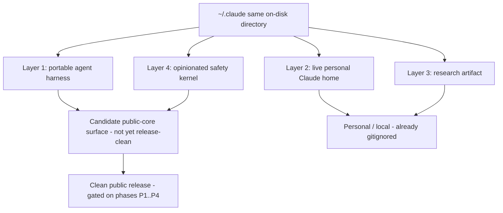

# Roadmap: Monolith Decomposition + Productization

> Maintainer-facing planning document. Stream E.
> Task-ID: 20260715-134718-roadmap · Created: 2026-07-15 · Status: plan (not executed)

---

## ⛔ No-split-this-cycle banner

**This cycle produces the plan ONLY. No monolith is split, moved, or edited; no
behavior is changed.** Every file count, seam, and cluster below is from read-only
measurement. The four monoliths — `commands/dev.md`, `commands/dev-overnight.md`,
`agents/qa.md`, `hooks/lib/runtime_guard/_core.py` — are analysis inputs, not edit
targets. The single deliverable is this document.

All quantitative claims were re-verified this session (`wc -l`, `grep -c`, `git grep`,
`git check-ignore`). The reproduction commands are inlined so any reader can re-check.

---

## 1. Product identity (one paragraph)

> This repository is four things layered into one `~/.claude` **same on-disk**
> directory at once: (1) a **portable, reusable agent harness** — an
> orchestrator-gated `/spec → /dev → /close → /commit → /push` pipeline built from
> Markdown prompts plus small Python and Bash hooks and scripts; (2) one maintainer's
> **live personal Claude home** — the very directory Claude Code runs from, so it
> accumulates `sessions/`, `projects/`, a `dev-registry/`, `worktrees/`, and a
> personal `settings.json`; (3) a **research artifact** — the accreted `specs/`,
> overnight dev-reports, and cross-cycle experiment logs that record how the harness
> was built; and (4) an **opinionated safety kernel** — a fail-closed git-protection,
> orchestrator-gate, and `runtime_guard` enforcement layer that is deliberately
> non-negotiable. It is all four simultaneously because the reusable product and the
> maintainer's running home are the *same on-disk directory*; productization is
> precisely the act of separating layers 1 and 4 (portable) from layers 2 and 3
> (personal), and no clean public core can exist until that separation is planned and
> executed.

### The four-identity layer model

---

## 2. Decomposition inventory

### 2.1 Verified measurements (re-checked this session)

| File | Lines | Test net | Kind | Reproduce |
|---|---:|---|---|---|
| `commands/dev.md` | **1618** | none | prompt | `wc -l commands/dev.md` |
| `commands/dev-overnight.md` | **1894** | none | prompt | `wc -l commands/dev-overnight.md` |
| `agents/qa.md` | **1916** | none | prompt | `wc -l agents/qa.md` |
| `hooks/lib/runtime_guard/_core.py` | **5839** | **405 tests / 4335 lines** | code | `wc -l hooks/lib/runtime_guard/_core.py` |

Supporting structural facts (verified):

- `_core.py` has **143** top-level `def`/`class` and **0** top-level classes — a flat
  module (`grep -cE '^(class |def )' hooks/lib/runtime_guard/_core.py` → 143;
  `grep -c '^class ' …` → 0).
- Its behavioral safety net is `hooks/tests/test_runtime_guard.py` — **4335** lines,
  **405** `test_*` cases (`grep -c '^\s*def test_' hooks/tests/test_runtime_guard.py`
  → 405).
- **No prompt transclusion mechanism exists** in `commands/*.md` or `agents/*.md`
  (`git grep -lE '@import|\{\{include\}\}|<!-- include|\{% include'` → 0 matches). See
  §3.

> **Shared-tree note:** these counts were measured against this plan's baseline commit
> `9e87b0d`. The repository is a live shared working tree (§1, identity 2) under
> concurrent edits, so a file's current `wc -l` may drift (the test net grew to 4349
> lines mid-plan). Re-measure at the extraction commit before acting — the counts fix
> the scale, not a frozen contract.

### 2.2 Per-file risk rating

| File | Lines | Test net? | Risk if split | Why |
|---|---:|---|---|---|
| `commands/dev.md` | 1618 | ✗ | **High (behavioral)** | Prompt loaded whole; a split alters the loaded text with no way to prove equivalence. |
| `commands/dev-overnight.md` | 1894 | ✗ | **High (behavioral)** | Same as above; longest pipeline prompt, most sub-protocols. |
| `agents/qa.md` | 1916 | ✗ | **High (behavioral)** | Same as above; persona + anti-fraud framing is order-sensitive. |
| `hooks/lib/runtime_guard/_core.py` | 5839 | ✓ 405 tests | **High-cost but regression-verifiable** | Fail-closed security kernel — highest cost to regress, but the ONLY monolith whose zero-behavior-change can be *strongly regression-verified* by the test suite (covered behavior only — a test suite cannot fully *prove* equivalence for a security parser). |

### 2.3 `commands/dev.md` — proposed decomposition

- **Named sections / seams (evidenced):** 17 numbered `### Step N` blocks (Step 1..17),
  a Four-Contracts-Awareness preamble, a completion-report template, and a
  standards / use-cases / example appendix tail. Seams = the step boundaries and the
  appendix tail.
- **Proposed named units (future):** `dev/00-contracts.md`, `dev/steps-01-17.md`
  (or one partial per phase group), `dev/completion-report.md`,
  `dev/appendix-standards.md`. Names are illustrative section labels, not authorized
  files.
- **Extraction RISK:** no transclusion mechanism (§3) — any physical split changes the
  loaded prompt and can alter orchestrator behavior; **no test net** to prove
  equivalence.
- **Safe sequence + per-step verification:** the ONLY safe action this cycle is
  documenting the section map above. A future split MUST first pick a mechanism
  (build-time concatenation of partials into the loaded file) and then PROVE the
  generated file is **byte-identical** to the current `commands/dev.md` before the
  split is accepted (`diff <(build) commands/dev.md` empty). Do not reorder or add a
  table-of-contents block in place — that also changes the loaded prompt.

### 2.4 `commands/dev-overnight.md` — proposed decomposition

- **Named sections / seams:** 21 numbered `### Step N` blocks + an
  exploration / specialist-calling sub-protocol + state-file-management + edge-cases
  appendices.
- **Proposed named units (future):** `dev-overnight/steps-01-21.md`,
  `dev-overnight/specialist-protocol.md`, `dev-overnight/state-management.md`,
  `dev-overnight/edge-cases.md`.
- **Extraction RISK:** identical class to §2.3 — high behavioral risk, no test net, no
  transclusion.
- **Safe sequence + per-step verification:** document the section map only; future
  split gated on the same byte-identical-loaded-prompt proof as §2.3.

### 2.5 `agents/qa.md` — proposed decomposition

- **Named sections / seams:** persona / anti-fraud preamble + 14 numbered `### Step N`
  verification blocks (with Step 10.x UI sub-blocks) + output-format + forbidden-patterns
  + checklist appendices.
- **Proposed named units (future):** `qa/00-persona-anti-fraud.md`,
  `qa/steps-01-14.md`, `qa/10-ui-subblocks.md`, `qa/output-format.md`,
  `qa/forbidden-patterns.md`, `qa/checklist.md`.
- **Extraction RISK:** identical class — the anti-fraud framing and step order are
  behaviorally load-bearing; no test net; no transclusion.
- **Safe sequence + per-step verification:** document the section map only; future split
  gated on the byte-identical-loaded-prompt proof.

### 2.6 `hooks/lib/runtime_guard/_core.py` — proposed decomposition

Flat module of ~143 functions in clear name-prefix clusters. Proposed submodules
(re-imported by a thinned `_core.py` to preserve every public entry point):

| Proposed submodule | Cluster (evidenced function prefixes) | Purity |
|---|---|---|
| `runtime_guard/_paths.py` | `_normalize_path`, `_glob_to_segment_regex`, `_glob_literal_prefix`, `_strip_quotes`, `_expand_leading_home`, `_dir_equal_or_under` (+ the intra-cluster helper `_has_shell_glob` that `_glob_literal_prefix` transitively needs) | **no writes / no config coupling, but environment-dependent** (`_normalize_path` / `_expand_leading_home` read `HOME`); phase-0 candidate — §5 |
| `runtime_guard/_shlex.py` | `_split_pipeline`, `_safe_shlex`, `_command_substitutions`, `_pipeline_groups` | mostly stateless parsing |
| `runtime_guard/_config.py` | `_load_config`, `_config_*` | **has I/O + global state** — extract last |
| `runtime_guard/_classify.py` | `_step0`, `_step1`, … classifier pipeline | orchestration core — extract last |
| `runtime_guard/_commands/` | `_git`, `_find`, `_anchor`, `_xargs` families | per-command handlers, some config coupling |

- **Natural seams:** the name-prefix clusters above; `_core.py` retains the public
  entry points and re-imports the extracted submodules.
- **Extraction RISK:** `_core.py` is a **fail-closed SECURITY kernel** — a shell-command
  parser that decides whether destructive bash is blocked. A regression silently
  *weakens the guard*. This is the highest-cost file to get wrong. It is also the ONLY
  monolith with a strong behavioral safety net (405 tests), so it is the only file
  where a zero-behavior-change extraction is *verifiable*.
- **Safe sequence + per-step verification:**
  1. Extract the **purest** cluster first — the stateless path/glob/quote helpers into
     `runtime_guard/_paths.py`, re-imported by `_core.py`. One small cluster per PR.
  2. **Per-step gate:** run the full `hooks/tests/test_runtime_guard.py` suite before
     and after; require a **byte-for-byte identical 405/405 pass set** (identity check,
     not "still green"). Precede each move with an import-surface / dependency preflight
     confirming the cluster has no shared mutable state or config coupling.
  3. **Never** move a function that touches config load, global state, or the `_step*`
     classifier in the *same* step as a util move. Config (`_config.py`) and the
     classifier (`_classify.py`) are extracted LAST, after the pure clusters are proven.
- **Do NOT fabricate finer maps:** any function-by-function split beyond the evidenced
  clusters above requires re-measurement with a cited command, not estimation.

---

## 3. The `.md`-vs-code decomposition distinction (why prompts are a different problem)

Command and agent `.md` files have **NO runtime transclusion / include mechanism**
(verified: `git grep -lE '@import|\{\{include\}\}|<!-- include|\{% include'` over
`commands/*.md` and `agents/*.md` → **0** matches). Claude Code loads each prompt file
**whole**.

Consequence: **a physical split of `commands/dev.md`, `commands/dev-overnight.md`, or
`agents/qa.md` is NOT zero-behavior-change** unless a build/concatenation step
re-assembles the partials into a byte-identical loaded file at install time. Even an
in-file section reorganization or an added table-of-contents block changes the loaded
prompt and can alter model behavior. Prompt "decomposition" is therefore a **different
problem class** from code decomposition:

| | Code (`_core.py`) | Prompts (dev/dev-overnight/qa `.md`) |
|---|---|---|
| Split mechanism | Python `import` (native) | none — no transclusion; needs a build/concat step |
| Equivalence proof | 405-test identity check | byte-identical loaded-prompt diff (must be built first) |
| Test net | ✓ present | ✗ absent |
| Safe this cycle | plan + preflight only | document section map only — do not touch files |

---

## 4. Public-core boundary + phased productization plan

### 4.1 Candidate public-core surface (NOT yet release-clean)

`hooks/`, `commands/`, `agents/`, `skills/`, `scripts/`, `schemas/`, `policies/`,
`templates/`, `tools/`, `settings.template.json`, and top-level docs (`README.md`,
`ARCHITECTURE.md`, `CLAUDE.md`, `LICENSE`, `NOTICE`, `CHANGELOG.md`). These are the
*source surface* a public release would draw from — but they are **not shippable
as-is**: they still contain tracked personal `/root` / maintainer references (see §4.3),
so a clean release is gated behind phases P1/P2 below. "Portable" here means
**candidate**, not **release-clean**.

### 4.2 Personal / local layer (do NOT ship — already gitignored)

Live runtime state: `sessions/`, `projects/`, `todos/`, `logs/`, `dev-registry/`,
`worktrees/`, `specs/spec-*/`, `workflow-*.json`, `file-history/`, `statsig/`,
`history.jsonl`, and the maintainer's `/root` symlink flows. `.gitignore` already
excludes most of this state. **Exception — the personal `settings.json` is personal
state yet is currently TRACKED** (`git ls-files` lists it), so it is a live
public/personal boundary violation rather than a gitignored file; see §4.3 and phase P3.

### 4.3 Blurred-boundary evidence (documented as content, NOT fixed this cycle)

The portable seed already exists as `settings.template.json` alongside the personal
`settings.json`, and `.gitignore` already excludes most runtime state — but personal
`/root` and maintainer references still leak into a handful of tracked "portable" files.
These are recorded here as boundary evidence; **fixing them is out of scope this cycle.**

| File(s) | Leakage | Feeds phase |
|---|---|---|
| `commands/dev.md`, `agents/qa.md`, `commands/close.md` | personal `/root` / `Yugoge` / maintainer references | P1 |
| `scripts/detect-hardcoded-paths.sh`, `scripts/spec-verify/spec_verify_parsers.py`, `scripts/close-scoring-decide.py`, `scripts/write-commit-grant.py` | tracked `/root` absolute paths | P2 |
| `settings.json` (**tracked**) | personal config committed to the repo: personal `permissions` allow/deny/ask entries + absolute `/root` paths; should be generated from `settings.template.json`, not tracked | P3 |

### 4.4 Phased productization plan

| Phase | Goal | Output | Builds on |
|---|---|---|---|
| **P1** | Inventory every personal reference in the tracked core | a leakage register (file:line list of `/root` / maintainer refs) | §4.3 evidence |
| **P2** | Parameterize `/root` / absolute paths to `$HOME` / `$CLAUDE_HOME` | scripts + prompts read env vars, no hardcoded personal paths | P1 register |
| **P3** | Make `settings.template.json` the canonical shipped config; generate the personal `settings.json` from it, then **untrack and gitignore** that personal `settings.json` (it is tracked today — a boundary violation) | one template → generated, gitignored personal config | existing `settings.template.json` |
| **P4** | Publish a clean tree containing only the portable core + templates | a release surface with zero personal state | P1..P3 complete |

---

## 5. Phase 0 finding

**Verdict: NO extraction is green-lit as "clearly safe" this cycle.** The requirement
asks whether a single *clearly-safe*, zero-behavior-change, bounded extraction exists.
For this repo the honest answer is: none is *clearly* safe right now. The only monolith
with a test net that could *prove* zero-behavior-change is `_core.py`, and it is a
fail-closed security kernel — the highest-cost file to regress. The three prompt
monoliths have no zero-behavior-change split available at all (no transclusion
mechanism, no test net — see §3).

**One bounded FUTURE phase-0 candidate is identified (not authorized, not performed):**
carve ONLY the stateless path/glob/quote helper cluster out of `_core.py` into
`runtime_guard/_paths.py` (the `_normalize_path`, `_glob_to_segment_regex`,
`_glob_literal_prefix`, `_strip_quotes`, `_expand_leading_home`, `_dir_equal_or_under`
family — see §2.6), gated by (1) a dependency / import-surface **preflight** confirming
the cluster has no shared mutable state or config coupling, and (2) the full **405-test**
suite as a **byte-for-byte before/after pass-set identity check**. It is the smallest,
purest cluster and would be the natural first step of a future multi-cycle effort — but
it is **a candidate, identified and DEFERRED**, explicitly **not green-lit** and
**not performed** this cycle.

**One-line phase-0 verdict:** *no clearly-safe extraction is authorized this cycle;
exactly one bounded candidate (`_core.py` → `_paths.py` pure utils) is identified and
deferred to a future phase-0, pending an import-surface preflight; the prompt files
require a mechanism decision before any split.*

---

## 6. Suggested future cycle-by-cycle sequence (illustrative — not authorized)

| Cycle | Target | Precondition | Zero-behavior-change gate |
|---|---|---|---|
| Future-0 | `_core.py` → `_paths.py` (pure utils) | import-surface preflight passes | 405/405 identical pass set |
| Future-1 | `_core.py` → `_shlex.py` (parsing) | Future-0 merged, preflight passes | 405/405 identical pass set |
| Future-2 | `_core.py` → `_config.py` + `_classify.py` (stateful) | pure clusters extracted first | 405/405 identical pass set |
| Future-3 | Prompt build/concat mechanism decision | mechanism chosen | byte-identical loaded-prompt diff |
| Future-4 | Prompt partial extraction (dev/dev-overnight/qa) | Future-3 mechanism proven | byte-identical loaded-prompt diff |
| P1..P4 | Productization (boundary cleanup) | independent of split work | leakage register empty at P4 |

---

## 7. Evidence cross-links

- Test net proving `_core.py` behavior: `hooks/tests/test_runtime_guard.py` (405 tests).
- Existing portable-vs-personal seed: `settings.template.json`.
- Delivery-path constraint (why this doc lives under `docs/reference/`): `.gitignore`
  ignores `docs/*` except `docs/reference/`; `docs/dev/` and `docs/planning/` are
  ignored, so a roadmap placed there would be silently untracked. Verify eligibility
  with `git check-ignore -v docs/reference/roadmap-decomposition-productization.md` — an
  empty result means NOT ignored (eligible to be tracked), NOT that the file is already
  tracked. A brand-new file stays untracked (`??`) until the commit stage `git add`s it;
  confirm actual tracking post-commit with `git ls-files --error-unmatch <path>`.
