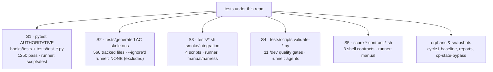
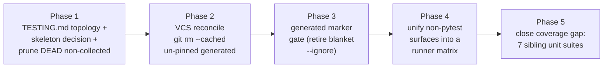

# Test Suite Overhaul Plan (Plan-of-Record)

> Assessment + phased plan-of-record for roadmap finding #4 ("messy test story").
> Companion to [monolith-split-plan.md](monolith-split-plan.md) (which decomposed
> `runtime_guard/_core.py` in 6 phases) — this doc scopes the test-landscape cleanup
> the same way: **inventory first, then a behavior-preserving ascending-risk sequence.**
> This cycle authored ONLY this doc — **no test file was moved, deleted, or rewritten.**
> All counts below were **measured** on 2026-07-16, not estimated.

---

## Authoritative baseline (measured)

| Metric | Value | How measured |
|---|---:|---|
| Authoritative run result | **1250 passed, 9 xpassed, 0 failed** | `python3 -m pytest hooks/tests/ tests/ -q` (venv) |
| Authoritative runtime | **68.5 s** | same run |
| Canonical runner | `scripts/test` | `= pytest hooks/tests tests -q --ignore=tests/generated` |
| pytest.ini | `testpaths = hooks/tests tests` · `addopts = --ignore=tests/generated` | file |

**This 1250/9 green baseline is the floor. Every phase below must hold it (P5 may only raise it).**

---

## 1. Inventory — five distinct "test surfaces" under one `tests/` roof

The mess is not one pile; it is **five surfaces with three different runners and no map.**

### S1 — the real, run-on-every-commit suite (TRUSTED)

| Location | Files | Tests | Role / coverage |
|---|---:|---|---|
| `hooks/tests/` | 11 `test_*.py` | ~1163 fn (of 1250 total) | The trustworthy core. `test_runtime_guard.py` alone = **4349 ln / 405 test fns** (guard engine); rest cover allowlist, cp-checkin, branch/pr/worktree guard, bulk-commit sentinel, git-cmd cross-consistency, agent_resolver, bash-safety, do-taskid-mint, extract |
| `tests/test_*.py` (top-level) | 6 `test_*.py` | remainder | `aggregate_dev_report`, `graphify_scripts`, `graphify_workflow_contract`, `overnight_loop_tz`, `resolve_spec_artifacts`, `specialist_yield` — script/contract unit tests |

**Trust verdict: authoritative and healthy.** 0 failures, 68 s, exercised by both `pytest.ini` and `scripts/test`.

### S2 — `tests/generated/` AC skeletons (IGNORED, half-realized, bit-rotted)

| Measure | Count | Method |
|---|---:|---|
| git-tracked files | **566** | `git ls-files tests/generated \| wc -l` |
| `.py` files | 470 (458 excl `.archive/`, 12 in `.archive/`) | `find … -name '*.py'` |
| `test_*.py` files | 449 | `find … -name 'test_*.py'` |
| still `TEST_INCOMPLETE` hard-stops | **56 files** (90 sentinels) | `grep -rl TEST_INCOMPLETE` |
| "realized" (assertions, no hard-stop) | **393 files** | set difference |
| **realized-but-passing?** | **≈90% only** — sample of 30 → **33 passed / 3 failed / 1 error** | targeted `pytest` run |
| git-untracked (ignored) | 0 | `git ls-files --others` |
| 2 `.gitignore`-pinned dirs | `20260704-134650` (14/29 still incomplete) · `20260704-225139` (0/21 incomplete) | per-dir grep |

**Trust verdict: cannot be un-ignored as-is.** Even the 393 "realized" files carry ~10% bit-rot
(they assert against paths/behaviors that have since drifted), and 56 still hard-stop by design.
Un-`--ignore`ing the tree today turns the suite red. Current value = **AC provenance only**
(they record what each cycle's acceptance criteria were), NOT a runnable safety net.
The tree is also **subprocess-heavy**: a full standalone run spawns throwaway git repos via
`ac_harness` `_work/` and did not finish in 120 s — unusable as a routine suite.

### S3 — top-level `tests/*.sh` smoke/integration (4 scripts, non-pytest)

| Script | Runner reality |
|---|---|
| `fresh-clone-bootstrap-smoke.sh` | manual; **invokes `ws2_zero_literal_gate.py`** (line 489) — so that "orphan" is actually USED |
| `integration-test.sh` | manual |
| `test-lock-detection.sh` | manual |
| `verify-stop-spec-session-isolation.sh` | manual |

**Trust verdict: real tests, invisible runner.** Not collected by pytest (no `test_` fn discovery of `.sh`); run by hand or ad-hoc. No doc says when/how.

### S4 — `tests/scripts/` validate-*.py (11 /dev quality gates, non-pytest)

11 `validate-*.py` (checklist-completeness, chinese-content, claude-md-protection, debug-file-age,
file-naming, optionality-language, posttool-ac, step-numbering, todowrite-requirement, venv-usage,
workflow-json-cleanup). **0 have a `test_` prefix** → pytest never collects them. Invoked by
`style-inspector` / `test-executor` agents. **Trust verdict: legitimate gates, orthogonal runner.**

### S5 — `score-*-contract/` shell contracts (3 *.sh, non-pytest)

`score-inject-contract/` (runtime-verify.sh, test-inject-branches.sh) + `score-lifecycle-contract/`
(test-lifecycle-cas.sh). **Not referenced in `pytest.ini` or `scripts/`.** Manual contract checks.

### Orphans & dated snapshots

| Path | Status | Evidence |
|---|---|---|
| `tests/cycle1-baseline-20260507-142952/` (7 `run_ac*.py` + helpers) | **DEAD snapshot** — not `test_`-prefixed, referenced only by auto-generated `INDEX.md`; **0 runner references** | `grep` across `*.sh/*.py/*.ini/*.json` = empty |
| `tests/reports/` (4 files, dated `20260107`) | **stale output artifacts** | dates 6 months old |
| `tests/cp-state-bypass-test-20260507-191743.py` | **true orphan** — no `test_` prefix, 0 references anywhere | `grep` = empty |
| `tests/ws2_zero_literal_gate.py` | **NOT orphan** — used by `fresh-clone-bootstrap-smoke.sh` | grep hit |
| `tests/fixtures/`, `tests/instructions/` | live fixtures / AI-instruction guides | consumed by agents |

### Coverage gap vs the decomposed `runtime_guard` (measured)

The monolith split created **7 sibling modules**; the test suite still only reaches them through the
`_core` re-assembly facade.

| Module | Direct-import unit test? | Evidence |
|---|:--:|---|
| `shell_lex.py` | ❌ | `grep 'from …runtime_guard.shell_lex import'` across `hooks/tests` + `tests/generated` = **0** |
| `constants.py` | ❌ | 0 direct imports |
| `pathmatch.py` | ❌ | 0 direct imports |
| `config.py` | ❌ | 0 direct imports (incidental substring only) |
| `find_cmds.py` | ❌ | 0 direct imports |
| `git_cmds.py` | ❌ | 0 direct imports |
| `anchor.py` | ❌ | 0 direct imports (incidental substring only) |

**All 7 are tested only transitively via `test_runtime_guard.py` importing the `runtime_guard` package.**
No module is exercised as the independent unit the decomposition made it — a regression inside a
sibling only fails if it also perturbs an end-to-end `_core` verdict.

---

## 2. Diagnosis — what specifically makes the story "messy"

| # | Symptom (measured) | Why it's a problem |
|---|---|---|
| D1 | **Five surfaces, three runners, no map** (S1 pytest, S3/S5 shell, S4 agent-invoked) | A contributor cannot answer "how do I run the tests / which are authoritative?" from any one doc |
| D2 | **566 tracked generated files, 393 realized but ~10% bit-rotted, 56 still hard-stop** | A large tracked tree that is `--ignore`d, half-runnable, and silently rotting — pure noise-to-signal drag |
| D3 | **`generated-tests-policy.md` is partly stale** — it says skeletons "hard-stop via `pytest.fail`", but 393/449 have been realized into assertions | The one doc describing S2 no longer matches reality |
| D4 | **`.gitignore` intends to keep only 2 pinned dirs, but 566 files stay tracked** (git negations don't untrack committed files — the policy doc's own "honest caveat") | Declared intent ≠ actual VCS state; the deferred `git rm --cached` never happened |
| D5 | **Dead dated snapshots never pruned** — `cycle1-baseline-20260507`, `reports/20260107`, `cp-state-bypass` orphan | Dated dirs accrete; nothing garbage-collects them |
| D6 | **Coverage gap vs 7 decomposed `runtime_guard` modules** — 0 direct-import unit tests | Decomposition's payoff (independent testability) is unrealized; sibling regressions hide behind the `_core` facade |
| D7 | **Non-`test_`-prefixed real tests are silently skipped** by pytest (`ws2_zero_literal_gate.py`, `cp-state-bypass`, `run_ac*.py`) | pytest's default discovery quietly excludes them; only a hand-written `.sh` remembers `ws2` |

---

## 3. Target state — one authoritative suite + a runner map + a policy for the rest

| Dimension | Target |
|---|---|
| **Authoritative suite** | S1 stays THE suite: `scripts/test` == `pytest hooks/tests tests`. Single documented entrypoint. Green floor 1250/9. |
| **Runner map** | A `tests/TESTING.md` (topology + runner matrix): every surface (S1–S5, orphans) lists its runner, when it runs, and its trust level. No surface without a documented runner. |
| **Generated skeletons** | **Decision: gate-behind-a-marker, not blanket `--ignore`.** Realized+green skeletons become opt-in-runnable under a `generated` pytest marker; `TEST_INCOMPLETE` + bit-rotted ones are quarantined, not tracked-and-ignored. Un-pinned residue is `git rm --cached` per the `.gitignore` intent (D4). |
| **Archival/fixtures policy** | Explicit rule: dated snapshot dirs are pruned once their cycle closes unless promoted to a named fixture; `tests/reports/` is scratch, not tracked. Provably-unreferenced snapshots are deletable. |
| **Coverage** | Each of the 7 `runtime_guard` siblings gets a direct-import unit suite, so a sibling regression fails on its own, not only via `_core`. |
| **Discovery hygiene** | Every file meant to run is either `test_`-prefixed (pytest) or listed in the runner map (shell/agent). No silently-skipped real test. |

---

## 4. Phased, ascending-risk sequence

**Risk metric** (as in the monolith plan, adapted): *the chance a phase destabilizes the green
authoritative suite or loses a genuinely-used fixture/gate.* Lowest first. Each phase is
independently shippable and behavior-preserving; **AC for every phase = `python3 -m pytest
hooks/tests/ tests/ -q` under the venv stays green (≥ 1250 passed / 9 xpassed).**

### Phase 1 — Topology doc + skeleton decision + prune provably-DEAD non-collected files  ·  Risk: **near-zero**  ·  RECOMMENDED FIRST

| Field | Value |
|---|---|
| Changes | (a) Add `tests/TESTING.md` — the surface/runner/trust matrix from §1. (b) Record the ratified generated-skeleton decision (gate-behind-marker, §3) so Phases 2–3 can execute it. (c) Prune ONLY **provably-unreferenced, non-pytest-collected** paths: `tests/cycle1-baseline-20260507-142952/` (0 runner refs), `tests/reports/2026010*` stale artifacts, `tests/cp-state-bypass-test-20260507-191743.py` (true orphan). |
| Why safe | None of the pruned paths are `test_`-prefixed → pytest never collected them → the authoritative count is **mathematically invariant**. `TESTING.md` is inert doc. |
| Risk | Near-zero. Only live danger is mis-classifying a "dead" file as unused → mitigated by INV-T3 (prove 0 inbound refs before delete). **`ws2_zero_literal_gate.py` MUST NOT be pruned** (used by `fresh-clone-bootstrap-smoke.sh`). |
| Acceptance | `pytest hooks/tests/ tests/ -q` = 1250 passed / 9 xpassed (unchanged). `git grep` proves each pruned path had 0 runner references. |

### Phase 2 — VCS reconcile `tests/generated/` (the deferred `git rm --cached`)  ·  Risk: **low**

| Field | Value |
|---|---|
| Changes | Execute the `.gitignore`-declared intent (D4): `git rm --cached` the un-pinned generated dirs, keeping only the 2 pinned dirs + any dir explicitly promoted in Phase 1. Update `generated-tests-policy.md` to match reality (fix the stale "hard-stop" claim, D3). |
| Why safe | Files remain `--ignore`d from the run either way → suite count invariant. This only changes VCS *tracking*, not test execution. Fully reversible. |
| Risk | Low. Must not untrack a dir a live workflow reads; mitigated by checking `manifest.json` provenance links before removal. |
| Acceptance | Suite green + unchanged; `git ls-files tests/generated` drops to pinned-only; working tree clean. |

### Phase 3 — Generated-skeleton marker gate (retire the blanket `--ignore`)  ·  Risk: **medium**

| Field | Value |
|---|---|
| Changes | Introduce a `generated` pytest marker + an opt-in path (e.g. `pytest -m generated`) so **realized+green** skeletons can run deliberately; keep `TEST_INCOMPLETE` and bit-rotted ones quarantined (not in the default path). Update `test-writer` agent emit-contract + `pytest.ini`/`scripts/test` to gate on the marker instead of the blanket directory `--ignore`. |
| Why safe | Default `scripts/test` still excludes the tree (via marker deselection, not `--ignore`), so the authoritative 1250/9 is unchanged; the tree becomes *opt-in runnable* rather than *invisible*. |
| Risk | Medium — touches pytest config + an agent contract; risk of mis-gating a skeleton into the default run. Mitigated: assert default-run count == 1250/9 in CI. |
| Acceptance | Default run unchanged (1250/9); `pytest -m generated` runs only opt-in skeletons; `pytest.ini` testpaths/markers coherent (INV-T2/T4). |

### Phase 4 — Unify the non-pytest surfaces into a documented runner matrix  ·  Risk: **medium**

| Field | Value |
|---|---|
| Changes | Give S3 (4 `*.sh`), S4 (11 `validate-*.py`), S5 (3 contract `*.sh`) a single documented umbrella (e.g. `scripts/test --smoke` / `--gates` tiers) and record each in `TESTING.md`. Adopt `ws2_zero_literal_gate.py` into the smoke tier explicitly; convert or retire `cp-state-bypass` per Phase-1 decision. |
| Why safe | Additive wiring — the pytest suite is untouched; shell/agent surfaces gain a named runner. |
| Risk | Medium — runner refactor could drop a used gate (esp. `ws2`, invoked from `fresh-clone-bootstrap-smoke.sh`). Mitigated by INV-T3 reference-proof before any move. |
| Acceptance | Every surface in `TESTING.md` has a runner; `pytest hooks/tests/ tests/` still 1250/9; the 4 `*.sh` + 11 gates still invokable. |

### Phase 5 — Close the `runtime_guard` coverage gap (7 sibling unit suites)  ·  Risk: **higher (effort + additive)**

| Field | Value |
|---|---|
| Changes | Add direct-import unit suites for `shell_lex`, `constants`, `pathmatch`, `config`, `find_cmds`, `git_cmds`, `anchor` — testing each module as an independent unit (import the sibling directly, assert its public helpers), complementing the `_core`-facade `test_runtime_guard.py`. |
| Why last | Depends on a stable topology (P1) and clean runner (P4). It only ADDS tests, so it cannot lower the floor — but new assertions must be non-flaky and must not couple to `_work/` subprocess machinery. |
| Risk | Higher effort; risk is flaky/env-coupled new tests. Mitigated: mirror `test_runtime_guard.py`'s dual-context import idiom; no subprocess harnesses. |
| Acceptance | Authoritative count **strictly increases** (net-new passing tests); 0 regressions; each of the 7 siblings has ≥1 direct-import test. |

---

## 5. Acceptance invariants (every phase MUST uphold)

| ID | Invariant | How verified |
|---|---|---|
| INV-T1 | **Green floor** — `python3 -m pytest hooks/tests/ tests/ -q` (venv) stays ≥ **1250 passed / 9 xpassed**, 0 failed. P1–P4 keep it exactly; P5 may only raise it. | run the command |
| INV-T2 | **testpaths coherent** — `pytest.ini` `testpaths = hooks/tests tests`; generated excluded by exactly ONE mechanism (marker OR `--ignore`, never a contradictory pair). | read `pytest.ini` |
| INV-T3 | **No loss of a used fixture/gate** — before deleting/untracking/moving any file, `git grep` proves 0 inbound refs from any runner (pytest, `scripts/test`, the 4 `*.sh`, agent validators). **`ws2_zero_literal_gate.py` is USED → never prune.** | `git grep` per path |
| INV-T4 | **Runner parity** — `scripts/test` and `pytest.ini` agree on what runs and what's excluded. | diff the two |
| INV-T5 | **No forbidden hand-edits** — doc-sync `INDEX.md`/`README.md`, `CLAUDE.md`, `settings.json` untouched; new doc + test files only. | `git status` review |

---

## Global constraints (all phases)

- **One phase per cycle**; land it green (full `hooks/tests` + `tests`, incl. live-hook tests) before the next — the monolith plan's phase-1 near-miss is the cautionary precedent.
- **Prove-before-prune**: no path is deleted/untracked without INV-T3 reference-proof.
- Do **not** hand-edit doc-sync `INDEX.md`/`README.md`, `CLAUDE.md`, `settings.json`, or
  `tests/generated/manifest.json`.
- This assessment cycle authored ONLY this doc. Execution begins at **Phase 1** in a future cycle.
