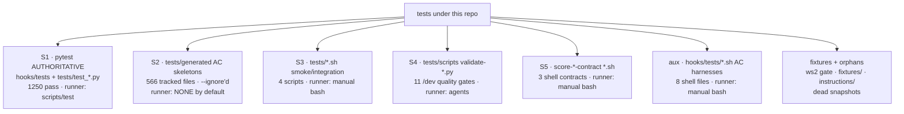

# Test Topology & Runner Map (authoritative)

> The map a new contributor needs to answer **"how do I run the tests / which are
> authoritative?"** in one place. Companion to
> [../docs/reference/test-suite-overhaul-plan.md](../docs/reference/test-suite-overhaul-plan.md)
> (this doc realizes that plan's §1 inventory + §3 target as Phase 1) and
> [../docs/reference/generated-tests-policy.md](../docs/reference/generated-tests-policy.md)
> (policy for the `tests/generated/` skeletons).
> Counts **measured** on 2026-07-16 under the repo `venv`.

---

## TL;DR — run this

```bash
scripts/test            # canonical: pytest hooks/tests tests -q --ignore=tests/generated (auto-sources venv)
# equivalently, by hand:
source venv/bin/activate && python3 -m pytest hooks/tests tests -q --ignore=tests/generated
```

**Green floor: `1250 passed, 9 xpassed, 0 failed` (~65 s).** That is the number
every change must hold. Everything else on this page is a *secondary* surface with
its own runner — none of them run on `scripts/test`.

---

## Five surfaces, three runners, one roof



---

## Surface / runner / trust matrix

| # | Surface | Location | Files | Runner | Runs on `scripts/test`? | Trust |
|---|---|---|---:|---|:--:|---|
| **S1** | Authoritative pytest suite | `hooks/tests/test_*.py` + `tests/test_*.py` | 11 + 6 | pytest (`scripts/test`) | ✅ collected | **AUTHORITATIVE** |
| **S2** | Generated AC skeletons | `tests/generated/` | 566 tracked (449 `test_*.py`) | none by default | ❌ `--ignore`'d | Archival provenance |
| **S3** | Smoke / integration shell | `tests/*.sh` | 4 | manual `bash` | ❌ not collected | Real tests, manual runner |
| **S4** | `/dev` quality-gate validators | `tests/scripts/validate-*.py` | 11 | agent-invoked | ❌ no `test_` prefix | Legitimate gates, orthogonal runner |
| **S5** | Score-contract shell | `tests/score-*-contract/*.sh` | 3 | manual `bash` | ❌ not collected | Manual contract checks |
| aux | AC-verification shell harnesses | `hooks/tests/*.sh` | 8 | manual `bash` | ❌ `.sh` not collected | Manual AC harnesses |

> **Discovery rule:** pytest's default `python_files` collects BOTH `test_*.py` (prefix)
> **and** `*_test.py` (suffix). A `.sh` file — even one named `test_*.sh` — is never
> collected. A `.py` file matching **neither** pattern (e.g. `ws2_zero_literal_gate.py`,
> `validate-*.py`) is never collected. Those live tests must be reached through their own
> runner, documented below.

---

## S1 — the authoritative suite (TRUSTED, run every change)

| Field | Value |
|---|---|
| **How to run** | `scripts/test`  ·  or  `python3 -m pytest hooks/tests tests -q --ignore=tests/generated` (venv) |
| **Measured result** | **1250 passed, 9 xpassed, 0 failed** (~65 s, 2026-07-16) |
| **Config** | `pytest.ini`: `testpaths = hooks/tests tests` · `addopts = --ignore=tests/generated` |
| **Runner parity** | `scripts/test` == `pytest.ini` (same paths, same single `--ignore`) — INV-T4 |

**Coverage:**

| Location | Files | Covers |
|---|---:|---|
| `hooks/tests/` | 11 `test_*.py` | Guard/hook core. `test_runtime_guard.py` (≈405 fns) is the guard engine; plus allowlist consolidation, cp-checkin, branch/PR/worktree guard, bulk-commit sentinel, git-cmd cross-consistency, agent_resolver, bash-safety (context + rules), do-taskid mint, extract |
| `tests/test_*.py` | 6 `test_*.py` | Script/contract units: `aggregate_dev_report`, `graphify_scripts`, `graphify_workflow_contract`, `overnight_loop_tz`, `resolve_spec_artifacts`, `specialist_yield` |

---

## S2 — `tests/generated/` AC skeletons (IGNORED by default)

`test-writer` emits one pytest skeleton per acceptance criterion. **566 tracked files
(449 `test_*.py`)**; the tree is excluded from the default run via
`--ignore=tests/generated` in both `pytest.ini` and `scripts/test`.

- **What it is:** per-cycle acceptance-criteria provenance, not a runnable safety net today.
- **Realization status (measured):** ≈393 of 449 have been realized into assertions;
  the remainder still hard-stop via `pytest.fail("TEST_INCOMPLETE:…")`.
- **Go-forward policy (ratified):** gate-behind-a-marker — realized+green skeletons become
  opt-in-runnable under a `generated` marker (`pytest -m generated`) while the default run
  stays green. **Mechanism lands in Phase 2/3, not yet wired.** Full detail + caveats:
  [../docs/reference/generated-tests-policy.md](../docs/reference/generated-tests-policy.md).
- **How to run today:** not run by `scripts/test`. Ad-hoc only, at your own risk (tree is
  subprocess-heavy and ~10% bit-rotted): `python3 -m pytest tests/generated/<dir> -q`.

---

## S3 — top-level smoke / integration shell (`tests/*.sh`, manual)

| Script | What it verifies | How to run |
|---|---|---|
| `fresh-clone-bootstrap-smoke.sh` | Fresh non-root clone: guards load their own clone helpers, block dangerous ops fail-closed, degrade optional capability gracefully, zero author-absolute literals. **Invokes `ws2_zero_literal_gate.py`.** | `bash tests/fresh-clone-bootstrap-smoke.sh [--json out.json] [--keep]` |
| `integration-test.sh` | Git-tracking scenarios: initial commit, `/push` flow, detached HEAD, special-char filenames, pre-commit modes | `bash tests/integration-test.sh` |
| `test-lock-detection.sh` | Git lock-file detection + handling | `bash tests/test-lock-detection.sh` |
| `verify-stop-spec-session-isolation.sh` | `stop-spec-coverage-enforce.py` session isolation (AC1–AC5 + regressions); exit 0 = all pass | `bash tests/verify-stop-spec-session-isolation.sh` |

---

## S4 — `/dev` quality-gate validators (`tests/scripts/validate-*.py`, agent-invoked)

11 `validate-*.py` gates, invoked by the `style-inspector` / `test-executor` agents during
`/dev`. **None are `test_`-prefixed → pytest never collects them.** Run one directly:
`python3 tests/scripts/validate-<name>.py <args>`.

`checklist-completeness` · `chinese-content` · `claude-md-protection` · `debug-file-age` ·
`file-naming` · `optionality-language` · `posttool-ac-dev-20260524-205811` · `step-numbering` ·
`todowrite-requirement` · `venv-usage` · `workflow-json-cleanup`.

---

## S5 — score-contract shell (`tests/score-*-contract/*.sh`, manual)

| Contract | Script | Verifies | How to run |
|---|---|---|---|
| `score-inject-contract/` | `runtime-verify.sh` | The 4-field score-injection echo contract against a captured QA report (rank/range/recomputed-digest/action) | `bash tests/score-inject-contract/runtime-verify.sh --qa-report <p> --expected-rank <r> --expected-range <g> --captured-inject-text <p>` |
| `score-inject-contract/` | `test-inject-branches.sh` | `scripts/score-inject.sh` emits the `INJECTION_PROOF` block + correct `sha256[:8]` for populated/missing/malformed JSONL branches | `bash tests/score-inject-contract/test-inject-branches.sh` |
| `score-lifecycle-contract/` | `test-lifecycle-cas.sh` | CAS + append-only invariants of `score-update.sh` / `lifecycle-baseline-import.sh` over a temp lifecycle JSONL | `bash tests/score-lifecycle-contract/test-lifecycle-cas.sh` |

---

## aux — `hooks/tests/*.sh` AC-verification harnesses (manual)

8 shell harnesses co-located with S1 but **not pytest-collected** (`.sh`). They mock `git` /
strip comments from `hooks/*.sh` and assert AC behavior. Run individually:
`bash hooks/tests/<name>.sh`.

`test_ac1_verify.sh` · `test_ac3_verify.sh` · `test_ac5_verify.sh` · `test_ac6_verify.sh` ·
`test_ac9_verify.sh` · `test_ac10_verify.sh` · `test_final_sweep.sh` · `test_push_sentinel_abort.sh`.

---

## Fixtures, live orphans & dead snapshots

| Path | Class | Runner / status |
|---|---|---|
| `tests/ws2_zero_literal_gate.py` | **LIVE — not an orphan** | Invoked by `fresh-clone-bootstrap-smoke.sh:489`; pytest skips it (no `test_` prefix). **Never prune.** |
| `tests/fixtures/` | Live fixtures | Consumed by agents (`canary-tool-policy.v1.json`, README, INDEX) |
| `tests/instructions/` | AI-instruction guides | `execution-guide.md`, `validation-guide.md` — consumed by test agents |
| `tests/cycle1-baseline-20260507-142952/` | **DEAD snapshot** | `symlink_test.py` matches pytest's `*_test.py` suffix, so it **was** import-collected — but it contributed **0 test items** and the dir has 0 inbound runner refs. Prune-safe because it's a dead snapshot losing no assertions, **not** because pytest "never collected" it. Prune candidate (Phase 1 — orchestrator executes). |
| `tests/reports/` dated artifacts | **Stale output** | `20260107`-dated reports; 0 runner refs; prune candidates |
| `tests/cp-state-bypass-test-20260507-191743.py` | **True orphan** | 0 refs anywhere; not `test_`-prefixed; prune candidate |

---

## Authoritative vs archival — the one-line verdict

| Class | Surfaces | Runs on every change? | Source of truth for "is the repo green?" |
|---|---|:--:|:--:|
| **Authoritative** | S1 | ✅ `scripts/test` | ✅ **yes — the green floor** |
| **Secondary (real, own runner)** | S3, S4, S5, aux | ❌ manual / agent | ❌ run deliberately, not on every change |
| **Archival provenance** | S2 (`tests/generated/`) | ❌ `--ignore`'d | ❌ AC record, not a gate (today) |
| **Prunable / dead** | dated snapshots, orphans | ❌ never collected | ❌ scheduled for removal |

> **The green floor is S1 only.** If `scripts/test` is `1250 passed / 9 xpassed`, the repo is
> green. The secondary surfaces are run on purpose (release smoke, `/dev` gates, contract
> checks), not as part of the default gate.
